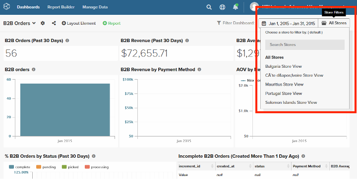

# Geavanceerd gebruikersbeheer

De functie [!DNL Advanced User Management] biedt verbeterde besturingselementen voor de zichtbaarheid van gegevens en schakelt het filteren van logische gegevens in op basis van gebruikersgroepen (organisatorische gebieden). Het staat u toe om gegevenszicht op gebruikersgroepen te maken en elimineert de behoefte om een replica van bestaande dashboards tot stand te brengen om aan regio-specifieke rapporteringsvereisten te voldoen telkens als de zaken zich aan een nieuw gebied uitbreiden.

[!DNL Advanced User Management] vereenvoudigt het delen van dashboard en de zichtbaarheid van gegevens en zorgt tegelijkertijd voor beveiliging en schaalbaarheid voor grote organisaties. De flexibiliteit om gebruikersgroepen, rollen, en toestemmingen te vormen maakt Commerce Intelligence een krachtig hulpmiddel voor onderneming-vlakke vereisten.

Als [!DNL Advanced User Management] is ingeschakeld, hebben alleen Admin-gebruikers toegang tot de volgende instellingen:

- Metrisch
- Visual Report Builder
- Op SQL gebaseerde rapporten
- E-mailoverzicht
- Onbewerkte export

## Eigenschappenmatrix

[!DNL Advanced User Management] heeft invloed op verschillende functies in Commerce Intelligence. De volgende lijst beschrijft eigenschappen, toestemmingen, en hun beschikbaarheid voor diverse rollen die op de eigenschap worden gebaseerd die worden toegelaten of onbruikbaar gemaakt.

<table><thead>
  <tr>
    <th colspan="3" rowspan="2">Commerce Intelligence-functies</th>
    <th colspan="6">Geavanceerde functies voor gebruikersbeheer (AUM)</th>
  </tr>
  <tr>
    <th colspan="3">Uitgeschakeld</th>
    <th colspan="3">Ingeschakeld</th>
  </tr></thead>
<tbody>
  <tr>
    <td>Functiegroep</td>
    <td>Functie</td>
    <td>Machtigingen</td>
    <td>Beheerder</td>
    <td>Standaard</td>
    <td>Alleen-lezen</td>
    <td>Beheerder</td>
    <td>Standaard</td>
    <td>Alleen-lezen</td>
  </tr>
  <tr>
    <td rowspan="7">Gebruikers beheren (toegankelijk voor alle beheerders en beïnvloedt alle rollen)</td>
    <td>Gebruikersgroepen configureren</td>
    <td></td>
    <td></td>
    <td></td>
    <td></td>
    <td>✓</td>
    <td></td>
    <td></td>
  </tr>
  <tr>
    <td>Gebruiker uitnodigen</td>
    <td></td>
    <td>✓</td>
    <td></td>
    <td></td>
    <td>✓</td>
    <td></td>
    <td></td>
  </tr>
  <tr>
    <td>Tabblad Machtigingen - Rollentoewijzing</td>
    <td></td>
    <td>✓</td>
    <td></td>
    <td></td>
    <td>✓</td>
    <td></td>
    <td></td>
  </tr>
  <tr>
    <td>Tabblad Machtigingen - Toewijzing gebruikersgroep (AUM)</td>
    <td></td>
    <td></td>
    <td></td>
    <td></td>
    <td>✓</td>
    <td></td>
    <td></td>
  </tr>
  <tr>
    <td>Tabblad Machtigingen - Ondersettoewijzing voor opslagruimten (AUM)</td>
    <td></td>
    <td></td>
    <td></td>
    <td></td>
    <td>✓</td>
    <td></td>
    <td></td>
  </tr>
  <tr>
    <td>Tabblad Metriek</td>
    <td></td>
    <td>✓</td>
    <td></td>
    <td></td>
    <td>✓</td>
    <td></td>
    <td></td>
  </tr>
  <tr>
    <td>Tabblad Gedeelde dashboards</td>
    <td></td>
    <td>✓</td>
    <td></td>
    <td></td>
    <td>✓</td>
    <td></td>
    <td></td>
  </tr>
  <tr>
    <td rowspan="2">Report Builder</td>
    <td>Visual Report Builder</td>
    <td></td>
    <td>✓</td>
    <td>✓</td>
    <td></td>
    <td>✓</td>
    <td></td>
    <td></td>
  </tr>
  <tr>
    <td>SQL REPORT BUILDER</td>
    <td></td>
    <td>✓</td>
    <td></td>
    <td></td>
    <td>✓</td>
    <td></td>
    <td></td>
  </tr>
  <tr>
    <td rowspan="2">E-mailoverzicht</td>
    <td>E-mailsamenvattingen maken zonder gegevenspartitionering</td>
    <td></td>
    <td>✓</td>
    <td>✓</td>
    <td></td>
    <td>✓</td>
    <td></td>
    <td></td>
  </tr>
  <tr>
    <td>E-mailsamenvattingen maken met gegevenspartitionering (AUM)</td>
    <td></td>
    <td></td>
    <td></td>
    <td></td>
    <td>✓</td>
    <td></td>
    <td></td>
  </tr>
  <tr>
    <td rowspan="4">Dashboards  - Delen</td>
    <td>Het dashboard van het aandeel met Gebruikers over Rollen</td>
    <td></td>
    <td>✓</td>
    <td>✓</td>
    <td></td>
    <td></td>
    <td></td>
    <td></td>
  </tr>
  <tr>
    <td>Het dashboard van het aandeel met Gebruikersgroepen &amp; Admins (AUM)</td>
    <td></td>
    <td></td>
    <td></td>
    <td></td>
    <td>✓</td>
    <td></td>
    <td></td>
  </tr>
  <tr>
    <td rowspan="2">Dashboard delen - Machtigingen</td>
    <td>Bewerken</td>
    <td>✓</td>
    <td>✓</td>
    <td></td>
    <td></td>
    <td></td>
    <td></td>
  </tr>
  <tr>
    <td>Weergave</td>
    <td>✓</td>
    <td>✓</td>
    <td></td>
    <td>✓</td>
    <td></td>
    <td></td>
  </tr>
  <tr>
    <td rowspan="18">Dashboards - Mening (Open Gedeeld Dashboard met bepaalde toestemmingen)</td>
    <td rowspan="2">Een gedeeld dashboard delen</td>
    <td>Bewerken</td>
    <td>✓</td>
    <td>✓</td>
    <td></td>
    <td></td>
    <td></td>
    <td></td>
  </tr>
  <tr>
    <td>Weergave</td>
    <td></td>
    <td></td>
    <td></td>
    <td></td>
    <td></td>
    <td></td>
  </tr>
  <tr>
    <td rowspan="2">Datumfilter (zonder functiemarkering TIJDopties BEWERKEN)</td>
    <td>Bewerken</td>
    <td>✓</td>
    <td>✓</td>
    <td>✓</td>
    <td></td>
    <td></td>
    <td></td>
  </tr>
  <tr>
    <td>Weergave</td>
    <td></td>
    <td></td>
    <td></td>
    <td>✓</td>
    <td></td>
    <td></td>
  </tr>
  <tr>
    <td rowspan="2">Datumfilter (met markering TIJDopties BEWERKEN)</td>
    <td>Bewerken</td>
    <td>✓</td>
    <td>✓</td>
    <td>✓</td>
    <td></td>
    <td></td>
    <td></td>
  </tr>
  <tr>
    <td>Weergave</td>
    <td>✓</td>
    <td>✓</td>
    <td></td>
    <td>✓</td>
    <td>✓</td>
    <td>✓</td>
  </tr>
  <tr>
    <td rowspan="2">Winkelfilter (zonder markering voor de functie Opties voor TIJD BEWERKEN)</td>
    <td>Bewerken</td>
    <td>✓</td>
    <td>✓</td>
    <td>✓</td>
    <td></td>
    <td></td>
    <td></td>
  </tr>
  <tr>
    <td>Weergave</td>
    <td>✓</td>
    <td>✓</td>
    <td></td>
    <td>✓</td>
    <td>✓</td>
    <td></td>
  </tr>
  <tr>
    <td rowspan="2">Winkelfilter (met markering voor de functie Opties voor BEWERKTIJD)</td>
    <td>Bewerken</td>
    <td>✓</td>
    <td>✓</td>
    <td>✓</td>
    <td></td>
    <td></td>
    <td></td>
  </tr>
  <tr>
    <td>Weergave</td>
    <td>✓</td>
    <td>✓</td>
    <td></td>
    <td>✓</td>
    <td>✓</td>
    <td></td>
  </tr>
  <tr>
    <td rowspan="2">Dashboardgegevens - Filter rapporteert gegevens op basis van gebruikergroepstoewijzing (AUM)</td>
    <td>Bewerken</td>
    <td></td>
    <td></td>
    <td></td>
    <td></td>
    <td></td>
    <td></td>
  </tr>
  <tr>
    <td>Weergave</td>
    <td></td>
    <td></td>
    <td></td>
    <td>✓</td>
    <td>✓</td>
    <td>✓</td>
  </tr>
  <tr>
    <td rowspan="2">Rapport - Bewerken</td>
    <td>Bewerken</td>
    <td>✓</td>
    <td>✓</td>
    <td></td>
    <td>✓</td>
    <td></td>
    <td></td>
  </tr>
  <tr>
    <td>Weergave</td>
    <td></td>
    <td></td>
    <td></td>
    <td>✓</td>
    <td></td>
    <td></td>
  </tr>
  <tr>
    <td rowspan="2">Export rapporteren (CSV, XLSX)</td>
    <td>Bewerken</td>
    <td>✓</td>
    <td>✓</td>
    <td>✓</td>
    <td>✓</td>
    <td></td>
    <td></td>
  </tr>
  <tr>
    <td>Weergave</td>
    <td>✓</td>
    <td>✓</td>
    <td>✓</td>
    <td>✓</td>
    <td>✓</td>
    <td>✓</td>
  </tr>
  <tr>
    <td rowspan="2">Rapport - Onbewerkte export</td>
    <td>Bewerken</td>
    <td>✓</td>
    <td>✓</td>
    <td></td>
    <td>✓</td>
    <td></td>
    <td></td>
  </tr>
  <tr>
    <td>Weergave</td>
    <td>✓</td>
    <td>✓</td>
    <td></td>
    <td></td>
    <td></td>
    <td></td>
  </tr>
</tbody></table>

## Besturingselement

Admin-gebruikers kunnen de volgende taken beheren:

- Configureren van gebruikersgroepen
- Rol en gebruikersgroep toewijzen aan individuele gebruikers
- Deel dashboards met gebruikersgroepen of andere beheerders met dashboardrechten
- E-mailsamenvattingen plannen met gegevensfilters op groepsniveau

### Gebruikersgroepen configureren

Gebruikersgroepen zijn logische groepen gebieden die zijn toegewezen aan specifieke opslagfilters (bijvoorbeeld gebruikersgroepen die zijn gemaakt op basis van namen van continenten, landen en regio&#39;s).

Gebruikersgroepen configureren:

1. Ga naar [!UICONTROL **Manage Gebruikers**] > [!UICONTROL **User Groups] **, om bestaande gebruikersgroepen te bekijken.

   

1. [!UICONTROL **voeg Groep**] toe staat beheerders toe om een nieuwe gebruikersgroep tot stand te brengen:

   - Voer een naam in voor de groep (bijvoorbeeld &quot;Amerika&#39;s&quot;).

   - Selecteer opslag of filters relevant voor de gebruikersgroep.

   - Sla de configuratie op.

      toe

1. Beheerders kunnen:

   - Bewerk gebruikersgroepen om winkeltoewijzingen bij te werken of hernoem ze voor de duidelijkheid.

   - Gebruikersgroepen verwijderen wanneer deze niet meer vereist zijn. Beheerders moeten handmatig bestaande gebruikers opnieuw toewijzen die zijn toegewezen aan de verwijderde gebruikersgroep.

1. Standaardgroepen:

   - [!UICONTROL **None]**: Een fallback-groep voor gebruikers die nog niet zijn toegewezen aan een specifieke groep. Deze gebruikers zullen geen gegevens zien tot toegewezen aan een aangewezen groep.

   - [!UICONTROL **allen**]: Verleent onbeperkte toegang tot alle gegevens (typisch gereserveerd voor admin gebruikers).

### Gebruikers toewijzen aan gebruikersgroepen

Admins kunnen nieuwe gebruikers aan relevante groepen tijdens hun onboarding in kaart brengen door [!UICONTROL **te gebruiken uitnodigen een Gebruiker**]. Bestaande gebruikers kunnen opnieuw worden toegewezen aan gebruikersgroepen op basis van zakelijke vereisten.

 toe

>[!TIP]
>
>- Totdat a [!UICONTROL **Standaard**] of [!UICONTROL **read-only**] gebruiker aan een relevante gebruikersgroep wordt toegewezen, is het veilig om hen aan [!UICONTROL **toe te wijzen niets**] om ervoor te zorgen dat zij geen dashboardgegevens incorrect toegang hebben.
>
>- Tijdens toewijzing van toestemmingen aan een gebruiker, die op bedrijfsvereisten wordt gebaseerd, is er een mogelijkheid om specifieke opslag binnen een groep voor een verbeterde controle te beperken.

De gebruikers Admin worden altijd in kaart gebracht aan [!UICONTROL **Alle**] opslag door gebrek, dat hen toestaat om dashboards met de volledige opslagmening te bekijken.

### dashboards delen

[!DNL Advanced User Management] biedt krachtige opties voor het delen van dashboards terwijl de gegevensbeveiliging behouden blijft.

- Beheerders kunnen dashboards delen met de gebruikersgroepen en met andere admingebruikers om samen te werken. Dit maakt gecentraliseerd beheer van dashboards mogelijk en vereenvoudigt het beheer voor grote organisaties.

  

- Tot de machtigingen voor delen van dashboard behoren:

   - [!UICONTROL **geeft**] uit: Beschikbaar voor admin gebruikers slechts om dashboards, filtergegevens te wijzigen, rapporten, of de uitvoergegevens te wijzigen.

   - [!UICONTROL **Mening**]: Beschikbaar aan gebruikers over alle rollen met (bepaalde beperkingen).

   - [!UICONTROL **niets**]: Herhaalt toegang tot het dashboard voor bepaalde gebruikersgroepen of admins.

  >[!NOTE]
  >
  >Verwijs naar de [ eigenschapmatrijs ](#feature-matrix) voor bruikbaarheid van diverse eigenschappen van Commerce Intelligence die op de regel en dashboardtoestemmingen worden gebaseerd om diverse combinaties te begrijpen.

#### Dashboardweergaven

Admin-gebruikers kunnen dashboardgegevens weergeven met toegang tot alle winkels.

Nochtans, kunnen de gebruikers dashboardgegevens bekijken die op de opslag worden gefiltreerd die aan hen tijdens gebruikersconfiguratie in kaart worden gebracht.

>[!TIP]
>
>Beheerders kunnen datumfilters inschakelen voor gedeelde dashboards, zodat gebruikers gegevens kunnen bekijken over verschillende datumbereiken in plaats van de standaardtijdreeks tijdens het maken van rapporten. Deze functie kan op basis van bedrijfsbehoeften in- of uitgeschakeld worden.

### E-mailsamenvattingen plannen

[!DNL Advanced User Management] breidt de mogelijkheden voor het filteren van gegevens uit tot e-mailoverzichten. Afhankelijk van het publiek kunnen beheergebruikers gebruikersgroepen opgeven waarvoor de geselecteerde rapporten moeten worden gefilterd.

