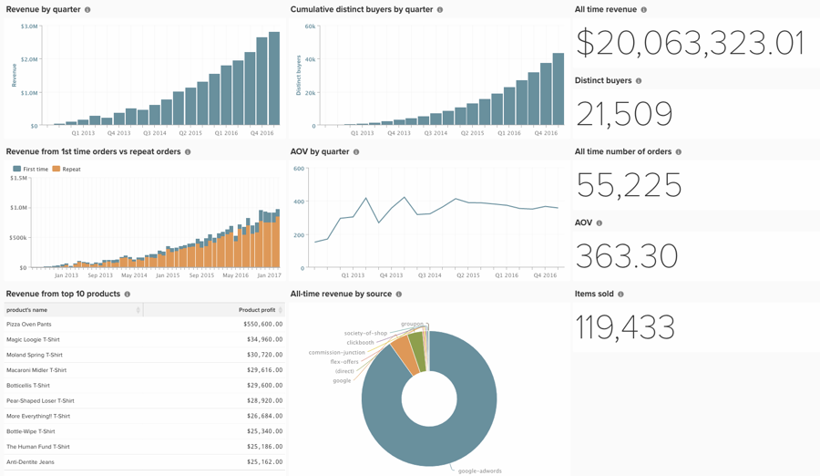

# Dashboard voor investeerders maken

Veel klanten werken met beleggers en moeten informatie delen van het platform, maar de dashboards die u creeert om dagelijkse bedrijfsbesluiten te nemen kunnen niet zijn wat een investeerder zoekt. Hieronder worden enkele aanbevolen procedures beschreven voor het maken van een dashboard dat alomvattend maar eenvoudig is en ideaal is voor het delen met actieve en potentiële investeerders.

Hier volgt wat u rapporten voor het dashboard van uw investeerder moet maken:

## Scalaire rapporten

* **[!UICONTROL All-time revenue]**
* **[!UICONTROL Distinct buyers]**
* **[!UICONTROL All-time number of orders]**
* **[!UICONTROL AOV]**
* **[!UICONTROL Items sold]**

## Visuele rapporten

* **[!UICONTROL Revenue by quarter]**
   * Metrisch - inkomsten
* **[!UICONTROL Revenue from 1st time orders vs repeat orders]**
   * Metrisch - inkomsten uit eerste bestellingen
      * Filter - Het ordernummer van de gebruiker is gelijk aan 1
   * Metrisch 2 - Herhalingsorderontvangsten
      * Filter - Het ordernummer van de gebruiker is groter dan 1
   * Schakel het selectievakje voor meerdere Y-assen uit
   * Wijzigen in een gestapeld kolomdiagram
* **[!UICONTROL AOV by quarter]**
   * Metrisch 1 - Inkomsten
      * Deze metrische waarde verbergen
   * Metrisch 2 - Aantal orders
      * Deze metrische waarde verbergen
   * Formule - AOV
      * A/B
* **[!UICONTROL All-time revenue by source]**
   * Metrisch - inkomsten
   * Groeperen op klantenbestand `utm_source`
* **[!UICONTROL Revenue from top 10 products]**
   * Metrisch - Productinkomsten
      * Het diagram verbergen
      * Groeperen op naam van product. Selecteer alle producten.
      * Tijdbereik instellen op All-Time
      * Tijdinterval instellen op Geen
      * Geef in &quot;Tonen boven/onder&quot; alleen de top 10 weer, gesorteerd op winst product
* **[!UICONTROL Cumulative distinct buyers by quarter]**
   * Metrisch - Afzonderlijke kopers
      * Perspectief - cumulatief
* **[!UICONTROL Site visits - New vs. repeat by month]**
* Sessies

Met een [!DNL Google Analytics] -integratie kunt u rapporten opnemen over:

* Bezoeken ter plaatse
* Omrekeningskoers

Met de [ diensten van de Verrijking van Gegevens van Commerce ](https://business.adobe.com/products/magento/magento-commerce.html), kunt u rapporten over omvatten:

* Unieke klanten naar land/regio, leeftijd, geslacht.

## Overige tips

* Gebruik duidelijk en beknopt [ noemend overeenkomst ](../best-practices/naming-elements.md)
* Het dashboard delen met beleggers
* Of verzend het via **[!UICONTROL Automated email summary]** (../data-user/export-data/email-summaries.md)
* Maak slechts één dashboard. Dit maakt de inhoud gemakkelijker te onderhouden en u weet precies wat uw investeerders bekijken.

Bewust uw rapporten en let op details. Na voltooiing ziet het dashboard er ongeveer als volgt uit:

