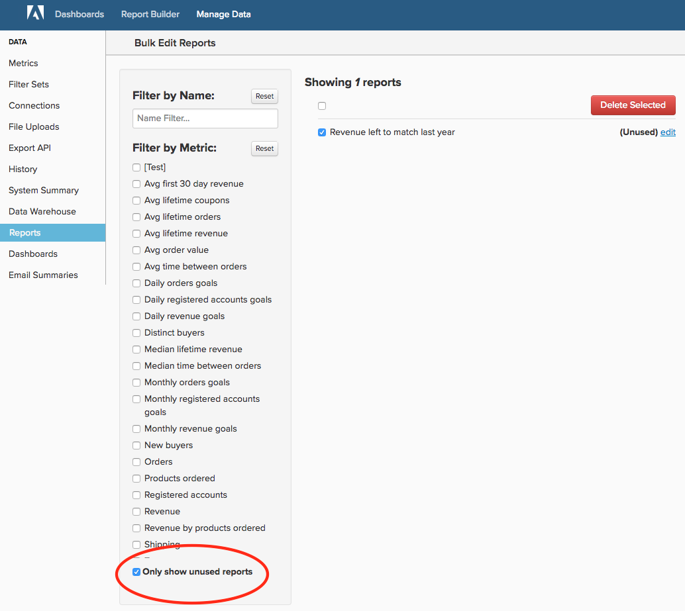

# Maak uw [!DNL MBI] Account

Of u met bent geweest [!DNL MBI] gedurende 6 maanden of 6 jaar is het bijhouden van een proefaccount van het grootste belang voor uw organisatie die het meeste uit het platform haalt. In tijd, is het natuurlijk voor er gebruikers, dashboards, rapporten, metriek, en kolommen zijn die niet meer nodig zijn. Misschien hebt u een rapport gemaakt voor eenmalig gebruik en bent u het vergeten, of een gebruiker die uw bedrijf heeft verlaten, heeft zijn of haar account nooit gedeactiveerd.

In combinatie met [gestandaardiseerde, duidelijke naamgeving voor alle elementen](../best-practices/naming-elements.md)) van uw [!DNL MBI] met de onderstaande stappen voor accountcontrole kunt u de rommelige en onnodige analyses voor uw gebruikers verminderen. Eén extra voordeel omvat [potentieel snellere updatecycli](../best-practices/reduce-update-cycle-time.md).

## Stap 1: Niet-actieve gebruikers identificeren

De eerste stap bij het opschonen van uw account is het deactiveren van de accounts van niet-actieve gebruikers, zoals mensen die het bedrijf hebben verlaten of die niet meer gebruiken [!DNL MBI] in hun huidige rollen.

U kunt dit doen door op de naam van uw bedrijf in de rechterbovenhoek van de bovenste navigatiebalk te klikken en vervolgens **[!UICONTROL Manage Users]**. Selecteer vervolgens de gebruiker die u wilt deactiveren en klik op **[!UICONTROL Deactivate User]**.

>[!NOTE]
>
>U hebt [Beheerdersmachtigingen](../administrator/user-management/user-management.md) om dit te doen.

>[!WARNING]
>
>Als u een gebruiker deactiveert, worden ook de diagrammen, dashboards en andere elementen verwijderd die door die gebruiker zijn gemaakt. Als u deze elementen wilt behouden, neemt u contact op met de [!DNL MBI] [ondersteuning](../guide-overview.md) team voordat u de gebruiker deactiveert. Ondersteuning kan u helpen deze middelen over te brengen naar een andere gebruiker.

### Gebruiker opnieuw activeren

Als u een gebruiker opnieuw wilt activeren, nodigt u de gebruiker opnieuw uit door zijn account opnieuw te maken met hetzelfde e-mailadres dat is gedeactiveerd. De toegang tot de gebruiker en de gegevens waarvan deze eigenaar is, worden bij het aanmelden hersteld.

## Stap 2: Ongebruikte dashboards en rapporten verwijderen

De volgende stap bij het controleren van uw account is het verwijderen van ongebruikte dashboards en rapporten.

>[!NOTE]
>
>U hebt `Admin` of `Standard` [gebruikersmachtigingen](../administrator/user-management/user-management.md) om dit te doen.

Elke gebruiker met `Admin` of `Standard` de toegang kan rapporten en dashboards tot stand brengen. Daarom moet iedereen met deze machtigingen de onderstaande stappen volgen om ongebruikte rapporten te identificeren en te verwijderen.

### Controleer uw dashboards en rapporten

Voordat u iets verwijdert, controleert u eerst uw rapporten en dashboards wat momenteel in gebruik is. Terwijl u **[!UICONTROL find unused reports]** met de hieronder beschreven functie maakt een eerste revisie uw opschoningsinspanningen veel productiever.

### Dashboards en rapporten verwijderen

Nadat u toegang hebt tot uw dashboards en rapporten, kunt u beginnen uw rekening op te schonen.

**Een rapport verwijderen van een dashboard**

1. Zoek het rapport dat u op het dashboard wilt verwijderen.
1. Selecteren **[!UICONTROL Options]** in de rechterbovenhoek van het rapport.
1. Klikken **[!UICONTROL Remove From Dashboard]**.

**Een volledig dashboard verwijderen**

1. Selecteren **[!UICONTROL Manage Data]** vervolgens **[!UICONTROL Dashboards**].
1. Klik op het dashboard dat u wilt verwijderen.
1. Klikken **[!UICONTROL Delete Dashboard]**.

U kunt ook **[!UICONTROL Dashboard Options]** vervolgens **[!UICONTROL Delete]** van het dashboard zelf.

>[!NOTE]
>
>Als u een dashboard verwijdert, worden de rapporten in het dashboard niet verwijderd. U moet dus nog een stap ondernemen om de rapporten te verwijderen.

**Ongebruikte rapporten verwijderen**

1. Selecteren **[!UICONTROL Manage Data]** vervolgens **[!UICONTROL Reports]**.
1. Controleer de **Alleen ongebruikte rapporten weergeven** onder de lijst Metriek. Hiermee wordt een lijst gemaakt met rapporten die niet worden gebruikt in een dashboard- of e-mailoverzicht.
1. Selecteer de rapporten die u wilt verwijderen. U kunt alle selecteren door checkbox boven de rapportlijst te klikken.
1. Klikken **[!UICONTROL Delete Selected]**.

Hier is een blik op het ongebruikte proces van de rapportschrapping:

## Stap 3: Ongebruikte metriek verwijderen

Nadat u uw gebruikerslijst, dashboards, en rapporten hebt schoongemaakt, kunt u zich op controle van uw lijst van metriek bewegen. Dit zal u helpen om het even wat identificeren die verouderd zou kunnen zijn - bijvoorbeeld, werd nieuw metrisch gecreeerd met een verschillende definitie - of niet in gebruik.

1. Om een lijst van afhankelijke rapporten voor metrisch te produceren, ga naar **[!DNL Manage Data]** Selecteer vervolgens Klikken **[!UICONTROL Metrics]**.
1. Klikken **[!UICONTROL Edit]** naast een metrische waarde.
1. Onder aan de pagina ziet u een sectie met de naam **[!UICONTROL Dependent Charts]**. Klik de verbinding om een afhankelijke rapportlijst voor dit metrisch te produceren.
1. Nadat het systeem de controle heeft voltooid, [!DNL MBI] toont een lijst van dashboards, rapporten, en gebruikers die dit metrisch gebruiken.

Als u besluit dat metrisch niet meer nodig is, navigeer terug naar **[!UICONTROL Metrics]** pagina door te klikken **[!UICONTROL Back to Metric List]** boven aan de pagina en zoek de metrische code die u wilt verwijderen. Klikken **[!UICONTROL Delete]**.

## Stap 4: Gesynchroniseerde kolommen beoordelen

De laatste stap is de kolommen te beoordelen die momenteel in uw gegevenspakhuis worden gesynchroniseerd. U kunt niet alleen de synchronisatie van kolommen in uw account ongedaan maken, maar ook de updatetijd verminderen.

Als u dit wilt nastreven, richt u zich tot [!DNL MBI] [Ondersteuning](../guide-overview.md). Het ondersteuningsteam kan een rapport maken dat alle kolommen bevat die in geen enkel dashboard voor een gebruiker worden gebruikt en die niet in e-mailoverzichten worden gebruikt, met uitzondering van SQL-rapporten. U kunt dit rapport dan gebruiken als richtlijn voor het selecteren van kolommen aan unsync via de Manager van de Data Warehouse.

>[!NOTE]
>
>U kunt deze kolommen in de toekomst altijd weer synchroniseren. Als u de synchronisatie van een kolom opheft, worden er geen gegevens uit uw gegevensopslagruimte verwijderd. alleen betekent dit dat deze kolom tijdens de updatecyclus niet wordt gecontroleerd op nieuwe of bijgewerkte waarden.

**De synchronisatie van een kolom (of kolommen) opheffen**

1. Ga naar **[!DNL Manage Data]** vervolgens **[!UICONTROL Data Warehouse]**.
1. In de **[!UICONTROL Synced Tables]** navigeer naar de tabel die de kolom bevat.
1. Schakel het selectievakje(s) in naast de kolom(men) waarvan u de synchronisatie wilt opheffen.
   >[!NOTE]
   >
   >U kunt de synchronisatie van een kolom Primaire sleutel niet ongedaan maken zonder de hele tabel neer te zetten.

1. Klikken **[!UICONTROL Remove]** om de synchronisatie van de kolom(men) ongedaan te maken.

Hier is een blik op het hele proces:

## Omloop

Dat is het! Uw [!DNL MBI] De account moet nu overzichtelijker en eenvoudiger door u en uw team kunnen navigeren.
