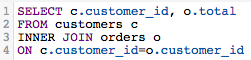
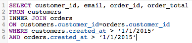

# SQL-query&#39;s optimaliseren

Met de SQL-Report Builder kunt u op elk gewenst moment query&#39;s uitvoeren op deze query&#39;s. Dit is nuttig wanneer u een vraag moet wijzigen zonder het moeten op een updatecyclus wachten om te beëindigen alvorens een kolom te realiseren of een rapport u creeerde behoeften het bijwerken.

Voordat een query wordt uitgevoerd, [[!DNL MBI] schat de kosten](https://experienceleague.adobe.com/docs/commerce-knowledge-base/kb/troubleshooting/miscellaneous/sql-queries-explain-cost-errors.html?lang=en). De kosten houden rekening met de tijdsduur en het aantal middelen die worden vereist om een vraag uit te voeren. Als die kosten te hoog worden geacht of als het aantal teruggekeerde rijen onze grenzen overschrijdt, zal de vraag niet lopen. Wij hebben een lijst van aanbevelingen voor het vragen van uw gegevenspakhuis opgesteld, die u zal verzekeren de meest gestroomlijnde vragen mogelijk schrijven.

## Alle kolommen selecteren of SELECT gebruiken

Het selecteren van alle kolommen maakt niet voor een geschikte, gemakkelijk uitgevoerde vraag. Zoekopdrachten die worden gebruikt `SELECT *` Het kan behoorlijk wat tijd vergen om te lopen, vooral als uw lijst een groot aantal kolommen heeft.

Daarom raden we u aan geen gebruik te maken van `SELECT *` waar mogelijk en neem alleen de kolommen op die u nodig hebt:

| **In plaats van dit...** | **Probeer dit!** |
|-----|-----|
|  |  |

{style=&quot;table-layout:auto&quot;}

## Volledige buitenverbindingen gebruiken

Buiten sluit zich aan selecteren de volledige twee lijsten die worden aangesloten bij, die de computerkosten van de vraag zullen verhogen. Dit betekent dat uw vraag langer zal duren om te lopen en waarschijnlijker zal ontbreken, aangezien het langer dan de uitvoeringsgrens kan duren om de resultaten terug te keren.

In plaats van dit type verbinding te gebruiken, denk na gebruikend een binnen of linkerverbinding. De binnenpartij verbindt terugkeerresultaten slechts waar tThis een kolomgelijke tussen lijsten is (bijvoorbeeld `order_id` bestaat in beide `customers` en `orders` tabel); de linker verbindingen zullen alle resultaten van de linker (eerste) lijst samen met de passende resultaten in de juiste (tweede) lijst terugkeren.

Neem een blik bij hoe wij een FULL OUTER JOIN vraag kunnen herschrijven:

| **In plaats van dit...** | **Probeer dit!** |
|-----|-----|
|  |  |

{style=&quot;table-layout:auto&quot;}

Zoals u kunt zien, zijn deze vragen identiek op elke manier behalve het type van VERBINDING zij gebruiken.

## Meerdere verbindingen gebruiken

Terwijl u veelvoudige verbindingen in uw vraag kunt omvatten, herinner dat het de kosten van de vraag kan drijven omhoog. Om ervoor te zorgen dat de kostendrempel niet wordt overschreden, raden we u aan waar mogelijk meerdere verbindingen te vermijden.

## Filters gebruiken

Gebruik filters waar mogelijk. `WHERE` en `HAVING` de clausules zullen uw resultaten filtreren en u slechts de gegevens geven u echt wilt.

## Filters gebruiken in JOIN-clausules

Als u een filter gebruikt wanneer het uitvoeren van een verbinding, ben zeker om het op beide lijsten in toe te passen zich. Zelfs als het overtollig is, zal dit de computerkosten van de vraag verminderen en zal de uitvoeringstijd versnellen.

| **In plaats van dit...** | **Probeer dit!** |
|-----|-----|
|  |  |

{style=&quot;table-layout:auto&quot;}

## Operatoren gebruiken

Als u query&#39;s schrijft, kunt u overwegen de &#39;minst dure&#39; operatoren te gebruiken. Elke vraag heeft computerkosten, die door de functies, de exploitanten, en de filters worden bepaald die omhoog de vraag maken. Sommige operatoren hebben minder rekenkracht nodig, waardoor ze minder kostbaar zijn dan andere operatoren.

Vergelijkingsoperatoren (>, &lt;, =, enzovoort) zijn het goedkoopst, gevolgd door [ZOALS. VERGELIJKBAAR MET POSIX-operatoren](https://www.postgresql.org/docs/9.5/functions-matching.html) die de duurste exploitanten zijn.

## BESTAANDE versus

Gebruiken `EXISTS` versus `IN` is afhankelijk van het type resultaten dat u wilt retourneren. Als u slechts in één waarde interesseert, gebruik `EXISTS` clausule in plaats van `IN`. `IN` wordt gebruikt samen met lijsten van komma-gescheiden waarden, die de rekenkosten van de vraag zullen verhogen.

Wanneer `IN` de vragen worden in werking gesteld, moet het systeem subquery eerst verwerken (de `IN` (instructie), dan de volledige query op basis van de relatie die is opgegeven in de `IN` instructie. `EXISTS` is veel efficiënter omdat de vraag niet door veelvoudige tijden moet worden in werking gesteld - een waar/valse waarde is teruggekeerd terwijl het controleren van de verhouding die in de vraag wordt gespecificeerd.

Om het simpelweg te zeggen: het systeem hoeft niet zo veel te verwerken wanneer het `EXISTS`.

| **In plaats van dit...** | **Probeer dit!** |
|-----|-----|
|  |  |

{style=&quot;table-layout:auto&quot;}

## ORDE GEBRUIKEN DOOR

`ORDER BY` is een dure functie in SQL en kan de kosten van een vraag beduidend verhogen. Als u een foutbericht ontvangt waarin wordt aangegeven dat de EXPLAIN-kosten van de query te hoog zijn, probeert u een `ORDER BY`s van uw vraag tenzij absoluut vereist.

Dat wil niet zeggen dat `ORDER BY` niet kan worden gebruikt - alleen dat het alleen moet worden gebruikt wanneer dat nodig is.

## GROEP BY en ORDE BY gebruiken

In sommige situaties is deze aanpak niet in overeenstemming met uw pogingen, maar de algemene regel is dat als u een `GROUP BY` en `ORDER BY`Plaats de kolommen in beide clausules in dezelfde volgorde. Bijvoorbeeld:

| **In plaats van dit...** | **Probeer dit!** |
|-----|-----|
|  |  |

{style=&quot;table-layout:auto&quot;}

## Omloop omhoog

De beste manier om SQL te leren schrijven - en dit efficiënt te doen - is door proef en fout. Als u wilt weten wat het beste voor u werkt, probeert u een aantal rapporten opnieuw te maken met alleen de SQL-editor.
