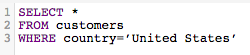
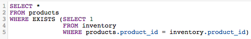

# SQL-query&#39;s optimaliseren

De [!DNL SQL Report Builder] staat u toe om op die vragen op om het even welk bepaald ogenblik te vragen en te herhalen. Dit is nuttig wanneer u een vraag moet wijzigen zonder het moeten op een updatecyclus wachten om te beëindigen alvorens een kolom te realiseren of een rapport u creeerde behoeften het bijwerken.

Voordat een query wordt uitgevoerd, [[!DNL Commerce Intelligence] schat de kosten](https://experienceleague.adobe.com/docs/commerce-knowledge-base/kb/troubleshooting/miscellaneous/sql-queries-explain-cost-errors.html). Kosten overweegt de tijdsduur en het aantal middelen die worden vereist om een vraag uit te voeren. Als die kosten te hoog worden geacht of als het aantal geretourneerde rijen groter is dan [!DNL Commerce Intelligence] limieten, mislukt de query. Voor het opvragen van uw [Data Warehouse](../data-analyst/data-warehouse-mgr/tour-dwm.md)Om ervoor te zorgen dat u de meest gestroomlijnde query&#39;s schrijft, raadt de Adobe het volgende aan.

## Alle kolommen selecteren of SELECT gebruiken

Het selecteren van alle kolommen maakt niet voor een geschikte, gemakkelijk uitgevoerde vraag. Zoekopdrachten die worden gebruikt `SELECT *` kan behoorlijk wat tijd vergen om te lopen, vooral als uw lijst vele kolommen heeft.

Daarom wordt u door de Adobe aangeraden het gebruik van `SELECT *` waar mogelijk en neem alleen de kolommen op die u nodig hebt:

| **In plaats van dit...** | **Probeer dit!** |
|-----|-----|
|  |  |

{style="table-layout:auto"}

## Volledige buitenverbindingen gebruiken

Buiten sluit zich aan selecteren de volledige twee lijsten die worden aangesloten bij, die de computerkosten van de vraag verhogen. Dit betekent dat het langer duurt om de query uit te voeren en dat het waarschijnlijker is dat de query mislukt, omdat het langer kan duren dan de uitvoeringslimiet om de resultaten te retourneren.

In plaats van dit type verbinding te gebruiken, denk na gebruikend een binnen of linkerverbinding. De binnenpartij verbindt terugkeerresultaten slechts wanneer er een kolomgelijke tussen lijsten is (bijvoorbeeld `order_id` bestaat in beide `customers` en `orders` tabel). Linkerverbindingen retourneren alle resultaten van de linker (eerste) tabel samen met de overeenkomende resultaten in de rechter (tweede) tabel.

Kijk hoe u een FULL OUTER JOIN vraag kunt herschrijven:

| **In plaats van dit...** | **Probeer dit!** |
|-----|-----|
|  |  |

{style="table-layout:auto"}

Deze vragen zijn identiek op elke manier behalve het type van VERBINDING zij gebruiken.

## Meerdere verbindingen gebruiken

Terwijl u veelvoudige verbindingen in uw vraag kunt omvatten, herinner dat het de kosten van de vraag kan drijven omhoog. Om te voorkomen dat de kostendrempel wordt overschreden, beveelt de Adobe aan waar mogelijk meerdere verbindingen te vermijden.

## Filters gebruiken

Gebruik filters waar mogelijk. `WHERE` en `HAVING` de clausules filteren uw resultaten en geven u slechts de gegevens u echt wilt.

## Filters gebruiken in JOIN-clausules

Als u een filter gebruikt wanneer het uitvoeren van een verbinding, ben zeker om het op beide lijsten in toe te passen zich. Zelfs als het overtollig is, drukt dit de computerkosten van de vraag en vermindert de uitvoeringstijd.

| **In plaats van dit...** | **Probeer dit!** |
|-----|-----|
|  |  |

{style="table-layout:auto"}

## Operatoren gebruiken

Als u query&#39;s schrijft, kunt u overwegen de &#39;minst dure&#39; operatoren te gebruiken. Elke vraag heeft computerkosten, die door de functies, de exploitanten, en de filters worden bepaald die omhoog de vraag maken. Sommige operatoren hebben minder rekenkracht nodig, waardoor ze minder kostbaar zijn dan andere operatoren.

Vergelijkingsoperatoren (>, &lt;, =, enzovoort) zijn het goedkoopst, gevolgd door [ZOALS. VERGELIJKBAAR MET POSIX-operatoren](https://www.postgresql.org/docs/9.5/functions-matching.html) die de duurste exploitanten zijn.

## BESTAANDE versus

Gebruiken `EXISTS` versus `IN` is afhankelijk van het type resultaten dat u wilt retourneren. Als u slechts in één waarde interesseert, gebruik `EXISTS` clausule in plaats van `IN`. `IN` wordt gebruikt met lijsten van komma-gescheiden waarden, die de computerkosten van de vraag verhogen.

Wanneer `IN` de vragen worden in werking gesteld, moet het systeem subquery eerst verwerken (de `IN` (instructie), dan de volledige query op basis van de relatie die is opgegeven in de `IN` instructie. `EXISTS` is veel efficiënter omdat de vraag niet door veelvoudige tijden moet worden in werking gesteld - een waar/valse waarde is teruggekeerd terwijl het controleren van de verhouding die in de vraag wordt gespecificeerd.

Om het simpel te zeggen: het systeem hoeft niet zo veel te verwerken als bij gebruik `EXISTS`.

| **In plaats van dit...** | **Probeer dit!** |
|-----|-----|
|  |  |

{style="table-layout:auto"}

## ORDE GEBRUIKEN DOOR

`ORDER BY` is een dure functie in SQL en kan de kosten van een vraag beduidend verhogen. Als u een foutbericht ontvangt waarin wordt aangegeven dat de EXPLAIN-kosten van de query te hoog zijn, probeert u een `ORDER BY`s van uw vraag tenzij vereist.

Dat wil niet zeggen dat `ORDER BY` niet kan worden gebruikt - alleen dat het alleen moet worden gebruikt wanneer dat nodig is.

## GROEP BY en ORDE BY gebruiken

Er kunnen enkele situaties zijn waarin deze aanpak niet strookt met wat u probeert te doen. De algemene regel is dat als u een `GROUP BY` en `ORDER BY`Plaats de kolommen in beide clausules in dezelfde volgorde. Bijvoorbeeld:

| **In plaats van dit...** | **Probeer dit!** |
|-----|-----|
|  |  |

{style="table-layout:auto"}

## Omloop omhoog

De beste manier om SQL te leren schrijven - en dit efficiënt te doen - is door proef en fout. Als u wilt weten wat het beste voor u werkt, probeert u een aantal rapporten opnieuw te maken met alleen de SQL-editor.
