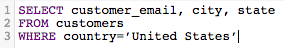
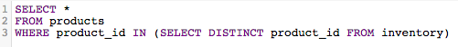

# SQL-query&#39;s optimaliseren

Met [!DNL SQL Report Builder] kunt u query&#39;s uitvoeren en wijzigen wanneer u dat wilt. Dit vermogen is nuttig als u een vraag onmiddellijk moet bijwerken, in plaats van het wachten op een updatecyclus om te beëindigen alvorens een kolom of een rapport te bevestigen.

Alvorens een vraag wordt uitgevoerd, [[!DNL Commerce Intelligence]  schat zijn kosten &#x200B;](https://experienceleague.adobe.com/docs/commerce-knowledge-base/kb/troubleshooting/miscellaneous/sql-queries-explain-cost-errors.html?lang=nl-NL). Kosten overweegt de tijdsduur en het aantal middelen die worden vereist om een vraag uit te voeren. Als die kosten te hoog worden geacht of als het aantal geretourneerde rijen de [!DNL Commerce Intelligence] -limieten overschrijdt, mislukt de query. Voor het vragen van uw [&#x200B; Data Warehouse &#x200B;](../data-analyst/data-warehouse-mgr/tour-dwm.md), die u verzekert schrijft de meest gestroomlijnde vragen mogelijk, adviseert Adobe het volgende.

## Alle kolommen selecteren of SELECT gebruiken

Het selecteren van alle kolommen maakt niet voor een geschikte, gemakkelijk uitgevoerde vraag. Het kan veel tijd duren om query&#39;s met `SELECT *` uit te voeren, vooral als uw tabel veel kolommen bevat.

Daarom raadt Adobe u aan `SELECT *` niet zoveel mogelijk te gebruiken en alleen de kolommen op te nemen die u nodig hebt:

| **In plaats van dit...** | **probeer dit!** |
|-----|-----|
|  |  selecteert |

{style="table-layout:auto"}

## Volledige buitenverbindingen gebruiken

Buiten sluit zich aan selecteren de volledige twee lijsten die worden aangesloten bij, die de computerkosten van de vraag verhogen. Dit betekent dat het langer duurt om de query uit te voeren en dat het waarschijnlijker is dat de query mislukt, omdat het langer kan duren dan de uitvoeringslimiet om de resultaten te retourneren.

In plaats van dit type verbinding te gebruiken, denk na gebruikend een binnen of linkerverbinding. De resultaten worden alleen geretourneerd als er een kolomovereenkomst is tussen tabellen (`order_id` bestaat bijvoorbeeld zowel in een standaard `customers` - als `orders` -tabel). Linkerverbindingen retourneren alle resultaten van de linker (eerste) tabel samen met de overeenkomende resultaten in de rechter (tweede) tabel.

Kijk hoe u een FULL OUTER JOIN vraag kunt herschrijven:

| **In plaats van dit...** | **probeer dit!** |
|-----|-----|
|  |  |

{style="table-layout:auto"}

Deze vragen zijn identiek op elke manier behalve het type van VERBINDING zij gebruiken.

## Meerdere verbindingen gebruiken

Terwijl u veelvoudige verbindingen in uw vraag kunt omvatten, herinner dat het de kosten van de vraag kan drijven omhoog. Om te voorkomen dat de kostendrempel wordt overschreden, raadt Adobe aan waar mogelijk meerdere verbindingen te vermijden.

## Filters gebruiken

Gebruik filters waar mogelijk. Met de clausules `WHERE` en `HAVING` filtert u de resultaten en geeft u alleen de gegevens die u echt wilt.

## Filters gebruiken in JOIN-clausules

Als u een filter gebruikt wanneer het uitvoeren van een verbinding, ben zeker om het op beide lijsten in toe te passen zich. Zelfs als het overtollig is, drukt dit de computerkosten van de vraag en vermindert de uitvoeringstijd.

| **In plaats van dit...** | **probeer dit!** |
|-----|-----|
|  |  |

{style="table-layout:auto"}

## Operatoren gebruiken

Als u query&#39;s schrijft, kunt u overwegen de &#39;minst dure&#39; operatoren te gebruiken. Elke vraag heeft computerkosten, die door de functies, de exploitanten, en de filters worden bepaald die omhoog de vraag maken. Sommige operatoren hebben minder rekenkracht nodig, waardoor ze minder kostbaar zijn dan andere operatoren.

Vergelijkingsoperatoren (>, &lt;, =, enzovoort) zijn het goedkoopst, gevolgd door [&#x200B; LIKE. VERGELIJKBAAR MET en POSIX exploitanten &#x200B;](https://www.postgresql.org/docs/9.5/functions-matching.html) die de duurste exploitanten zijn.

## BESTAANDE versus

Het gebruik van `EXISTS` versus `IN` is afhankelijk van het type resultaten dat u wilt retourneren. Als u slechts in één waarde geïnteresseerd bent, gebruikt u de component `EXISTS` in plaats van `IN` . `IN` wordt gebruikt met lijsten met door komma&#39;s gescheiden waarden, waardoor de rekenkosten van de query stijgen.

Wanneer `IN` query&#39;s worden uitgevoerd, moet het systeem eerst de subquery (de `IN` instructie) verwerken en vervolgens de volledige query op basis van de relatie die in de `IN` instructie is opgegeven. De query `EXISTS` is veel efficiënter omdat de query niet meerdere keren hoeft te worden uitgevoerd. Er wordt een waarde true/false geretourneerd tijdens het controleren van de relatie die in de query is opgegeven.

Om het simpelweg te zeggen: het systeem hoeft niet zo veel te verwerken wanneer het gebruiken van `EXISTS`.

| **In plaats van dit...** | **probeer dit!** |
|-----|-----|
|  |  |

{style="table-layout:auto"}

## ORDE GEBRUIKEN DOOR

De functie `ORDER BY` is duur in SQL en kan de kosten van een query aanzienlijk verhogen. Als u een foutenmelding die ontvangt dat de EXPLAIN kosten van uw vraag te hoog is, probeer eliminerend om het even welke `ORDER BY` s van uw vraag tenzij vereist.

Dit wil niet zeggen dat `ORDER BY` niet kan worden gebruikt, alleen dat het alleen moet worden gebruikt wanneer dat nodig is.

## GROEP BY en ORDE BY gebruiken

Er kunnen enkele situaties zijn waarin deze aanpak niet strookt met wat u probeert te doen. De algemene regel is dat als u een `GROUP BY` en `ORDER BY` gebruikt, u de kolommen in beide componenten in dezelfde volgorde moet plaatsen. Bijvoorbeeld:

| **In plaats van dit...** | **probeer dit!** |
|-----|-----|
|  |  |

{style="table-layout:auto"}

## Omloop omhoog

De beste manier om SQL te leren schrijven - en dit efficiënt te doen - is door proef en fout. Als u wilt weten wat het beste voor u werkt, probeert u een aantal rapporten opnieuw te maken met alleen de SQL-editor.
