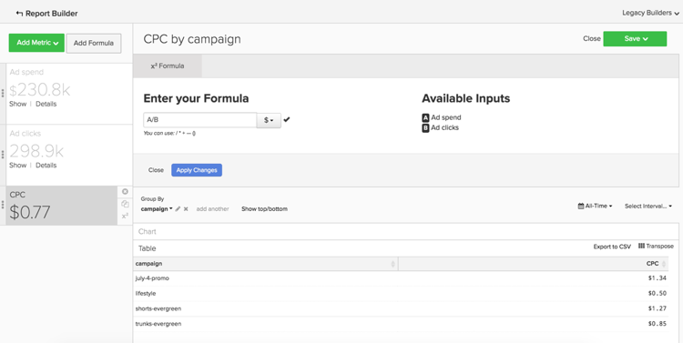

# Basisanalyses

Als u eenmaal bekend bent met het [!DNL Adobe Commerce Intelligence] -platform en een basiskennis hebt van het gereedschap, wilt u beginnen met het samenstellen van rapporten. Een van de meest voorkomende vragen die je hebt is: &quot;Waar moet ik naar kijken?&quot;

De informatie hieronder schetst enkele gemeenschappelijke metriek en rapporten die u waardevol zou kunnen vinden. Sommige van deze rapporten bestaan in uw account, dus controleer de cijfers en rapporten die in uw account staan om te voorkomen dat er duplicaten worden gemaakt.

## Tabellen en kolommen die u wilt begrijpen

Wanneer het bouwen van metrisch, moet u vier stukken van informatie kennen:

1. De tafel waarop de gegevens leven,
1. De specifieke handeling die u wilt uitvoeren,
1. De kolom waarop u die handeling wilt uitvoeren, en
1. Het tijdstempel dat u wilt gebruiken voor het bijhouden van die gegevens.

Waarschijnlijk verschillen de namen van de tabellen die in deze voorbeelden worden gebruikt enigszins van de kolom- en tabelnamen in uw database, omdat elke database uniek is. Verwijs naar de onderstaande definities als u hulp met het identificeren van een overeenkomstige lijst of kolom in uw gegevensbestand nodig hebt.

## Klantentabel

Deze lijst bevat de belangrijkste informatie over elke klant, zoals een unieke klant - identiteitskaart, e-mailadres, etc. In de onderstaande voorbeelden wordt **[!UICONTROL customer_entity]** gebruikt als de naam van een voorbeeldklantentabel.

Als sommige van deze berekeningen momenteel niet bestaan in uw database, kunnen alle beheerders in uw account ze maken. Bovendien moet u ervoor zorgen dat deze afmetingen gegroepeerd zijn voor alle toepasselijke metriek.

**Afmetingen**

* **[!UICONTROL Entity_id]**: Een unieke id voor elke klant. Dit kan ook een uniek klantnummer of een e-mailadres van een klant zijn en moet fungeren als referentietoets voor de tabel van uw bestelling.
* **[!UICONTROL Created_at]**: De datum waarop de account van de klant is gemaakt en aan uw database is toegevoegd.
* **[!UICONTROL Customer's lifetime revenue]**: De totale levensopbrengsten die door een klant worden gegenereerd.
* **[!UICONTROL Customer's first 30-day revenue]**: Het totale bedrag aan inkomsten dat een klant in de eerste 30 dagen heeft gegenereerd.
* **[!UICONTROL Customer's lifetime number of orders]**: Het aantal bestellingen dat een klant gedurende zijn levensduur heeft geplaatst.
* **[!UICONTROL Customer's lifetime number of coupons]**: Het totale aantal coupons dat een klant gedurende zijn levensduur gebruikt.
* **[!UICONTROL Customer's first order date]**: De datum van de eerste bestelling van een klant. Dit kan anders zijn dan de created_at datum als een klant geen orde op het tijdstip van hun verwezenlijking plaatste.

**Accepteert u gastorden?**

*als zo, kan deze lijst niet al uw klanten bevatten. Contacteer het [ ondersteuningsteam ](https://experienceleague.adobe.com/docs/commerce-knowledge-base/kb/troubleshooting/miscellaneous/mbi-service-policies.html) om uw klantenanalyses te verzekeren omvat alle klanten.*

*niet zeker als u gastorden goedkeurt? Verwijs naar [ dit onderwerp ](../data-warehouse-mgr/guest-orders.md) om meer te leren!*

## Orderentabel

In deze tabel vertegenwoordigt elke rij één volgorde. De kolommen in deze lijst bevatten basisinformatie over elke orde, zoals identiteitskaart van de orde, creatieve datum, status, identiteitskaart van de klant die de orde plaatste, etc. In de onderstaande voorbeelden wordt **[!UICONTROL sales_flat_order]** gebruikt als de naam van een tabel met voorbeeldorders.

**Afmetingen**

* **[!UICONTROL Customer_id]**: Een unieke id voor de klant die de bestelling heeft geplaatst. Dit wordt vaak gebruikt om informatie tussen de klant en ordentabellen te bewegen. In deze voorbeelden verwacht u dat de customer_id in de **[!UICONTROL sales_flat_order]** -tabel wordt uitgelijnd met de **[!UICONTROL entitiy_id]** on the **[!UICONTROL customer_entity]** -tabel.
* **[!UICONTROL Created_at]**: De datum waarop de bestelling is gemaakt of geplaatst.
* **[!UICONTROL Customer_email]**: Het e-mailadres van de klant die de bestelling heeft geplaatst. Dit kan ook de unieke identificatie voor de klant zijn.
* **[!UICONTROL Customer's lifetime number of orders]**: Een kopie van de kolom met dezelfde naam in de `Customers` -tabel.
* **[!UICONTROL Customer's order number]**: Het volgnummer van de bestelling dat aan de bestelling is gekoppeld. Bijvoorbeeld, als de rij u bekijkt de eerste orde van een klant is, is deze kolom &quot;1&quot;; maar, als dit de 15e orde van de klant was, toont deze kolom &quot;15&quot;voor deze orde. Als deze afmeting niet op uw `Customers` lijst bestaat, vraag het [ ondersteuningsteam ](https://experienceleague.adobe.com/docs/commerce-knowledge-base/kb/troubleshooting/miscellaneous/mbi-service-policies.html) om u te helpen het bouwen.
* **[!UICONTROL Customer's order number (previous-current)]**: een samenvoeging van twee waarden in de kolom **[!UICONTROL Customer's order number]** . Het wordt gebruikt in een steekproefrapport hieronder om de verstreken tijd tussen om het even welke twee orden te tonen. De tijd tussen bijvoorbeeld de eerste besteldatum van een klant en de tweede besteldatum wordt bij deze berekening weergegeven als &quot;1-2&quot;.
* **[!UICONTROL Coupon_code]**: geeft aan welke coupons op elke bestelling zijn gebruikt.
* **[!UICONTROL Seconds since previous order]**: De tijd (in seconden) tussen bestellingen van een klant.

## Tabel met volgordeitems

In deze tabel staat elke rij voor één object dat is verkocht. Deze tabel bevat informatie over de objecten die in elke bestelling worden verkocht, zoals het referentienummer van de bestelling, het productnummer, de hoeveelheid, enzovoort. In de onderstaande voorbeelden wordt `sales_flat_order_item` gebruikt als de naam van een tabel met items in de voorbeeldvolgorde.

**Afmetingen**

* **[!UICONTROL Item_id]**: De unieke id voor elke rij in de tabel.
* **[!UICONTROL Order_id]**: De referentietoets naar de `Orders` -tabel die aangeeft welke items in dezelfde volgorde zijn aangeschaft. Als een volgorde meerdere items bevat, wordt deze waarde herhaald.
* **[!UICONTROL Product_id]**: Als u informatie wilt over het specifieke product dat is aangeschaft (zoals kleur, grootte, enzovoort), gebruikt u deze kolom om die informatie uit de tabel met producten te halen.
* **[!UICONTROL Order's created_at]**: Het tijdstempel dat de volgorde is geplaatst, wordt meestal vanuit de tabel `order line items` naar de `Orders` -tabel gekopieerd.
* **[!UICONTROL Order's coupon_code]**: net als bij de `Order's created_at` -dimensie wordt deze kolom gekopieerd uit de tabel met bestellingen.

## Subscriptietabel

Deze tabel wordt gebruikt voor het beheer van uw abonnementsgegevens, zoals de abonnements-id, het e-mailadres van de abonnee, de startdatum van het abonnement enzovoort.

**Afmetingen**

* **[!UICONTROL Customer_id]**: Een unieke id voor de klant die de bestelling heeft geplaatst. Dit is een gemeenschappelijke manier om een weg tussen de lijst van Klanten en de lijst van Orden te bouwen. In deze voorbeelden, verwacht u customer_id op de **sales_flat_order** lijst om met `entitiy_id` op de `customer_entity` lijst te richten.
* **[!UICONTROL Start date]**: De datum waarop het abonnement van een klant is gestart.

## Tabel met marketinguitgaven

Wanneer u uw marketinguitgaven analyseert, kunt u [!DNL Facebook] , [!DNL Google AdWords] of andere bronnen in uw analyses opnemen. Als u veelvoudige marketing uitgavenbronnen hebt, contacteer het [ Team van Managed Services ](https://business.adobe.com/products/magento/fully-managed-service.html) voor hulp bij vestiging een geconsolideerde lijst voor uw marketing campagnes.

**Afmetingen**

* **[!UICONTROL Spend]**: De totale advertentie die wordt uitgegeven. In [!DNL Facebook] is dit de uitgavenkolom in de `facebook_ads_insights_####` -tabel. Voor [!DNL Google AdWords] is dit de `adCost` -kolom in de `campaigns####` -tabel.
* De `####` die aan elk van deze tabellen wordt toegevoegd, heeft betrekking op de specifieke account-id voor uw [!DNL Facebook] - of [!DNL Google AdWords] -account.
* **[!UICONTROL Clicks]**: Het totale aantal klikken. In [!DNL Facebook] is dit de kolom click in de `facebook_ads_insights_####` -tabel. In [!DNL Google AdWords] is dit de kolom adClick in de tabel `campaigns####` .
* **[!UICONTROL Impressions]**: Het totale aantal afbeeldingen. In [!DNL Facebook] zijn dit de indrukken in de `facebook_ads_insights_####` -tabel. In [!DNL Google AdWords] zou dit de indrukken van de `campaigns####` tabel zijn.
* **[!UICONTROL Campaign]**: Het totale aantal klikken. In [!DNL Facebook] is dit de kolom campagne_naam in de `facebook_ads_insights_####` -tabel. In [!DNL Google AdWords] is dit de kolom Campagne in de `campaigns####` -tabel.
* **[!UICONTROL Date]**: De tijd en datum waarop de activiteit (doorgeven, klikken of indrukken) voor een bepaalde campagne is opgetreden. In [!DNL Facebook] zou dit de `date_start` kolom in de `facebook_ads_insights_####` tabel zijn. In [!DNL Google AdWords] is dit de datumkolom in de `campaigns####` -tabel.
* **[!UICONTROL Customer's first order's source]**: De bron van de bestelling van de eerste bestelling van een klant. Controleer eerst of u een kolom hebt met de naam `customer's first order's source` in uw account. Als deze kolom niet wordt weergegeven, kunt u met deze instructies de gewenste kolom maken.
* **[!UICONTROL Customer's first order's medium]**: Het medium van de bestelling van de eerste bestelling van de klant. Controleer eerst of u een kolom hebt met de naam `customer's first order's source` in uw account. Als deze kolom niet wordt weergegeven, kunt u met deze instructies de gewenste kolom maken.
* **[!UICONTROL Customer's first order's campaign]**: De campagne van de bestelling van een eerste bestelling van een klant. Controleer eerst of u een kolom hebt met de naam `customer's first order's source` in uw account. Als deze kolom niet wordt weergegeven, kunt u met deze instructies de gewenste kolom maken.

## Algemene rapporten en maatstaven

Hier volgen enkele voorbeelden van rapporten en meetgegevens die u nuttig kunt vinden:

* [Klantenanalyse](#customeranalytics)
* [Order Analytics](#orderanalytics)
* [Analyse van marketinguitgaven](#mktgspendanalytics)

## Klantenanalyse {#customeranalytics}

### Nieuwe gebruikers

* **Beschrijving**: Een telling van het totale aantal onlangs verworven gebruikers over een bepaalde periode. `New Users` verschilt van `Unique Customers` , omdat `New Users` de tijdstempel heeft dat een account met uw service is gemaakt (dit betekent niet dat ze noodzakelijkerwijs een bestelling hebben geplaatst) terwijl `Unique Customers` ten minste één bestelling heeft geplaatst.
* **Metrische Definitie**: Dit metrisch voert a **Telling** van `entity_id` van `customer_entity` lijst uit die door `created_at` wordt bevolen.
* **Voorbeeld van het Rapport**: Aantal nieuwe gebruikers die vorige maand werden gecreeerd
   * **[!UICONTROL Metric]**: `New Users`
   * **[!UICONTROL Time Range]**: `Last Month`
   * **[!UICONTROL Time Interval]**: `By Day`

<!--{: width="929"}-->

### Unieke klanten

* **Beschrijving**: Een telling van het totale aantal verschillende klanten over een bepaalde periode. Dit verschilt van `New Users`, omdat het alleen klanten volgt die minstens één bestelling hebben geplaatst. Een verschillend rapport van de klant volgt slechts één keer een klant in een bepaald tijdinterval. Als u het tijdsinterval instelt op `By Day` en een klant op die dag meer dan één aankoop doet, wordt de klant slechts één keer geteld. Als u een totaal aantal aankopen in het algemeen wilt zien, kijkt u naar `Number of Orders`.
* **Metrische Definitie**: Dit metrisch voert a **Afzonderlijke Telling** van `customer_id` van `sales_flat_order` lijst uit die door `created_at` wordt bevolen.
* **Voorbeeld van het Rapport**: Verschillende klanten door week over de laatste 90 dagen
   * **[!UICONTROL Metric]**: `Distinct Customers`
   * **[!UICONTROL Time Range]**: `Moving range > Last 90 Days`
   * **[!UICONTROL Time Interval]**: `By Day`

<!--{: width="929"}-->

### Nieuwe abonnees

* **Beschrijving**: Een telling van het totale aantal nieuwe abonnees die over een bepaalde periode worden verworven.
* **Metrische Definitie**: Dit metrisch voert a **Afzonderlijke Telling** van `customer_id` van `subscriptions` lijst uit die door `start_date` wordt bevolen.
* **Voorbeeld van het Rapport**: De nieuwe abonnees dit jaar door maand
   * **[!UICONTROL Metric]**: `New Subscribers`
   * **[!UICONTROL Time Range]**: `1 Year Ago to 0 Days Ago`
   * **[!UICONTROL Time Interval]**: `By Month`

<!--{: width="929"}-->

### Klanten herhalen

* **Beschrijving**: Het totale aantal klanten die meer dan één orde over een periode plaatsten. In een rapport van een terugkerende klant kunt u de `Distinct Customers` -dimensie en de `Customer's Order Number` -dimensie uit uw `orders` -tabel gebruiken.
* **Metrisch Gebruikte**: `Distinct Customers`
* **Voorbeeld van het Rapport**: Aantal 2de en 3de aankopen vorig jaar geplaatst
   * **[!UICONTROL Metric]**: `Distinct Customers`
   * **[!UICONTROL Time Range]**: `Moving Range > Last Year`
   * **[!UICONTROL Time Interval]**: `By Month`
   * **[!UICONTROL Group By]**: `Customer's Order Number` , selecteer vervolgens `2` en `3`

  

* **Voorbeeld van het Rapport 2**: Het aantal herhalingsklanten vorig jaar
   * **[!UICONTROL Metric]**: `Distinct Customers`
   * **[!UICONTROL Filters]**: `Customer's Order Number Greater Than 1`
   * **[!UICONTROL Time Range]**: `Moving range > Last Year`
   * **[!UICONTROL Time Interval]**: `By Month`

  <!--{: width="929"}-->

### Bovenste klanten op levenslange aantal orders

* **Beschrijving**: Een lijst van de hoogste klanten die op hun totaal aantal orden worden gebaseerd. Dit biedt je een directe lijst van je meest voorkomende kopers.
* **Metrisch Gebruikte**: `Orders`
* **Voorbeeld van het Rapport**: Hoogste 25 klanten door levenaantal orden
   * **[!UICONTROL Metric]**: `Orders`
   * **[!UICONTROL Time Range]**: `All Time`
   * **[!UICONTROL Time Interval]**: `None`
   * **[!UICONTROL Group By]**: `customer_email`
   * **[!UICONTROL Show Top/Bottom]**: bovenste 25 gesorteerd op bestellingen

  <!--{: width="929"}-->

### De hoogste klanten door levensinkomsten

* **Beschrijving**: Een lijst van de hoogste klanten die op levensinkomsten worden gebaseerd.
* **Metrisch Gebruikte**: `Average Lifetime Revenue`
* **voorbeeld van het Rapport**: Hoogste 25 klanten door Inkomsten van het Leven
   * **[!UICONTROL Metric]**: `Average Lifetime Revenue`
   * **[!UICONTROL Time Range]**: `All time`
   * **[!UICONTROL Time Interval]**: `None`
   * **[!UICONTROL Group By]**: `customer_email`
   * **[!UICONTROL Show Top Bottom]**: bovenste 25 gesorteerd op LiveTime-inkomsten

  <!--{: width="929"}-->

### Gemiddelde levensopbrengsten per cohort

* **Beschrijving**: Spoor de [ gemiddelde levenopbrengst van verschillende cohorts ](../dev-reports/lifetime-rev-cohort-analysis.md) van gebruikers in tijd om top uitvoerend cohorts te identificeren. Cohorts worden gegroepeerd op een gemeenschappelijke datum, zoals de eerste besteldatum of de aanmaakdatum.
* **Metrisch Gebruikte**: `Revenue`
* **Voorbeeld van het Rapport**: Gemiddelde Inkomsten van de Levensduur van de Klant door Cohort
   * **[!UICONTROL Metric]**: `Revenue`
   * **[!UICONTROL Cohort Date]**: `Customer's first order date`
   * **[!UICONTROL Time Interval]**: `Month`
   * **[!UICONTROL Time Period]**: Set cohorts verplaatsen van de meest recente acht cohorts met ten minste vier maanden gegevens
   * **[!UICONTROL Duration]**: `12 Month(s)`
   * **[!UICONTROL Table]**: `Customer_entity`
   * **[!UICONTROL Perspective]**: cumulatieve gemiddelde waarde per cohortlid

  <!--{: width="929"}-->

### Klanten op basis van gebruik van coupons

* **Beschrijving**: Een telling van het aantal klanten die een coupon/disconteringscode hebben gebruikt. Dit kan u helpen een duidelijk beeld van uw kortingzoekers tegenover volledige kopers te krijgen.
* **Metrisch Gebruikte**: `New Users`
* **Voorbeeld van het Rapport**: Coupon en niet-coupon klanten door maand
   * **[!UICONTROL Metric A]**: `Non coupon customers`
   * **[!UICONTROL Metric]**: `New Users`
   * **[!UICONTROL Filters]**: Levensduur van de klant van bestellingen groter dan 0 en levenslange aantal coupons gelijk aan 0 van de klant
   * **[!UICONTROL Metric B]**: `Coupon customers`
   * **[!UICONTROL Metric]**: `New Users`
   * **[!UICONTROL Filters]**: Levensduur van klanten Aantal bestellingen groter dan 0 en levenslange aantal coupons van klant groter dan 0
   * **[!UICONTROL Time range]**: `All Time`
   * **[!UICONTROL Time interval]**: `By Month`

  <!--{: width="929"}-->

* **Voorbeeld 2 van het Rapport**: Percentage klanten van Coupon en van de Geen coupon door maand
   * **[!UICONTROL Metric A]**: `Non coupon customers` (metrische gegevens verbergen)
      * **[!UICONTROL Metric]**: `New Users`
      * **[!UICONTROL Filters]**: `Customer's Lifetime Number of Orders Greater Than 0` and `Customer's Lifetime Number of Coupons Equal to 0`
   * **[!UICONTROL Metric B]**: `Coupon customers`
      * **[!UICONTROL Metric]**: `New Users`
      * **[!UICONTROL Filters]**: `Customers Lifetime Number of Orders Greater Than 0` and `Customer's Lifetime Number of Coupons Greater Than 0`
   * **[!UICONTROL Time Range]**: `All Time`
   * **[!UICONTROL Time Interval]**: `By Month`
   * **[!UICONTROL Formula]**: `B/(A+B)`

>[!NOTE]
>
> **verberg alle metriek**

<!--{: width="929"}-->

### Gemiddelde eerste 30-daagse inkomsten

* **Beschrijving**: Het gemiddelde van de opbrengst die door klanten binnen hun eerste 30 dagen als klant wordt geproduceerd.
* **Metrische Beschrijving**: Dit metrisch voert een **Gemiddelde** van `Customer's First 30 Day Revenue` van `customer_entity` lijst uit die door `created_at` wordt bevolen.
* **Beschrijving van het Rapport**: Alle-tijdgemiddelde van eerste 30 dagopbrengst van de Klant
   * **[!UICONTROL Metric]**: `Average First 30 Day Revenue`
   * **[!UICONTROL Time Range]**: `All Time`
   * **[!UICONTROL Time Interval]**: `None`

<!--{: width="929"}-->

### Gemiddelde omzet tijdens de levensduur van de klant

* **Beschrijving**: De gemiddelde hoeveelheid opbrengst die door uw klanten over hun leven wordt geproduceerd.
* **Metrische Beschrijving**: Deze metrisch voert een **Gemiddelde** van de `Customer's Lifetime Revenue` kolom op de `customer_entity` lijst uit die op `created_at` wordt gebaseerd.
* **Beschrijving van het Rapport**: Het gemiddelde van alle tijd van de levensinkomsten van de Klant
   * **[!UICONTROL Metric]**: `Average Customer Lifetime Revenue`
   * **[!UICONTROL Time Range]**: `All Time`
   * **[!UICONTROL Time Interval]**: `None`

<!--{: width="929"}-->

## Analyses bestellen {#orderanalytics}

### Ontvangsten

* **Beschrijving**: De opbrengst metrische toont de totale opbrengst die over een gekozen tijdspanne wordt verdiend.
* Deze metrisch voert a **som** van `grand_total` van `sales_flat_order` lijst uit die door `created_at` wordt bevolen.
* **Voorbeeld van het Rapport**: Ontvangsten door maand, YTD
   * **[!UICONTROL Metric]**: `Revenue`
   * **[!UICONTROL Time Range]**: `1 Year Ago to 1 Month Ago`
   * **Interval van de Tijd**: `By Month`

>[!TIP]
>
>Zorg ervoor uw omzetmetrische berekening verenigbaar met de definitie is die u intern bespreekt. U wilt bijvoorbeeld inkomsten tellen uit orders die zijn verzonden, valuta&#39;s uit verschillende regio&#39;s converteren of belasting uitsluiten. Ook, kunt u [ Reeksen van de Filter ](../../data-user/reports/ess-manage-data-filters.md) gebruiken om consistentie over alle metriek te verzekeren die op de zelfde lijst wordt voortgebouwd.

<!--{: width="929"}-->

### Orders

* **Beschrijving**: Een telling van het totale aantal orden over een bepaalde periode. Een orderrapport volgt veranderingen in ordervolume die door nieuw productdienstenaanbod, promoties, of om het even wat worden veroorzaakt die (of) transactievolume kunnen verhogen of verminderen. U kunt deze metrisch vaak door sommige variabelen willen segmenteren om uw vragen te beantwoorden.
* **Metrische definitie**: Deze metrische voert a **Telling** van `entity_id` van `sales_flat_order` lijst uit die door `created_at` wordt bevolen.
* **Voorbeeld van het Rapport**: Orden door maand, YTD
   * **[!UICONTROL Metric]**: `number of orders`
   * **[!UICONTROL Time Range]**: `1 Year Ago to 1 Month Ago`
   * **[!UICONTROL Time Interval]**: `By Month`

>[!TIP]
>
>Enkel als opbrengst metrisch, zou u [ Reeksen van de Filter ](../../data-user/reports/ess-manage-data-filters.md) op zijn plaats moeten hebben om onvolledige, test, of teruggekeerde orden uit te sluiten.

<!--{: width="929"}-->

### Geordende producten

* **Beschrijving**: De producten bevolen metrisch vertelt u de hoeveelheid punten die over een specifieke tijdspanne worden verkocht.
* **Metrische definitie**: Deze metrische voert a **som** van `qty_ordered` van `sales_flat_order_item` lijst uit die door `created_at` wordt bevolen.
* **Voorbeeld van het Rapport**: Punten die door maand, YTD worden verkocht
   * **[!UICONTROL Metric]**: `Products ordered`
   * **[!UICONTROL Time Range]**: `1 Year Ago to 1 Month Ago`
   * **[!UICONTROL Time Interval]**: `By Month`

  <!--{: width="929"}-->

* Combineer deze metrische waarde met het aantal orders om het aantal items per bestelling te berekenen. Voeg vervolgens couponcodes toe aan het rapport om te bepalen hoe uw promoties de grootte van winkelwagentjes beïnvloeden of deel deze met nieuwe of herhaalde bestellingen om het gedrag van uw klanten beter te begrijpen.
* **Voorbeeld van het Rapport**: Producten per orde: eerste orde vs herhalingsorden
   * **[!UICONTROL Metric A]**: Producten geordend: eerste volgorde
      * **[!UICONTROL Metric]**: `Products ordered`
      * **[!UICONTROL Filter]**: `Customer's order number = 1`
   * **[!UICONTROL Metric B]**: Bestellingen: eerste volgorde
      * **[!UICONTROL Metric]**: `Orders`
      * **[!UICONTROL Filter]**: `Customer's order number = 1`
   * **[!UICONTROL Metric C]**: Producten geordend: herhalingsopdrachten
      * **[!UICONTROL Metric]**: `Products ordered`
      * **[!UICONTROL Filter]**: `Customer's order number > 1`
   * **[!UICONTROL Metric D]**: bestellingen: bestellingen herhalen
      * **[!UICONTROL Metric]**: `Orders`
      * **[!UICONTROL Filter]**: `Customer's order number > 1`
   * **[!UICONTROL Time Range]**: `1 Year Ago to 1 Month Ago`
   * **[!UICONTROL Time Interval]**: `By Week`
   * **[!UICONTROL Formula 1]**: `A/B`
   * **[!UICONTROL Formula 2]**: `C/D`

>[!NOTE]
>
>Schakel de opties `Multiple Y-Axes box` en `Hide` all metrics uit.

<!--{: width="929"}-->

### Gemiddelde orderwaarde

* **Beschrijving**: Houd de gemiddelde waarde van de orden bij die over een periode worden geplaatst. Met deze maatstaf kunt u snel bepalen hoe uw gemiddelde orderwaarde (AOV) is gewijzigd als gevolg van uw marketinginspanningen, productaanbod en/of andere wijzigingen in uw bedrijf.
* **Metrische definitie**: Dit metrisch voert een **gemiddelde** van `grand_total` van `sales_flat_order` lijst uit die door `created_at` wordt bevolen.
* **Voorbeeld van het Rapport**: AOV vs vorig jaar, YTD
   * **[!UICONTROL Metric]**: `Average order value`
   * **[!UICONTROL Time Range]**: `1 Year Ago to 1 Month Ago`
   * **[!UICONTROL Time Interval]**: `By Month`
   * **[!UICONTROL Perspective]**: `Amount Change vs Previous Year`

  <!--{: width="929"}-->

### Producten die het meest met coupons worden aangeschaft

* **Beschrijving**: Dit rapport verstrekt insight waarin de producten worden verkocht wanneer u promoties of coupons aanbiedt.
* **Metrisch gebruikte**: Geordende producten
* **Voorbeeld van het Rapport**: De producten het meest die met coupons worden gekocht
   * **[!UICONTROL Metric]**: `Products ordered`
   * **[!UICONTROL Filter]**: `Order's coupon_code Is Not \[NULL\]`
   * **[!UICONTROL Time Range]**: `All-Time`
   * **[!UICONTROL Time Interval]**: `None`
   * **[!UICONTROL Group By**]: `name` (of `SKU` , of een andere product-id)
   * **[!UICONTROL Show top/bottom]**: bovenste 25 gesorteerd op geordende producten

  <!--{: width="929"}-->

### Tijd tussen bestellingen

* **Beschrijving**: Test uw veronderstellingen en verwachtingen over de aankoopcycli van uw klanten met a **tijd tussen orden** analyse die de gemiddelde (of mediaan!) hoeveelheid tijd tussen aankopen bekijkt. In de onderstaande grafiek ziet u dat uw beste klanten - die meer dan drie bestellingen plaatsen - hun tweede aankoop binnen minder dan zes maanden doen. Klanten die geen vierde bestelling hebben geplaatst, wachten veertien maanden voordat ze een tweede aankoop doen.
* **Metrische definitie**: Dit metrisch voert een **gemiddelde** van `Time since previous order` van `sales_flat_order` uit die door `created_at` wordt bevolen.
* **voorbeeld van het Rapport**:
   * **Metrisch 1**: ≤ 3 orden
      * **[!UICONTROL Metric]**: `Average time between orders`
      * **[!UICONTROL Filter]**: `Customer's lifetime number of orders ≤ 3`
   * **Metrisch 2**: > 3 orden
      * **[!UICONTROL Metric]**: `Average time between orders`
      * **[!UICONTROL Filter]**: `Customer's lifetime number of orders > 3`
   * **[!UICONTROL Time Range]**: `All-Time`
   * **[!UICONTROL Time Interval]**: `None`
   * **[!UICONTROL Group By]**:` Customer's order number (previous-current)`

>[!NOTE]
>
>Schakel het selectievakje `Multiple Y-Axes` uit.

<!--{: width="929"}-->

## Analyse marketinguitgaven {#mktgspendanalytics}

### Advertentie-uitgaven

* **Beschrijving**: U kunt uw marketing uitgeven over diverse tijdsperioden en intervallen, door campagnes of advertentiesets, of andere segmentaties analyseren.
* **Metrische Definitie**: Deze metrisch voert een som op de uitgavenkolom in de `Marketing Spend` lijst uit die door de `date` kolom wordt bevolen.
* **Voorbeeld van het Rapport**: Advertentie besteedt door campagne
   * **[!UICONTROL Metric]**: `Ad spend`
   * **[!UICONTROL Time Range]**: `All-Time`
   * **[!UICONTROL Time Interval]**: `None`
   * **[!UICONTROL Group By]**: `campaign`

<!--{: width="929"}--> toe

### Afbeeldingen toevoegen en klikken

* **Beschrijving**: Naast het analyseren van en het uitgeven van, kunt u uw advertentievormingen analyseren en klikken.
* **Metrische Definitie**: Dit metrisch voert een som op de (of klikt) kolom van indrukkingen in de `Marketing Spend` lijst uit die door de datumkolom wordt bevolen.
* **Voorbeeld van het Rapport**: Voeg impressies toe en klik tegen dag
   * **[!UICONTROL Metric A]**: `Ad impressions`
   * **[!UICONTROL Metric B]**: `Ad clicks`
   * **[!UICONTROL Time Range]**: `1 Year Ago to 3 Months Ago`
   * **[!UICONTROL Time Interval]**: `By Day`

  <!--{: width="929"}-->

### Doorklikken-tarief (CTR)

* **Beschrijving**: Gebruikend de advertentie impressies en klik metriek u hierboven creeerde, kunt u uw klik-door-tarief door verschillende campagnes in tijd analyseren.
* **Voorbeeld van het Rapport**: CTR door campagne
   * **[!UICONTROL Metric A]**: `Ad impressions`
   * **[!UICONTROL Metric B]**: `Ad clicks`
   * **[!UICONTROL Time Range]**:`All-Time`
   * **[!UICONTROL Time Interval]**: `None`
   * **[!UICONTROL Formula]**: `B/A`
   * Selecteer de optie `%` .
   * **[!UICONTROL Group By]**: `campaign`

>[!NOTE]
>
>U kunt **titel** de formule als `CTR`, en **verbergen** alle metriek.

<!--{: width="929"}-->

### Kosten per klik (CPC)

* **Beschrijving**: Gebruikend de advertentie uitgeeft en klikt metriek die u hierboven creeerde, kunt u uw kosten per klik door verschillende campagnes in tijd analyseren.
* **Voorbeeld van het Rapport**: CPC door campagne
   * **[!UICONTROL Metric A]**: `Ad spend`
   * **[!UICONTROL Metric B]**: `Ad clicks`
   * **[!UICONTROL Time Range]**: `All-Time`
   * **[!UICONTROL Time Interval]**: `None`
   * **[!UICONTROL Formula]**: `A/B`
   * Selecteer de optie `currency`
   * **[!UICONTROL Group By]**: `campaign`

>[!NOTE]
>
>U kunt **titel** de formule als `CPC`, en **verbergen** alle metriek.

<!--{: width="929"}-->

### Klanten op basis van aankoopbron

* **Beschrijving**: Als u de bron van een orde, het middel, en de campagne gebruikend [!DNL Google eCommerce] volgt, kunt u uw klanten door hun aanschafbron analyseren. Op deze manier kunt u beter bepalen welke marketingbronnen klanten aanschaffen en vragen beantwoorden zoals &quot;Zijn de meeste klanten die hun eerste bestellingen uitvoeren via [!DNL Google] , [!DNL Facebook] of een andere bron?&quot;
* **Voorbeeld van het Rapport**: Klanten door verwervingsbron
   * **[!UICONTROL Metric Used]**: `New Customers`
   * **[!UICONTROL Time Range]**: `All-Time`
   * **[!UICONTROL Time Interval]**: `By Month`
   * **[!UICONTROL Group By]**: `Customer's first order's source`

>[!NOTE]
>
>Controle uit [ dit artikel ](../analysis/most-value-source-channel.md) voor meer voorbeelden van rapporten die verwervingsbron gebruiken.

<!--{: width="929"}-->

### Klanten via aankoopmedium en acquisitiecampagne

* **Beschrijving**: Gelijkaardig aan het analyseren van klanten door verwervingsbron, kunt u uw klanten door het middel en de campagne van hun eerste orde ook analyseren. Dit kan u helpen vragen zoals &quot;beantwoorden welke campagnes nieuwe klanten aantrekken?&quot;
* **Voorbeeld van het Rapport**: Klanten door verwervingscampagne met betaald middel
   * **[!UICONTROL Metric Used]**: `New customers`
   * **[!UICONTROL Filter]**: `Customer's first order's medium IN ppc`
   * **[!UICONTROL Time Range]**: `All-Time`
   * **[!UICONTROL Time Interval]**: `None`
   * **[!UICONTROL Group By]**: `Customer's first order's campaign`

>[!NOTE]
>
>Voor het filter in uw metrische `New Customers`, kunt u om het even welke andere media toevoegen die als &quot;betaalde&quot;media voor uw zaken zoals cpc of betaald onderzoek worden beschouwd.

<!--{: width="929"}-->

### Aanschafkosten (CAC) of kostprijs per aankoop (CPA)

* **Beschrijving**: Één manier om de kosten van een campagne te analyseren moet alle kosten aan slechts de klanten toeschrijven u door de campagne verwierf.
* **Voorbeeld van het Rapport**: CAC door campagne
   * **[!UICONTROL Metric A]**: `New customers`
   * **[!UICONTROL Filter]**: `Customer's first order's medium IN ppc`
   * **[!UICONTROL Metric B]**: `Ad Spend`
   * **[!UICONTROL Time Range]**: `All-Time`
   * **[!UICONTROL Time Interval]**: `None`
   * **[!UICONTROL Formula]**: `B/A`
   * Selecteer de optie `currency`
   * **[!UICONTROL Group By]**:
      * Selecteer `A` voor metrisch `Customer's first order's campaign`
      * Selecteer `B` voor metrisch `campaign`

  

>[!NOTE]
>
>U kunt **titel** de formule als `CTR`, en **verbergen** alle metriek. Ook, controleer [ dit artikel ](../analysis/roi-ad-camp.md) voor meer informatie.

### De waarde van het leven door aanschafbron, middel, en campagne

* **Beschrijving**: Naast het analyseren van het aantal klanten die door elke campagne worden verworven, kunt u de gemiddelde levenopbrengst van deze klanten analyseren. Zo kunt u beter identificeren:
   * Als bepaalde campagnes een groot aantal klanten aantrekken, maar die klanten hebben een lage levenwaarde.
   * Als bepaalde campagnes een laag volume van klanten aantrekken, maar die klanten hebben een hoge levenwaarde.
* **Voorbeeld van het Rapport**: Voeg eerst metrisch toe `New customers`. Voeg vervolgens de metrische waarde `Average lifetime revenue` toe. Selecteer het gewenste tijdframe en kies `interval` als `None` . Selecteer ten slotte de optie `group by` als `Customer's first order's campaign` .
   * **[!UICONTROL Metric A]**: `New Customers`
   * **[!UICONTROL Filter A]**: `Customer's first order's source` LIKE &#39;%google%&#39;
   * **[!UICONTROL Filter B]**: `Customer's first order's medium IN ppc`
   * **[!UICONTROL Metric B]**: `Average lifetime revenue`
   * **[!UICONTROL Filter A]**: `Customer's first order's source` LIKE &#39;%google%&#39;
   * **[!UICONTROL Filter B]**: `Customer's first order's medium IN ppc`
   * **[!UICONTROL Time Range]**: `All-Time`
   * **[!UICONTROL Time Interval]**: `None`
   * **[!UICONTROL Group By]**: `Customer's first order's campaign`

>[!NOTE]
>
>Voor de twee filters, kunt u andere media toevoegen die als &quot;betaalde&quot;media voor uw zaken (zoals cpc of betaalde onderzoek) worden beschouwd. U kunt ook andere bronnen toevoegen die u wilt analyseren, zoals Facebook. Controle uit [ dit artikel ](../analysis/roi-ad-camp.md) voor meer details op CAC, LTV, en ROI.

<!--{: width="929"}-->

### Rendement van investeringen (ROI)

* **Beschrijving**: Één manier om ROI door campagne te berekenen is door alle die orden te analyseren door de campagne worden geplaatst. Nochtans, analyseert een alternatieve methode de levenwaarde van klanten die door een campagne worden verworven. Om ROI te analyseren, is het belangrijk dat de campagnemenamen over uw uitgavengegevens en transactionele gegevens verenigbaar zijn. Als u het volgende rapport creeert en er geen waarden van ROI toe te schrijven aan mismatch campagnemenamen bestaan, kunt u in het [ etiketteren UTM ](../../best-practices/utm-tagging-google.md) moeten kijken u hebt uitgevoerd.
* **Voorbeeld van het Rapport**: ROI door campagne
   * **[!UICONTROL Metric A]**: `New Customers`
   * **[!UICONTROL Filter A]**: `Customer's first order's source` LIKE &#39;%google%&#39;
   * **[!UICONTROL Filter B]**: `Customer's first order's medium IN ppc`
   * **[!UICONTROL Metric B]**: `Average lifetime revenue`
   * **[!UICONTROL Filter A]**: `Customer's first order's source` LIKE &#39;%google%&#39;
   * **[!UICONTROL Filter B]**: `Customer's first order's medium IN ppc`
   * **[!UICONTROL Metric C]**: `Ad spend`
   * **[!UICONTROL Time Range]**: `All-Time`
   * **[!UICONTROL Time Interval]**: `None`
   * **[!UICONTROL Formula]**: `(B-(C/A))/(C/A)`
   * Selecteer de optie `% `
   * **[!UICONTROL Group By]**:
      * Voor metrisch `A` en `B` selecteert u `Customer's first order's campaign`
      * Selecteer `C` voor metrisch `campaign`

>[!NOTE]
>
>U kunt de formule een titel geven als &quot;ROI&quot; en alle metriek verbergen. Bovendien kunt u de filters in de metriek aanpassen om alternatieve bronnen en media te analyseren. Ook, controleer [ dit onderwerp ](../analysis/roi-ad-camp.md) voor meer details op CAC, LTV, en ROI.

<!--{: width="929"}-->

<!--{: width="929"}-->
