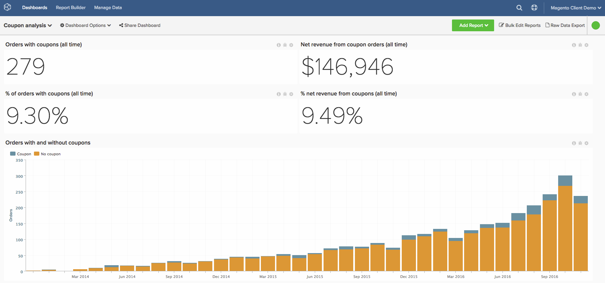

# Geavanceerde puntcodeanalyse

Kennis van de couponprestaties van uw bedrijf is een interessante manier om uw bestellingen te segmenteren en uw klanten beter te begrijpen. Dit onderwerp begeleidt u door de stappen om analyses tot stand te brengen om te begrijpen welke klanten u door coupons te gebruiken verkrijgt, hoe zij uitvoeren en algemeen coupongebruik volgen.

<!--{: width="800" height="375"}-->

Deze analyse bevat [ geavanceerde berekende kolommen ](../data-warehouse-mgr/adv-calc-columns.md).

## Aan de slag

Als eerste stap, moet u ervoor zorgen dat de volgende kolommen aan uw Data Warehouse worden gesynchroniseerd. Als dat niet het geval is, gaat u door en volgt u deze door naar `Manage Data` > `Data Warehouse` te navigeren en synchroniseert u het volgende:

* **verkoop\_flat\_order** lijst
* **coupon\_code**
* **basis\_disconto\_amount**

## Berekende kolommen

Kolommen om ongeacht het beleid van gastorden tot stand te brengen:

* `sales\_flat\_order` table
* **de Orde heeft toegepaste coupon?**
   * [!UICONTROL Column type]: `Same Table => CALCULATION`
   * [!UICONTROL Inputs]:
      * `A`: `coupon\_code`

   * &#x200B;

     [!UICONTROL Datatype]: `String`
   * [!UICONTROL Calculation]: als `A` null is, dan `No coupon` else `Coupon` end

* **\[INPUT\] klant\_id - couponcode**
   * [!UICONTROL Column type]: `Same Table => CALCULATION`
   * [!UICONTROL Inputs]:
      * `A`: `customer\_id`
      * `B`: `coupon\_code`

   * [!UICONTROL Datatype] String
   * [!UICONTROL Calculation]: `concat(A,' - ',B)`

* **Aantal orden met deze coupon**
   * [!UICONTROL Column type]: `Same Table => EVENT\_NUMBER`
   * Eigenaar van gebeurtenis:`INPUT customer_id - coupon code`
   * Gebeurtenisgroep: `created\_at`
   * [!UICONTROL Filters] : `Orders we count` filterset

Extra kolommen die moeten worden gemaakt als gastorders NIET worden ondersteund:

* `customer\_entity` table
   * **de eerste orde van de Klant omvatte een coupon? (Coupon/Geen coupon)**
   * [!UICONTROL Column type]: `Many to One => MAX`
   * [!UICONTROL Path]: `sales\_flat\_order.customer\_id = customer\_entity.entity\_id`
   * Selecteer een [!UICONTROL column]: `Order has coupon applied? (Coupon/No coupon)`
   * [!UICONTROL Filters]:
      * `A`: `Orders we count`
      * `B`: `Customer's order number = 1`

   * **de eerste coupon van de orde van de Klant &lbrace;**
      * [!UICONTROL Column type]: `Many to One => MAX`
      * [!UICONTROL Path]: `sales\_flat\_order.customer\_id = customer\_entity.entity\_id`
      * Selecteer een [!UICONTROL column]: `coupon\_code`
      * [!UICONTROL Filter]:
         * `A`: `Orders we count`
         * `B`: `Customer's order number = 1`

   * **het levenslevensaantal gebruikte coupons van de Klant**
      * [!UICONTROL Column type]: `Many to One => COUNT`
      * [!UICONTROL Path]: `sales\_flat\_order.customer\_id = customer\_entity.entity\_id`
      * [!UICONTROL Filter]:
         * `A`: `Orders we count`
         * `B`: `Order has coupon applied? (Coupon/No coupon) = Coupon`

   * **klant van de verwerving van coupon of de klant van de niet-couponverwerving**
      * [!UICONTROL Column type]: `Same Table => CALCULATION`
      * [!UICONTROL Inputs]:
         * `A`: `Customer's first order included a coupon? (Coupon/No coupon)`

      * &#x200B;

        [!UICONTROL Datatype]: `String`
      * [!UICONTROL Calculation]: **geval wanneer A=&#39;Coupon&#39; toen &quot;de aanschafklant van de Coupon&quot;anders &quot;de klant van de niet-couponaanschaf&quot;eind**

   * **Percentage van de orden van de klant met coupon**
      * [!UICONTROL Column type]: `Same Table => CALCULATION`
      * [!UICONTROL Inputs]:
         * `A`: `User's lifetime number of coupons used`
         * `B`: `User's lifetime number of orders`

      * &#x200B;

        [!UICONTROL Datatype]: `Decimal`
      * [!UICONTROL Calculation]: **geval wanneer A ongeldig of B ongeldig is of B=0 dan ongeldig anders A/B eind**

   * {het gebruik van de coupon van 0} Klant **&#x200B;**
      * [!UICONTROL Column type]: `Same Table => Calculation`
      * [!UICONTROL Inputs]:
         * `A`: `Percent of customer's orders with coupon`

      * &#x200B;

        [!UICONTROL Datatype]: `String`
      * [!UICONTROL Calculation]: **geval wanneer A ongeldig dan wanneer A=0 toen &quot;nooit gebruikte coupon&quot;wanneer A&lt;0.5 toen &quot;Meestal volledige prijs&quot;wanneer A=0.5 toen &quot;50/50&quot;wanneer A=1 toen &quot;Coupons slechts&quot;wanneer A>0.5 toen &quot;Meestal coupon&quot;anders &quot;Undefined&quot;eind** is.

* `sales\_flat\_order` table
   * **Eerste bestelling van klant inbegrepen coupon? (Coupon/Geen coupon)**
      * [!UICONTROL Column type]: `One to Many => JOINED\_COLUMN`
      * [!UICONTROL Path]: `sales\_flat\_order.customer\_id = customer\_entity.entity\_id`
      * Selecteer een [!UICONTROL column]: `Customer's first order included a coupon? (Coupon/No coupon)`
^

   * **de eerste coupon van de orde van de Klant &lbrace;**
      * [!UICONTROL Column type]: `One to Many => JOINED\_COLUMN`
      * [!UICONTROL Path]: `sales\_flat\_order.customer\_id = customer\_entity.entity\_id`
      * Selecteer een [!UICONTROL column]: `Customer's first order coupon?`

Extra kolommen die moeten worden gemaakt als gastorders NIET worden ondersteund:

* `sales\_flat\_order` table
   * **de eerste orde van de Klant omvatte een coupon? (Coupon/No coupon)** **-** gecreeerd door analist als deel van uw \[COUPON ANALYSE \] kaartje
   * **de eerste coupon van de orde van de Klant** {::} **-** gecreeerd door analist als deel van uw \ [COUPON ANALYSE \] kaartje

* **de levenslange aantal gebruikte coupons van de Klant** {::} **-** gecreeerd door analist als deel van uw \ [COUPON ANALYSE \] kaartje
* **klant van de verwerving van coupon of de klant van de niet-couponverwerving**
   * [!UICONTROL Column type]: `Same Table => CALCULATION`
   * [!UICONTROL Inputs]:
      * `A`: `Customer's first order included a coupon? (Coupon/No coupon)`

   * &#x200B;

     [!UICONTROL Datatype]: `String`
   * [!UICONTROL Calculation]: **geval wanneer A=&#39;Coupon&#39; toen &quot;de aanschafklant van de Coupon&quot;anders &quot;de klant van de niet-couponaanschaf&quot;eind**

* **Percentage van de orden van de klant met coupon**
   * [!UICONTROL Column type]: `Same Table => CALCULATION`
   * [!UICONTROL Inputs]:
      * `A`: `User's lifetime number of coupons used`
      * `B`: `User's lifetime number of orders`

   * &#x200B;

     [!UICONTROL Datatype]: `Decimal`
   * [!UICONTROL Calculation]: **geval wanneer A ongeldig of B ongeldig is of B=0 dan ongeldig anders A/B eind**

* {het gebruik van de coupon van 0} Klant **&#x200B;**
   * [!UICONTROL Column type]: `Same Table => Calculation`
   * [!UICONTROL Inputs]:
      * `A`: `Percent of customer's orders with coupon`

   * &#x200B;

     [!UICONTROL Datatype]: `String`
   * [!UICONTROL Calculation]: **geval wanneer A ongeldig dan wanneer A=0 toen &quot;nooit gebruikte coupon&quot;wanneer A&lt;0.5 toen &quot;Meestal volledige prijs&quot;wanneer A=0.5 toen &quot;50/50&quot;wanneer A=1 toen &quot;Coupons slechts&quot;wanneer A>0.5 toen &quot;Meestal coupon&quot;anders &quot;Undefined&quot;eind** is.

## Metrisch

* **Bedrag van de Korting van de Coupon**
   * `Orders we count`
   * `Order has coupon applied? (Coupon/No coupon)= Coupon`

* In de tabel `sales\_flat\_order`
* Deze metrisch voert a **Som** uit
* Op de kolom `discount\_amount`
* Besteld door de `created\_at` timestamp
* [!UICONTROL Filter]:

* **Aantal gebruikte coupons**
   * `Orders we count`
   * `Order has coupon applied? (Coupon/No coupon)= Coupon`

* In de tabel `sales\_flat\_order`
* Deze metrisch voert a **Telling** uit
* Op de kolom `entity\_id`
* Besteld door de `created\_at` timestamp
* [!UICONTROL Filter]:

>[!NOTE]
>
>Zorg ervoor om [ alle nieuwe kolommen als afmetingen aan metriek ](../data-warehouse-mgr/manage-data-dimensions-metrics.md) toe te voegen alvorens nieuwe rapporten te bouwen.

## Rapporten

* **% van klanten met en zonder coupon**
   * [!UICONTROL Metric]: `New customers`

* Metrisch `A`: `Coupon acquisitions`
* [!UICONTROL Time period]: `All time`
* &#x200B;
  [!UICONTROL Interval]: `None`
* [!UICONTROL Group by]: `Coupon acquisitions customer` of `Non coupon acquisition customer`
* &#x200B;
  [!UICONTROL Chart type]: `Pie`

* **Aantal van coupon-verworven en niet-coupon-verworven klanten**
   * [!UICONTROL Metric]: `New customers`

* Metrisch A: `Coupon acquisitions`
* [!UICONTROL Time period]: `All time`
* [!UICONTROL Interval]: `By Month`
* [!UICONTROL Group by]: `Coupon acquisitions customer` of `Non coupon acquisition customer`
* [!UICONTROL Chart type]: `Stacked column`

* **Gemiddelde levensinkomsten: Coupon Acq. (leeftijd van 90+ dagen)**
   * [!UICONTROL Metric]: `Average lifetime revenue`
   * [!UICONTROL Filter]:
      * De eerste bestelling van de klant bevatte een coupon (coupon/Geen coupon) = Coupon

* Metrisch `A`: `Average lifetime revenue (at least 3 months age)`
* [!UICONTROL Time period]: `X years ago to 90 days ago`
* &#x200B;
  [!UICONTROL Interval]: `None`
* &#x200B;
  [!UICONTROL Chart type]: `Scalar`

* **Gemiddelde levensinkomsten: Geen coupon Acq. (leeftijd van 90+ dagen)**
   * [!UICONTROL Metric]: gemiddelde inkomsten tijdens de levensduur
   * [!UICONTROL Filter]:
      * De eerste opdracht van de klant bevatte een coupon (Coupon/No Coupon) = Geen coupon

* Metrisch `A`: `Average lifetime revenue (at least 3 months age)`
* [!UICONTROL Time period]: `X years ago to 90 days ago`
* &#x200B;
  [!UICONTROL Interval]: `None`
* &#x200B;
  [!UICONTROL Chart type]: `Scalar`

* **Gemiddelde levensinkomsten door eerste orde coupon**
   * [!UICONTROL Metric]: `Average lifetime revenue`

* Metrisch `A`: `Average lifetime revenue`
* [!UICONTROL Time period]: `All time`
* &#x200B;
  [!UICONTROL Interval]: `None`
* [!UICONTROL Group by]: `Customer's first order's coupon`
* &#x200B;
  [!UICONTROL Chart type]: `Column`

>[!NOTE]
>
>Als u veel couponcodes hebt, zoals veel clients doen, wilt u een Top/Bottom toepassen, zoals Top 10, gesorteerd op Gem. levenslange inkomsten

* **de waarschijnlijkheid van de orde van de Herhaling: De verwervingen van de coupon**
   * [!UICONTROL Metric]: `Number of orders`
   * [!UICONTROL Filter]:
      * De eerste bestelling van de klant bevatte een coupon (coupon/Geen coupon) = Coupon

   * [!UICONTROL Metric]: `Number of orders`
   * [!UICONTROL Filter]:
      * De eerste bestelling van de klant bevatte een coupon (coupon/Geen coupon) = Coupon
      * Is de laatste bestelling van de klant? = Nee
   * &#x200B;

     [!UICONTROL -formule]: `B/A`
   * [!UICONTROL Format]: `Percentage %`

   * Selecteer statistisch significant getal in `Customer's by lifetime orders` -diagram. Wanneer het bekijken van de grafiek, als goede regel orderaantallen met 30 of meer klanten in het emmertje moet zoeken. Afhankelijk van uw gegevensset kan dit een groot aantal zijn, zodat u 1-10 gratis kunt toevoegen.

* Metrisch `A`: `Number of orders`
* Metrisch `B`: `Number of non last orders`
* [!UICONTROL Formula]: `Repeat order probability`
* [!UICONTROL Time period]: `All time`
* &#x200B;
  [!UICONTROL Interval]: `None`
* [!UICONTROL Group by]: `Customer's order number`
* [!UICONTROL Chart type]: `Bar chart`

* **Herhaal orde waarschijnlijkheid: Niet-coupon verwervingen**
   * [!UICONTROL Metric]: `Number of orders`
   * [!UICONTROL Filter]:
      * De eerste bestelling van de klant bevatte een coupon (Coupon/No Coupon) = Geen coupon

   * [!UICONTROL Metric]: `Number of orders`
   * [!UICONTROL Filter]:
      * De eerste bestelling van de klant bevatte een coupon (Coupon/No Coupon) = Geen coupon
      * Is de laatste bestelling van de klant? = Nee

   * &#x200B;

     [!UICONTROL -formule]: `B/A`
   * [!UICONTROL Format]: `Percentage %`

   * Selecteer statistisch significant getal in `Customer's by lifetime orders` grafiek of 1-5.

* Metrisch `A`: `Number of orders`
* Metrisch `B`: `Number of non last orders`
* [!UICONTROL Formula]: `Repeat order probability`
* [!UICONTROL Time period]: `All time`
* &#x200B;
  [!UICONTROL Interval]: `None`
* [!UICONTROL Group by]: `Customer's order number`
* [!UICONTROL Chart type]: `Bar chart`

* **coupon-verworven het gebruikstarief van de klantencoupon (herhaalde orden)**
   * [!UICONTROL Metric]: `New customers`
   * [!UICONTROL Filter]:
      * Klanten die geld aankopen of klanten die geen coupon aankopen = couponaankoop

   * [!UICONTROL Metric]: `Number of orders`
   * [!UICONTROL Filter]:
      * bestelnummer van de klant > 1
      * De eerste bestelling van de klant is voorzien van een coupon? (Coupon/No coupon) = Coupon

   * [!UICONTROL Metric]:`Number of orders`
   * [!UICONTROL Filter]:
      * bestelnummer van de klant > 1
      * De eerste bestelling van de klant is voorzien van een coupon? (Coupon/No coupon) = Coupon
      * Op de order is coupon toegepast? (Coupon/No coupon) = Coupon

   * &#x200B;

     [!UICONTROL -formule]: `C/B`
   * [!UICONTROL Format]: `Percentage %`

* Metrisch `A`: `Coupon-acquired customers`
* Metrisch `B`: `Number of repeat orders`
* Metrisch `C`: `Number of repeat orders with coupon`
* [!UICONTROL Formula]: `% of repeat orders with coupon`
* [!UICONTROL Time period]: `All time`
* &#x200B;
  [!UICONTROL Interval]: `None`
* &#x200B;
  [!UICONTROL Chart type]: `Table` (kan deze tabel omzetten voor een betere visualisatie)

* **niet-coupon-verworven het gebruikstarief van de klantencoupon (herhaalde orden)**
   * [!UICONTROL Metric]: `New customers`
   * [!UICONTROL Filter]:
      * Klanten die geld aankopen of klanten die geen coupon kopen = Niet-couponaankoop

   * [!UICONTROL Metric]: `Number of orders`
   * [!UICONTROL Filter]:
      * bestelnummer van de klant > 1
      * De eerste bestelling van de klant is voorzien van een coupon? (Coupon/No coupon) = Geen coupon

   * [!UICONTROL Metric]: `Number of orders`
   * [!UICONTROL Filter]:
      * bestelnummer van de klant > 1
      * De eerste bestelling van de klant is voorzien van een coupon? (Coupon/No coupon) = Geen coupon
      * Op de order is coupon toegepast? (Coupon/No coupon) = Coupon

   * &#x200B;

     [!UICONTROL -formule]: `C/B`
   * [!UICONTROL Format]: `Percentage %`

* Metrisch `A`: `Non-coupon-acquired customers`
* Metrisch `B`: `Number of repeat orders`
* Metrisch `C`: `Number of repeat orders with coupon`
* [!UICONTROL Formula]: `% of repeat orders with coupon`
* [!UICONTROL Time period]: `All time`
* &#x200B;
  [!UICONTROL Interval]: `None`
* &#x200B;
  [!UICONTROL Chart type]: `Table` (kan deze tabel omzetten voor een betere visualisatie)

* **het gebruiksdetails van de coupon (eerste tijdorden)**
   * [!UICONTROL Metric]: `Number of orders`
   * [!UICONTROL Filter]:
      * bestelnummer van de klant = 1
      * Aantal opdrachten met deze coupon > 10

   * &#x200B;

     [!UICONTROL Metric]: `Revenue`
   * [!UICONTROL Filter]:
      * bestelnummer van de klant = 1
      * Aantal opdrachten met deze coupon > 10

   * [!UICONTROL Metric]: `Coupon discount amount`
   * [!UICONTROL Filter]:
      * bestelnummer van de klant = 1
      * Aantal opdrachten met deze coupon > 10

   * [!UICONTROL Formula]: `B-C` (als C negatief is); B+C (als C positief is)
   * &#x200B;

     [!UICONTROL -indeling]: `Currency`

   * [!UICONTROL Metric]: `Average order value`
   * [!UICONTROL Filter]:
      * bestelnummer van de klant = 1
      * Aantal opdrachten met deze coupon > 10

* Metrisch `A`: `First time orders (FTO)`
* Metrisch `B`: `Revenue from FTO`
* Metrisch `C`: `Discounts applied to FTO`
* [!UICONTROL Formula]: `Gross revenue from FTO`
* Metrisch `E`: `Average order value for FTO`
* [!UICONTROL Time period]: `All time`
* &#x200B;
  [!UICONTROL Interval]: `None`
* [!UICONTROL Group by]: `coupon code`
* &#x200B;
  [!UICONTROL Chart type]: `Table`
>[!NOTE]
>
>Het aantal van 10 voor &quot;Aantal orders met deze coupon&quot; is willekeurig. Voel u vrij om de meest geschikte hoeveelheid voor dit filter te gebruiken.

* **Aantal orden met coupon (allen tijd)**
   * [!UICONTROL Metric]: `Number of coupons used`

* Metrisch `A`: `Number or orders with coupon`
* [!UICONTROL Time period]: `All time`
* &#x200B;
  [!UICONTROL Interval]: `None`
* &#x200B;
  [!UICONTROL Chart type]: `Scalar`

* **Netto opbrengst van orden met coupons (allen tijd)**
   * &#x200B;

     [!UICONTROL Metric]: `Revenue`
   * [!UICONTROL Filter]:
      * Op de order is coupon toegepast? (Coupon/No coupon) = Coupon

* Metrisch `A`: `Net revenue from orders with coupons`
* [!UICONTROL Time period]: `All time`
* &#x200B;
  [!UICONTROL Interval]: `None`
* &#x200B;
  [!UICONTROL Chart type]: `Scalar`

* **Kortingen van coupons (allen tijd)**
   * [!UICONTROL Metric]: `Number of coupons used`

* Metrisch `A`: `Coupon discount amount`
* [!UICONTROL Time period]: `All time`
* &#x200B;
  [!UICONTROL Interval]: `None`
* &#x200B;
  [!UICONTROL Chart type]: `Scalar`

* **Aantal orden met en zonder coupons**
   * [!UICONTROL Metric]: `Number of orders`

* Metrisch `A`: `Number of orders`
* [!UICONTROL Time period]: `Last 24 months`
* &#x200B;
  [!UICONTROL Interval]: `None`
* [!UICONTROL Group by]: `Order has coupon applied? (Coupon/No coupon)`
* [!UICONTROL Chart type]: `Stacked column`

* **gebruik van de coupon onder herhaalde gebruikers**
   * [!UICONTROL Metric]: `New customers`
   * [!UICONTROL Filter]:
      * Aantal bestellingen > 1

* Metrisch `A`: `New customers`
* [!UICONTROL Time period]: `All time`
* &#x200B;
  [!UICONTROL Interval]: `None`
* [!UICONTROL Group by]: `Customer's coupon usage`
* &#x200B;
  [!UICONTROL Chart type]: `Pie`

* **details van het gebruiksgebruik van de coupon**
   * [!UICONTROL Metric]: `Number of orders with coupon`
   * [!UICONTROL Filter]:
      * Aantal opdrachten met deze coupon > 10

   * &#x200B;

     [!UICONTROL Metric]: `Revenue`
   * [!UICONTROL Filter]:
      * Aantal opdrachten met deze coupon > 10

   * [!UICONTROL Metric]: `Coupon discount amount`
   * [!UICONTROL Filter]:
      * Aantal opdrachten met deze coupon > 10

   * [!UICONTROL Formula]: `B-C` (if `C` is negatief); `B+C` (if `C` is positief)
   * &#x200B;

     [!UICONTROL -indeling]: `Currency`

   * [!UICONTROL Formula]: `C/(B-C)` (if `C` is negatief); `C/(B+C)` (if `C` is positief)
   * &#x200B;

     [!UICONTROL -indeling]: `Percentage`

   * [!UICONTROL Metric]: `Average order value`
   * [!UICONTROL Filter]:
      * Aantal opdrachten met deze coupon > 10

   * &#x200B;

     [!UICONTROL -formule]: `C/A`
   * &#x200B;

     [!UICONTROL -indeling]: `Currency`

   * [!UICONTROL Metric]: `Distinct buyers`
   * [!UICONTROL Filter]:
      * Aantal opdrachten met deze coupon > 10

* Metrisch `A`: `Number of orders`
* Metrisch `B`: `Net revenue from orders`
* Metrisch `C`: `Total discounts applied`
* [!UICONTROL Formula]: `Gross revenue`
* [!UICONTROL Formula]: `% discounted`
* Metrisch `F`: `Average net order value`
* [!UICONTROL Formula]: `Average order discount`
* Metrisch `H`: `Distinct buyers`
* [!UICONTROL Time period]: `All time`
* &#x200B;
  [!UICONTROL Interval]: `None`
* [!UICONTROL Group by]: `coupon code`
* &#x200B;
  [!UICONTROL Chart type]: `Table`

>[!NOTE]
>
>Het aantal van 10 voor &quot;Aantal orders met deze coupon&quot; is willekeurig. Voel u vrij om de meest geschikte hoeveelheid voor dit filter te gebruiken.

Nadat u alle rapporten hebt gecompileerd, kunt u deze naar wens op het dashboard ordenen. Het resultaat ziet er mogelijk uit als de afbeelding boven aan de pagina.

Als u in om het even welke vragen loopt terwijl het bouwen van deze analyse, of eenvoudig het Professionele team van de Diensten in dienst willen nemen, [ contactsteun ](https://experienceleague.adobe.com/docs/commerce-knowledge-base/kb/troubleshooting/miscellaneous/mbi-service-policies.html).

>[!NOTE]
>
>Vanaf Adobe Commerce 2.4.7, kunnen de klanten **quote_coupons** en **sales_order_coupons** lijsten gebruiken om inzicht op te krijgen hoe de klant veelvoudige coupons gebruikt.

