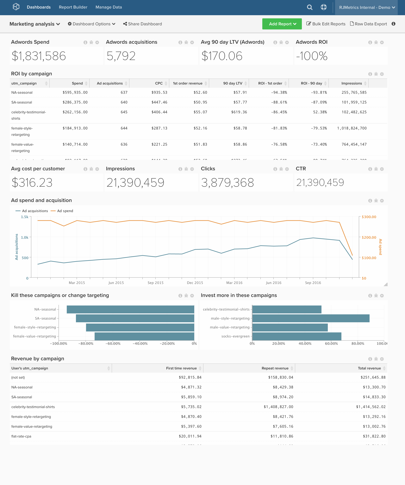

# Marketing ROI

>[!NOTE]
>
>Dit onderwerp bevat instructies voor cliënten die de originele architectuur en de nieuwe architectuur gebruiken. U bent op de [nieuwe architectuur](../../administrator/account-management/new-architecture.md) als u de sectie &quot;Weergaven Data Warehouse&quot; hebt beschikbaar nadat u Gegevens beheren hebt geselecteerd op de hoofdwerkbalk.

Als u geld uitgeeft aan online reclame, wilt u uw rendement op dit geld volgen en gegevensgedreven besluiten over verdere investeringen nemen. Dit onderwerp toont hoe te opstelling een dashboard dat uw kanaalanalyse - met inbegrip van ROI in bijeengevoegde en door campagne volgt.

Voordat u aan de slag gaat, wilt u verbinding maken met de [!DNL [Facebook Ads]](../importing-data/integrations/facebook-ads.md), [!DNL [Adwords]](../importing-data/integrations/google-adwords.md), en [!DNL [Google Ecommerce]](../importing-data/integrations/google-ecommerce.md) en brengt extra online en bestede gegevens in. Deze analyse bevat [geavanceerd berekende kolommen](../data-warehouse-mgr/adv-calc-columns.md).

## Geconsolideerde tabellen

**Oorspronkelijke architectuur:** Om uw uitgaven uit diverse bronnen samen te brengen, zoals [!DNL Facebook Ads] of [!DNL Google Adwords], raadt Adobe aan een **geconsolideerde tabel** van al je advertentie-uitgaven. U hebt een analist nodig om deze stap voor u te voltooien. Als dat niet het geval is, [een supportverzoek indienen](../../guide-overview.md#Submitting-a-Support-Ticket) met het onderwerp `[MARKETING ROI ANALYSIS]`en een analist maakt deze tabel.

**Nieuwe architectuur:** U kunt het voorbeeld volgen in [Deze analysebibliotheek](../../data-analyst/data-warehouse-mgr/create-dw-views.md) onderwerp. De geconsolideerde Lijsten zijn nu genoemd geworden Mening van de Data Warehouse over de nieuwe architectuur.

## Berekende kolommen

Te maken kolommen

* **`Consolidated Digital Ad Spend`** table
* **`Campaign name`** wordt gemaakt door een Adobe-analist als onderdeel van uw **[ANALYSE VAN HET VERKOOPPERVLAK]** kaartje

**Oorspronkelijke en nieuwe architecturen:**

* **`sales_flat_order`** table
   * **`Order's GA campaign`**
      * Selecteer een definitie: `Joined Column`
      * [!UICONTROL Create Path]:
      * 
        [!UICONTROL Many]: `sales_flat_order.increment_id`
      * 
        [!UICONTROL One]: `ecommerce####.transaction_id`

      * Selecteer een [!UICONTROL table]: `ecommerce####`
      * Selecteer een [!UICONTROL column]: `campaign`
      * [!UICONTROL Path]: `sales_flat_order.increment_id = ecommerce#####.transactionID`

   * **`Order's GA medium`**
      * Selecteer een definitie: Samengevoegde kolom
      * Selecteer een [!UICONTROL table]: `ecommerce####`
      * Selecteer een [!UICONTROL column]: `medium`
      * [!UICONTROL Path]: sales_flat_order.increment_id = e-commerce####.transactionId

   * **`Order's GA source`**
      * Selecteer een definitie: Samengevoegde kolom
      * Selecteer een [!UICONTROL table]: `ecommerce####`
      * Selecteer een [!UICONTROL column]: `source`
      * [!UICONTROL Path]: sales_flat_order.increment_id = e-commerce####.transactionId ^

* **`customer_entity`** table
* **`Customer's first order GA campaign`**
   * Selecteer een definitie: `Max`
   * Selecteer een [!UICONTROL table]: `sales_flat_order`
   * Selecteer een [!UICONTROL column]: `Order's GA campaign`
   * [!UICONTROL Path]: `sales_flat_order.customer_id = customer_entity.entity_id`
   * [!UICONTROL Filter]:
      * `Orders we count`
      * `Customer's order number = 1`

* **`Customer's first order GA source`**
   * Selecteer een definitie: `Max`
   * Selecteer een [!UICONTROL table]: `sales_flat_order`
   * Selecteer een [!UICONTROL column]: `Order's GA source`
   * [!UICONTROL Path]: sales_flat_order.customer_id = customer_entiteit.entiteit_id
   * [!UICONTROL Filter]:
      * `Orders we count`
      * `Customer's order number = 1`

* **`Customer's first order GA medium`**
   * Selecteer een definitie: `Max`
   * Selecteer een [!UICONTROL table]: `sales_flat_order`
   * Selecteer een [!UICONTROL column]: `Order's GA medium`
   * [!UICONTROL Path]: `sales_flat_order.customer_id = customer_entity.entity_id`
   * [!UICONTROL Filter]:
      * `Orders we count`
      * `Customer's order number = 1`

* **`sales_flat_order`** table
* **`Customer's first order GA campaign`**
   * Selecteer een definitie: `Joined Column`
   * Selecteer een [!UICONTROL table]: `customer_entity`
   * Selecteer een [!UICONTROL column]: `Customer's first order GA campaign`
   * [!UICONTROL Path]: `sales_flat_order.customer_id = customer_entity.entity_id`

* **`Customer's first order GA source`**
   * Selecteer een definitie: Samengevoegde kolom
   * Selecteer een [!UICONTROL table]: `customer_entity`
   * Selecteer een [!UICONTROL column]: `Customer's first order GA source`
   * [!UICONTROL Path]: `sales_flat_order.customer_id = customer_entity.entity_id`

* **`Customer's first order GA medium`**
   * Selecteer een definitie: `Joined Column`
   * Selecteer een [!UICONTROL table]: `customer_entity`
   * Selecteer een [!UICONTROL column]: `Customer's first order GA medium`
   * [!UICONTROL Path]: `sales_flat_order.customer_id = customer_entity.entity_id`

## Metrisch

* **Advertentie-uitgaven**
* In de **`Consolidated Digital Ad Spend`** table
* Deze maatstaf voert een **Som**
* Op de **`adCost`** kolom
* Besteld door de **`date`** tijdstempel

* **Advertentie-impressies**
* In de **`Consolidated Digital Ad Spend`** table
* Deze maatstaf voert een **Som**
* Op de **`Impressions`** kolom
* Besteld door de **`Month`** tijdstempel

* **Advertentieklikken**
* In de **`Consolidated Digital Ad Spend`** table
* Deze maatstaf voert een **Som**
* Op de **`adClicks`** kolom
* Besteld door de **`Month`** tijdstempel

>[!NOTE]
>
>Zorg ervoor dat [alle nieuwe kolommen als afmetingen toevoegen aan metriek](../../data-analyst/data-warehouse-mgr/manage-data-dimensions-metrics.md) alvorens nieuwe rapporten op te stellen.

## Rapporten

* **Advertentie-uitgaven (altijd)**
   * [!UICONTROL Metric]: Advertentie-uitgaven

* Metrisch `A`: Advertentie-uitgaven
* [!UICONTROL Time period]: `All time`
* 
  [!UICONTROL Interval]: `None`
* 
  [!UICONTROL Chart Type]: `Scalar`

* **Klantenovernames toevoegen (altijd)**
   * [!UICONTROL Metric]: `New customers`
   * [!UICONTROL Filters]:
      * `User's first order's source LIKE %google%`
      * `User's first order's source LIKE %facebook%`
      * `User's first order's source LIKE %fb%`
      * `User's first order's medium IN cpc, ppc`
      * Filterlogica: ([`A`] OF [`B`] OF [`C`]) EN [`D`]

* Metrisch `A`: `Ad customer acquisitions`
* [!UICONTROL Time period]: `All time`
* 
  [!UICONTROL Interval]: `None`
* 
  [!UICONTROL Chart Type]: `Scalar`

* **Ad ROI**
   * [!UICONTROL Metric]: Advertentie-uitgaven

   * [!UICONTROL Metric]: `New customers`
   * [!UICONTROL Filters]:
      * `User's first order's source LIKE %google%`
      * `User's first order's source LIKE %facebook%`
      * `User's first order's source LIKE %fb%`
      * `User's first order's medium IN cpc, ppc`
      * Filterlogica: ([`A`] OF [`B`] OF [`C`]) EN [`D`]

   * [!UICONTROL Metric]: Gemiddelde inkomsten tijdens de levensduur
   * [!UICONTROL Filters]:
      * `User's first order's source LIKE %google%`
      * `User's first order's source LIKE %facebook%`
      * `User's first order's source LIKE %fb%`
      * `User's first order's medium IN cpc, ppc`
      * Filterlogica: ([`A`] OF [`B`] OF [`C`]) EN [`D`]

   * [!UICONTROL Formula]: `((C - (A / B)) / (A / B))`
   * 
     [!UICONTROL Format]: `Percentage`

* Metrisch `A`: `Ad Spend (hide)`
* Metrisch `B`: `Ad customer acquisitions (hide)`
* Metrisch `C`: `Average LTV (hide)`
* [!UICONTROL Formula]: `Ads ROI`
* [!UICONTROL Time period]: `All time`
* 
  [!UICONTROL Interval]: `None`
* 
  [!UICONTROL Chart Type]: `Scalar`

* **Orders op gr-medium**
   * 
     [!UICONTROL Metric]: `Orders`

* Metrisch `A`: `Orders`
* [!UICONTROL Time period]: `All time`
* [!UICONTROL Interval]: `By Month`
* [!UICONTROL Group by]: `Order's medium`
* 
  [!UICONTROL Chart Type]: `Area`

* **ROI per campagne toevoegen**
   * [!UICONTROL Metric]: `Ad Spend`

   * [!UICONTROL Metric]:`New customers`
   * [!UICONTROL Filters]:
      * `User's first order's source LIKE %google%`
      * `User's first order's source LIKE %facebook%`
      * `User's first order's source LIKE %fb%`
      * `User's first order's medium IN cpc, ppc`
      * Filterlogica: ([`A`] OF [`B`] OF [`C`]) EN [`D`]

   * [!UICONTROL Metric]: Gemiddelde inkomsten tijdens de levensduur
   * [!UICONTROL Filters]:
      * `User's first order's source LIKE %google%`
      * `User's first order's source LIKE %facebook%`
      * `User's first order's source LIKE %fb%`
      * `User's first order's medium IN cpc, ppc`
      * Filterlogica: ([`A`] OF [`B`] OF [`C`]) EN [`D`]

   * [!UICONTROL Metric]: Gemiddeld aantal orders gedurende de looptijd
   * [!UICONTROL Filters]:
      * `User's first order's source LIKE %google%`
      * `User's first order's source LIKE %facebook%`
      * `User's first order's source LIKE %fb%`
      * `User's first order's medium IN cpc, ppc`
      * Filterlogica: ([`A`] OF [`B`] OF [`C`]) EN [`D`]

   * [!UICONTROL Formula]: `(A / B)`
   * 
     [!UICONTROL Format]: `Currency`

   * [!UICONTROL Formula]: `(C - (A / B))`
   * 
     [!UICONTROL Format]: `Currency`

   * [!UICONTROL Formula]: `((C - (A / B)) / (A / B))`
   * 
     [!UICONTROL Format]: `Percentage`

   * [!UICONTROL Metric]: `Ad Clicks`

   * [!UICONTROL Metric]: `Ad Impressions`

   * [!UICONTROL Formula]: `(H / I)`
   * 
     [!UICONTROL Format]: `Percentage`

   * [!UICONTROL Formula]: `(A / H)`
   * 
     [!UICONTROL Format]: `Currency`

* Metrisch `A`: `Ad Spend` (verbergen)
* Metrisch `B`: `Ad customer acquisitions`
* Metrisch `C`: `Average LTV`
* Metrisch `D`: `Average lifetime # of orders`
* 
  [!UICONTROL-formule]: `CAC`
* [!UICONTROL Formula]: `Avg return`
* [!UICONTROL Formula]: `Ads ROI`
* Metrisch `H`: `adClicks`
* Metrisch `I`: `Impressions`
* 
  [!UICONTROL-formule]: `CTR`
* 
  [!UICONTROL-formule]: `CPC`
* [!UICONTROL Time period]: `All time`
* 
  [!UICONTROL Interval]: `None`
* 
  [!UICONTROL Group door]: `campaign` (Gebruik de campagne &#39;First Order&#39; van de Klant voor niet-ad-uitgaventabelgegevens)
* 
  [!UICONTROL Chart Type]: `Table`

Als u op om het even welke vragen loopt terwijl het bouwen van deze analyse, of eenvoudig het Professionele team van de Diensten wilt in dienst nemen, [contactondersteuning](https://experienceleague.adobe.com/docs/commerce-knowledge-base/kb/troubleshooting/miscellaneous/mbi-service-policies.html).

### Verwante

* [Aanbevolen procedures voor UTM-codering in [!DNL Google Analytics]](../../best-practices/utm-tagging-google.md)
* [Hoe werkt [!DNL Google Analytics] UTM-toewijzingswerk?](../analysis/utm-attributes.md)
