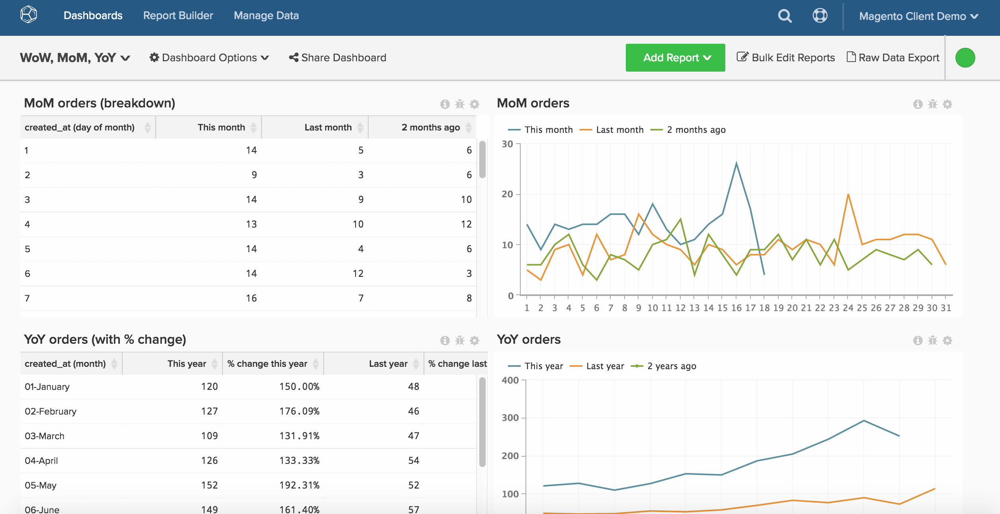
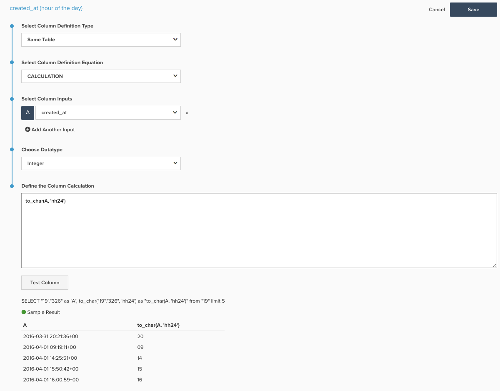

# Rapportage over tijdvakken

>[!NOTE]
>
>Dit onderwerp bevat instructies voor cliënten die de originele architectuur en de nieuwe architectuur gebruiken. U bent op de [nieuwe architectuur](../../administrator/account-management/new-architecture.md) als u de [!DNL _Weergaven Data Warehouse_] sectie beschikbaar na het selecteren [!DNL Manage Data] van de hoofdwerkbalk.

De rapportbouwer staat u toe om tendensen in tijd gemakkelijk te zien en perspectief voor tijdsperioden te veranderen u kunt willen vergelijken. Dit onderwerp toont hoe te opstelling een dashboard om een niveau dieper te gaan om u toe te staan om rapporten voor week over week, maand over maand en jaar over jaaranalyse te creëren.

Voordat u aan de slag gaat, moet u de perspectieven nader onderzoeken [hier](../../tutorials/using-visual-report-builder.md) en onafhankelijke tijdopties [hier](../../tutorials/time-options-visual-rpt-bldr.md).

Deze analyse bevat [geavanceerd berekende kolommen](../data-warehouse-mgr/adv-calc-columns.md).

## Berekende kolommen

* **`Sales_flat_order`** table
* **Oorspronkelijke architectuur:** de onderstaande kolommen worden gemaakt door een analist als onderdeel van uw `[YoY WoW MoM ANALYSIS]` kaartje
* `created_at (month-day)`
* `created_at (month)`
* `created_at (day of the month)`
* `created_at (day of the week)`
* `created_at (hour of the day)`

* **Nieuwe architectuur:** SQL hieronder met een foto van een voorbeeld voor hoe te om deze berekening tot stand te brengen
   * `created_at (month-day)` [!UICONTROL Calculation]: **to_char(A, &#39;mm-dd&#39;)**
   * `created_at (month)` [!UICONTROL Calculation]: **to_char(A, &#39;mm-month&#39;)**
   * `created_at (day of the month)`&lt; [!UICONTROL Calculation]: **to_char(A, &#39;dd&#39;)**
   * `created_at (day of the week)` [!UICONTROL Calculation]: **to_char(A, &#39;d-dag&#39;)**
   * **`created_at (hour of the day)` [!UICONTROL Calculation]: **to_char(A, &#39;h24&#39;)**
     

## Metrisch

Geen.

>[!NOTE]
>
>Zorg ervoor dat [alle nieuwe kolommen als afmetingen toevoegen aan metriek](../data-warehouse-mgr/manage-data-dimensions-metrics.md) alvorens nieuwe rapporten op te stellen.

## Rapporten

* **YoY-grafiek**
   * [!UICONTROL Metric]: `Number of orders`

   * [!UICONTROL Metric]: `Number of orders`
   * [!UICONTROL Time options]: `Time range (Custom)`: `2 years ago to 1 year ago`

   * [!UICONTROL Show top/bottom]: bovenste 100%, gesorteerd op **`created_at (month-day)`***

* Metrisch `A`: `This year`
* Metrisch `B`: `Last year`
* [!UICONTROL Time period]: `1 year ago to 0 years ago`
* 
  [!UICONTROL Interval]: `None`
* [!UICONTROL Group by]: `created_at (month-day)`
* 
  [!UICONTROL Chart Type]: `Line`

* **MoM-grafiek**
   * [!UICONTROL Metric]: `Number of orders`

   * [!UICONTROL Metric]: `Number of orders`
   * Tijdopties: `Time range (Custom)`: `2 months ago to 1 month ago`

   * Boven/onder tonen: Boven 100% gesorteerd op **`created_at (day of month)`***

* Metrisch `A`: Deze maand*
* Metrisch `B`: Vorige maand*
* [!UICONTROL Time period]: een maand geleden tot 0 maanden geleden
* 
  [!UICONTROL Interval]: None
* [!UICONTROL Group by]: `created_at (day of month)`
* 
  [!UICONTROL Chart Type]: Line

* **W-diagram**
   * [!UICONTROL Metric]: `Number of orders`

   * [!UICONTROL Metric]: `Number of orders`
   * [!UICONTROL Time options]: `Time range (Custom)`: `2 weeks ago to 1 week ago`

   * [!UICONTROL Show top/bottom]: bovenste 100%, gesorteerd op `created_at (day of week)`

* Metrisch `A`: `This week`
* Metrisch `B`: `Last week`
* [!UICONTROL Time period]: `1 week ago to 0 weeks ago`
* 
  [!UICONTROL Interval]: `None`
* [!UICONTROL Group by]: `created_at (day of week)`
* 
  [!UICONTROL Chart Type]: `Line`

* **DoD-diagram**
   * [!UICONTROL Metric]: `Number of orders`

   * [!UICONTROL Metric]: `Number of orders`
   * [!UICONTROL Time options]: `Time range (Custom)`: `2 days ago to 1 day ago`

   * [!UICONTROL Show top/bottom]: bovenste 100%, gesorteerd op `created_at (hour of day)`

* Metrisch `A`: `Today`
* Metrisch B: `Yesterday`
* [!UICONTROL Time period]: `1 day ago to 0 days ago`
* 
  [!UICONTROL Interval]: `None`
* [!UICONTROL Group by]: `created_at (hour of day)`
* 
  [!UICONTROL Chart Type]: `Line`

Nadat u alle rapporten hebt gecompileerd, kunt u deze naar wens op het dashboard ordenen. Het resultaat ziet er mogelijk uit als de afbeelding boven aan deze pagina.
