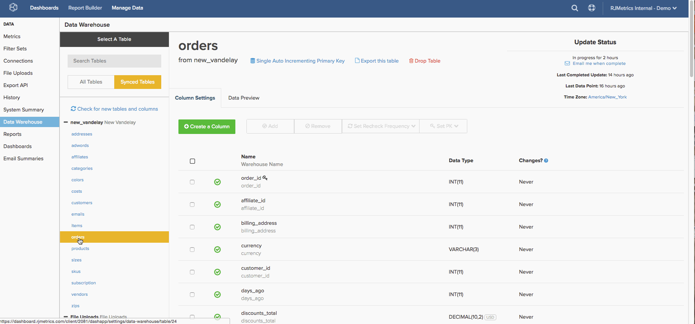

# [!DNL Google ECommerce] Afmetingen bouwen

>[!NOTE]
>
>Vereist [ toestemmingen Admin ](../../administrator/user-management/user-management.md).

Nu u [ wordt gebeëindigd verbindend uw [!DNL Google ECommerce] rekening ](../../data-analyst/importing-data/integrations/google-ecommerce.md), wat kunt u met die gegevens in [!DNL Commerce Intelligence] doen? Dit onderwerp begeleidt u door bouwdimensies die uw gegevens van de eCommerce met uw orden en klantengegevens verbinden.

De behandelde dimensies geven u de capaciteit om analyses te bouwen die [ essentiële vragen over uw marketing kanalen en campagnes ](../../data-analyst/analysis/most-value-source-channel.md) beantwoorden. Welk percentage van opbrengst komt uit elke bron? Hoe vergelijk de levensduurwaarde van [!DNL Facebook] overgenomen klanten met die van [!DNL Google]?

## Voorwaarden en overzicht

Als u de afmetingen in dit onderwerp wilt maken, hebt u een [!DNL Google ECommerce] -tabel, een `orders` -tabel en een `customers` -tabel nodig. Die lijsten moeten [ aan uw Data Warehouse ](../../data-analyst/data-warehouse-mgr/tour-dwm.md) worden gesynchroniseerd alvorens de dimensies kunnen worden gebouwd. Tabellen die worden gesynchroniseerd, worden weergegeven in de sectie `Synced Tables` van `Data Warehouse Manager` .

Hier volgt een snelle blik bij het synchroniseren van lijsten en kolommen als u een verfrisser nodig hebt:

Nadat u een samenvoeging hebt gemaakt van de tabel `orders` naar de tabel [!DNL Google eCommerce] , maakt u de eerste drie dimensies in de onderstaande lijst. Vervolgens gebruikt u deze afmetingen om drie gebruikers-/klantafmetingen in de tabel `customers` te maken. Als u wilt voltooien, voegt u deze kolommen bij de tabel `orders` .

Hieronder worden de afmetingen beschreven:

* **de lijst van Orden**

* Bron van bestelling [!DNL Google Analytics]
* Order&#39;s [!DNL Google Analytics] medium
* De campagne van de orde [!DNL Google Analytics] A
* De eerste bestelbron van de klant [!DNL Google Analytics]
* De eerste bestelling van de klant [!DNL Google Analytics] medium
* De [!DNL Google Analytics] -campagne van de eerste bestelling van de klant

* **lijst van Klanten**

* De eerste bestelbron van de klant [!DNL Google Analytics]
* De eerste bestelling van de klant [!DNL Google Analytics] medium
* De [!DNL Google Analytics] -campagne van de eerste bestelling van de klant

## De afmetingen opbouwen

Om dimensies tot stand te brengen, open de [ Manager van Data Warehouse ](../data-warehouse-mgr/tour-dwm.md) door **[!UICONTROL Data]** > **[!UICONTROL Data Warehouse]** te klikken.

### Tabel met bestellingen, rond 1

Dit voorbeeld bouwt de **Source [!DNL Google Analytics] dimensie van de Orde** .

1. Klik in de lijst met tabellen in de Data Warehouse op de tabel (in dit geval `orders` ) die uw bestelgegevens bevat.
1. Klik op **[!UICONTROL Create a Column]**.
1. Geef de kolom een naam.
1. Selecteer `Joined Column` van [ definitie dropdown ](../data-warehouse-mgr/calc-column-types.md). Dit voorbeeld werkt met a [ één-aan-één verhouding ](../data-warehouse-mgr/table-relationships.md), die de `eCommerce.transactionID` kolom aan precies één rij van de `orders` lijst aanpast.
1. Vervolgens moet u het pad definiëren, of de manier waarop de tabel en kolom worden verbonden. Klik op de vervolgkeuzelijst `Select a table and column` .
1. Het pad dat u nodig hebt, is niet beschikbaar. U moet dus een nieuw pad maken. Klik op **[!UICONTROL Create new Path]**.
1. In het venster dat wordt weergegeven, stelt u de zijde `Many` in op `orders.order\_id` of de kolom in de tabel `orders` die de volgorde-id bevat.
1. Zoek aan de zijde van `One` de tabel `Google ECommerce` en stel vervolgens de kolom in op `transactionID` .

   

1. Klik op **[!UICONTROL Save]** om het pad te maken.
1. Klik nogmaals op het vervolgkeuzemenu **[!UICONTROL Select table and column]** nadat het pad is toegevoegd.
1. Zoek de tabel `ECommerce` en klik op de kolom `Source` . Hierdoor worden de orders aan de broninformatie gekoppeld.
1. Als u weer in het tabelschema bent, klikt u nogmaals op **[!UICONTROL Save]** om de dimensie te maken.

Hier is een blik op het hele proces:

Daarna, probeer creërend **middel [!DNL Google Analytics] en** van de Orde `campaign`. Niet veel veranderingen voor deze dimensies, dus geef het een poging. Maar als u geplakt wordt, kunt u uit [ het eind van dit artikel ](#stuck) controleren om te zien wat verschillend is.

### Klantentabel {#customers}

Dit voorbeeld bouwt de **bron [!DNL Google Analytics] dimensie van de eerste orde van de Klant &lbrace;.**

1. Klik in de lijst met tabellen in de Data Warehouse op de tabel (in dit geval `customers` ) die uw klantgegevens bevat.
1. Klik op **[!UICONTROL Create a Column]**.
1. Geef de kolom een naam.
1. Voor dit voorbeeld, selecteer de `is MAX` definitie van [ dropdown definitie ](../../data-analyst/data-warehouse-mgr/calc-column-types.md). De definitie van `is MIN` werkt ook als deze wordt toegepast op een tekstkolom met slechts één mogelijke waarde. Het belangrijkste onderdeel is ervoor te zorgen dat er juiste filters worden ingesteld, wat u later doet.
1. Klik op het vervolgkeuzemenu **[!UICONTROL Select a table and column]** en selecteer de `orders` -tabel en vervolgens de `Order's [!DNL Google Analytics] source` -kolom.
1. Klik op **[!UICONTROL Save]**.
1. Als u weer in het tabelschema bent, klikt u op de vervolgkeuzelijst `Options` en vervolgens op `Filters` .
1. Klik op **[!UICONTROL Add Filter Set]** en selecteer vervolgens de `Orders we count` -set. U wilt alleen orders opnemen in de orders die u telt en waarvoor een filterset is ingesteld, zodat het belangrijk is dat deze filterset is geselecteerd.
1. Klik op **[!UICONTROL Add Filter]**. U wilt de bron [!DNL Google Analytics] van de eerste orde van de klant vinden, zodat moet u een filter toevoegen:

   _orders.bestelnummer van de klant = 1

   _
1. Klik op **[!UICONTROL Save]** om de dimensie te maken.

Daarna, probeer creërend **middel [!DNL Google Analytics] en** van de eerste orde van de Klant 1&rbrace;. `campaign` Niet veel veranderingen voor deze dimensies, dus geef het een poging. Maar als u geplakt wordt, kunt u uit [ het eind van dit artikel ](#stuck) controleren om te zien wat verschillend is.

### Bonus: Orders table, rond 2

U kunt hier ophouden als u wilt, maar deze sectie laat verdere analyse door de **dimensies [!DNL Google Analytics] van de eerste orde van de Klant te brengen** toe u in de [ laatste sectie ](#customers) lijst creeerde. `orders` Door de afmetingen in deze sectie te maken, kunt u alle maatstaven analyseren die op de `orders` -tabel zijn gebaseerd - `Revenue` , `Number of orders` , `Distinct buyers` , enzovoort - met behulp van de [!DNL Google Analytics] -kenmerken van de eerste volgorde van een klant.

In dit voorbeeld wordt de `Customer's first order's [!DNL Google Analytics] source` -dimensie aan de `orders` -tabel toegevoegd.

1. Klik in de lijst met tabellen in de Data Warehouse op de tabel (in dit geval `orders` ) die uw bestelgegevens bevat.
1. Klik op **[!UICONTROL Create a Column]**.
1. Geef de kolom een naam.
1. Selecteer `Joined Column` in het keuzemenu Definitie. Hierdoor worden de afmetingen van de klant die u in de vorige sectie hebt gemaakt, samengevoegd met de tabel `orders` .
1. Klik op het vervolgkeuzemenu **[!UICONTROL Select a table and column]** en selecteer vervolgens de kolommen `customers` table en `Customer's first order's [!DNL Google Analytics] source` .
1. Als een pad niet automatisch wordt ingevuld, selecteert u het pad dat de klanten het beste verbindt en de tabellen bestelt.
1. Klik op **[!UICONTROL Save]** om de dimensie te maken.

Hier is een blik op het hele proces:

Voltooi de bewerking door de `Customer's first order's` medium en `campaign` afmetingen aan de `orders` tabel te koppelen. Sluit zich aan bij de dimensies, en als er problemen zijn, dan controle uit [ het eind van het artikel ](#stuck) als u hulp nodig hebt.

### Omloop omhoog

U hebt de afmetingen gemaakt, wat betekent dat u nu krachtige analyses kunt maken die de prestaties van de verschillende kanalen en campagnes volgen. Herinner dat de **nieuwe kolommen niet beschikbaar zullen zijn tot nadat de volgende update** voltooit.

Sommige populairdere dimensies worden in dit onderwerp behandeld, maar de lucht is de grens - probeer creërend uw of voel vrij om ons te pingelen als u met het onderzoeken van andere opties wilt helpen. 

### Aanvullende opmerkingen

**`Orders`table #1**: Wanneer u het `Order's [!DNL Google Analytics]` medium en `campaign` -afmetingen maakt, is het verschil de kolommen die in stap 12 zijn geselecteerd. In dit voorbeeld was de kolom `Source` .

**`Customers`table**: Wanneer u de `Customer's first order's [!DNL Google Analytics]` medium- en `campaign` afmetingen maakt, is het verschil de kolommen die in stap 5 zijn geselecteerd. In dit voorbeeld was de kolom `Order's [!DNL Google Analytics]` source.

**`Orders`table #2**: Wanneer u de kolommen `Customer's first order's [!DNL Google Analytics]` medium en `campaign` toevoegt aan de tabel `orders` , is het verschil de kolommen die u in stap 5 hebt geselecteerd. In dit voorbeeld was de kolom `Customer's first order's [!DNL Google Analytics]` source.
