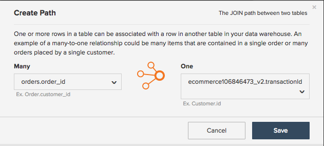

# Opbouwen [!DNL Google ECommerce] Dimension

>[!NOTE]
>
>Vereisten [Beheerdersmachtigingen](../../administrator/user-management/user-management.md).

Nu bent u klaar [verbinden uw[!DNL Google ECommerce] account](../../data-analyst/importing-data/integrations/google-ecommerce.md), wat kunt u doen met die gegevens in [!DNL Commerce Intelligence]? Dit onderwerp begeleidt u door bouwdimensies die uw gegevens van de eCommerce met uw orden en klantengegevens verbinden.

Met de vermelde afmetingen kunt u analyses maken die [belangrijke vragen beantwoorden over uw marketingkanalen en -campagnes](../../data-analyst/analysis/most-value-source-channel.md). Welk percentage van opbrengst komt uit elke bron? Hoe bepaalt de levenswaarde van [!DNL Facebook] overgenomen klanten vergelijken met klanten van [!DNL Google]?

## Voorwaarden en overzicht

Als u de afmetingen in dit onderwerp wilt maken, hebt u een [!DNL Google ECommerce] tabel `orders` en een `customers` tabel. Deze tabellen moeten [gesynchroniseerd met uw Data Warehouse](../../data-analyst/data-warehouse-mgr/tour-dwm.md) voordat de afmetingen kunnen worden opgebouwd. Tabellen die worden gesynchroniseerd, worden weergegeven in het dialoogvenster `Synced Tables` van de `Data Warehouse Manager`.

Hier volgt een snelle blik bij het synchroniseren van lijsten en kolommen als u een verfrisser nodig hebt:

Nadat u een samenvoeging hebt gemaakt met de `orders` aan de [!DNL Google eCommerce] in de tabel hieronder maakt u de eerste drie dimensies. Vervolgens gebruikt u deze afmetingen om drie gebruikers-/klantendimensies te maken in de `customers` tabel. Als u wilt voltooien, voegt u deze kolommen toe aan de `orders` tabel.

Hieronder worden de afmetingen beschreven:

* **Orderentabel**

* Bestelling [!DNL Google Analytics] bron
* Bestelling [!DNL Google Analytics] medium
* Bestelling [!DNL Google Analytics]Een campagne
* Eerste bestelling van de klant [!DNL Google Analytics] bron
* Eerste bestelling van de klant [!DNL Google Analytics] medium
* Eerste bestelling van de klant [!DNL Google Analytics] campagne

* **Klantentabel**

* Eerste bestelling van de klant [!DNL Google Analytics] bron
* Eerste bestelling van de klant [!DNL Google Analytics] medium
* Eerste bestelling van de klant [!DNL Google Analytics] campagne

## De afmetingen opbouwen

Als u dimensies wilt maken, opent u het dialoogvenster [Data Warehouse Manager](../data-warehouse-mgr/tour-dwm.md) door te klikken **[!UICONTROL Data]** > **[!UICONTROL Data Warehouse]**.

### Tabel met bestellingen, rond 1

In dit voorbeeld wordt het **Bestelling [!DNL Google Analytics] Bron** dimensie.

1. Klik in de lijst met tabellen in de Data Warehouse op de tabel (in dit geval `orders`) die uw bestelgegevens bevat.
1. Klikken **[!UICONTROL Create a Column]**.
1. Geef de kolom een naam.
1. Selecteren `Joined Column` van de [vervolgkeuzelijst voor definities](../data-warehouse-mgr/calc-column-types.md). Dit voorbeeld werkt met een [één-op-één relatie](../data-warehouse-mgr/table-relationships.md), overeenkomstig de `eCommerce.transactionID` kolom naar exact één rij van de `orders` tabel.
1. Vervolgens moet u het pad definiëren, of de manier waarop de tabel en kolom worden verbonden. Klik op de knop `Select a table and column` vervolgkeuzelijst.
1. Het pad dat u nodig hebt, is niet beschikbaar. U moet dus een nieuw pad maken. Klikken **[!UICONTROL Create new Path]**.
1. In het venster dat wordt weergegeven, stelt u de `Many` zijde naar `orders.order\_id`of de kolom in de `orders` tabel die de volgorde-id bevat.
1. Op de `One` zijde, zoek de `Google ECommerce` tabel, en stel vervolgens de kolom in op `transactionID`.

   

1. Klikken **[!UICONTROL Save]** om het pad te maken.
1. Nadat het pad is toegevoegd, klikt u op de knop **[!UICONTROL Select table and column]** weer neerzetten.
1. Zoek de `ECommerce` en klik vervolgens op de knop `Source` kolom. Hierdoor worden de orders aan de broninformatie gekoppeld.
1. Als u weer in het tabelschema bent, klikt u op **[!UICONTROL Save]** opnieuw om de dimensie te creëren.

Hier is een blik op het hele proces:

Probeer het daarna opnieuw **Bestelling [!DNL Google Analytics] medium** en `campaign`. Niet veel veranderingen voor deze dimensies, dus geef het een poging. Maar als je vastzit, kun je uitchecken [het einde van dit artikel](#stuck) om te zien wat anders is.

### Klantentabel {#customers}

In dit voorbeeld wordt het **Eerste bestelling van de klant [!DNL Google Analytics] bron** dimensie.

1. Klik in de lijst met tabellen in de Data Warehouse op de tabel (in dit geval `customers`) die uw klantgegevens bevat.
1. Klikken **[!UICONTROL Create a Column]**.
1. Geef de kolom een naam.
1. Selecteer in dit voorbeeld de optie `is MAX` van de [vervolgkeuzelijst voor definities](../../data-analyst/data-warehouse-mgr/calc-column-types.md). De `is MIN` definitie kan ook werken als deze wordt toegepast op een tekstkolom met slechts één mogelijke waarde. Het belangrijkste onderdeel is ervoor te zorgen dat er juiste filters worden ingesteld, wat u later doet.
1. Klik op de knop **[!UICONTROL Select a table and column]** vervolgkeuzelijst en selecteert u de `orders` tabel, dan de `Order's [!DNL Google Analytics] source` kolom.
1. Klikken **[!UICONTROL Save]**.
1. Als u weer in het tabelschema bent, klikt u op de knop `Options` vervolgkeuzelijst, vervolgens `Filters`.
1. Klikken **[!UICONTROL Add Filter Set]** en selecteer vervolgens de `Orders we count` set. U wilt alleen orders opnemen in de orders die u telt en waarvoor een filterset is ingesteld, zodat het belangrijk is dat deze filterset is geselecteerd.
1. Klikken **[!UICONTROL Add Filter]**. U wilt de eerste bestelling van de klant vinden [!DNL Google Analytics] bron, dus moet u een filter toevoegen:

   _orders.bestelnummer van de klant = 1

   _
1. Klikken **[!UICONTROL Save]** om de dimensie te maken.

Probeer het daarna opnieuw **Eerste bestelling van de klant [!DNL Google Analytics] medium** en `campaign`. Niet veel veranderingen voor deze dimensies, dus geef het een poging. Maar als je vastzit, kun je uitchecken [het einde van dit artikel](#stuck) om te zien wat anders is.

### Bonus: Orders table, round 2

U kunt hier stoppen als u wilt, maar deze sectie maakt verdere analyse mogelijk door de **Eerste bestelling van de klant [!DNL Google Analytics] afmetingen** u in [laatste sectie](#customers) in de `orders` tabel. Door de afmetingen in deze sectie te maken, kunt u alle op uw `orders` tabel - `Revenue`, `Number of orders`, `Distinct buyers`, enzovoort, het gebruik van de [!DNL Google Analytics] kenmerken van de eerste bestelling van een klant.

In dit voorbeeld wordt de `Customer's first order's [!DNL Google Analytics] source` de `orders` tabel.

1. Klik in de lijst met tabellen in de Data Warehouse op de tabel (in dit geval `orders`) die uw bestelgegevens bevat.
1. Klikken **[!UICONTROL Create a Column]**.
1. Geef de kolom een naam.
1. Selecteren `Joined Column` in het keuzemenu met definities. Hiermee voegt u de klantdimensies die u in de vorige sectie hebt gemaakt, toe aan de `orders` tabel.
1. Klik op de knop **[!UICONTROL Select a table and column]** vervolgkeuzelijst, selecteert u vervolgens de `customers` en de `Customer's first order's [!DNL Google Analytics] source` kolom.
1. Als een pad niet automatisch wordt ingevuld, selecteert u het pad dat de klanten het beste verbindt en de tabellen bestelt.
1. Klikken **[!UICONTROL Save]** om de dimensie te maken.

Hier is een blik op het hele proces:

Voltooien door deel te nemen aan de `Customer's first order's` medium en `campaign` de `orders` tabel. Sluit zich aan bij de dimensies, en als er problemen zijn, dan controleer uit [het einde van het artikel](#stuck) als u hulp nodig hebt.

### Omloop omhoog

U hebt de afmetingen gemaakt, wat betekent dat u nu krachtige analyses kunt maken die de prestaties van de verschillende kanalen en campagnes volgen. Vergeet niet dat de **nieuwe kolommen zijn pas beschikbaar nadat de volgende update is voltooid**.

Sommige populairdere dimensies komen voor in dit onderwerp, maar de lucht is de grens - probeer zelf te creëren of voel ons vrij om ons te pingelen als u hulp met het onderzoeken van andere opties wilt. 

### Aanvullende opmerkingen

**`Orders`tabel #1**: Wanneer u het `Order's [!DNL Google Analytics]` medium en `campaign` Het verschil is de kolommen die in stap 12 zijn geselecteerd. In dit voorbeeld was de kolom `Source`.

**`Customers`table**: Wanneer u het `Customer's first order's [!DNL Google Analytics]` medium en `campaign` Het verschil is de kolommen die in stap 5 zijn geselecteerd. In dit voorbeeld was de kolom `Order's [!DNL Google Analytics]` bron.

**`Orders`tabel #2**: Wanneer u de `Customer's first order's [!DNL Google Analytics]` medium en `campaign` kolommen naar de `orders` In de tabel is het verschil de kolommen die in stap 5 zijn geselecteerd. In dit voorbeeld was de kolom `Customer's first order's [!DNL Google Analytics]` bron.
