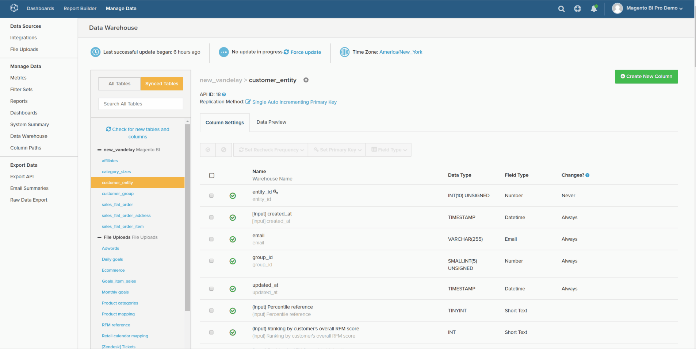

# Berekende kolomtypen

* [Dezelfde tabelberekeningen](#sametable)
* [Eén tot veel berekeningen](#onetomany)
* [Veel berekeningen](#manytoone)
* [Handmatige verwijzingskaart](#map)
* [Geavanceerde berekende kolommen](#advanced)

Binnen de [ Manager van Data Warehouse ](../data-warehouse-mgr/tour-dwm.md), kunt u kolommen tot stand brengen om uw gegevens voor analyse te verhogen en te optimaliseren. [ Deze functionaliteit ](../data-warehouse-mgr/creating-calculated-columns.md) kan worden betreden door om het even welke lijst in de Manager van Data Warehouse te selecteren en **[!UICONTROL Create New Column]** te klikken.

In dit onderwerp worden de typen kolommen beschreven die u kunt maken met Data Warehouse Manager. Het behandelt ook de beschrijving, een visuele looppas-door van die kolom, en a [ verwijzingskaart ](#map) van alle die input wordt vereist om een kolom tot stand te brengen. Er zijn drie manieren om berekende kolommen te maken:

1. [Dezelfde tabel berekende kolommen](#sametable)
1. [Een-op-veel berekende kolommen](#onetomany)
1. [Vele-aan-één berekende kolommen](#manytoone)

## Dezelfde tabel berekende kolommen {#sametable}

Deze kolommen worden gebouwd gebruikend inputkolommen van de zelfde lijst.

### Leeftijd {#age}

Een pagina berekende kolom keert het aantal seconden tussen de huidige tijd en wat inputtijd terug.

In het onderstaande voorbeeld wordt `Seconds since customer's most recent order` in de tabel `customers` gemaakt. Hiermee kunt u gebruikerslijsten samenstellen van klanten die binnen `X days` geen aankopen hebben gedaan (dit wordt ook wel churning genoemd).

### Valuta-converter

Een berekende valutacoconverter zet de native valuta van een kolom om in een gewenste nieuwe valuta.

In het onderstaande voorbeeld wordt `base\_grand\_total In AED` gemaakt en wordt `base\_grand\_total` vanuit dit voorbeeld omgezet in een native valuta in de `sales\_flat\_order` -tabel. Deze kolom werkt goed voor winkels met meerdere valuta&#39;s die in hun lokale valuta willen rapporteren.

Voor Commerce-clients worden in het veld `base\_currency\_code` gewoonlijk native valuta&#39;s opgeslagen. Het veld `Spot Time` moet overeenkomen met de datum die wordt gebruikt in de metriek.

## Een-op-veel berekende kolommen {#onetomany}

`One-to-Many` kolommen [ gebruiken een weg tussen twee lijsten ](../../data-analyst/data-warehouse-mgr/create-paths-calc-columns.md). Dit pad impliceert altijd één tabel, waar een kenmerk woont, en een vele tabel, waar dat kenmerk naar beneden wordt verplaatst. Het pad kan worden omschreven als een `foreign key--primary key` -relatie.

### Samengevoegde kolom {#joined}

Een aangesloten bij kolom verplaatst een attribuut op één lijst *aan* de vele lijst. Het klassieke voorbeeld van één/vele is klanten (één) en orden (vele).

In het onderstaande voorbeeld wordt de `Customer's group\_id` -dimensie samengevoegd tot de `orders` -tabel.

## Vele-aan-één berekende kolommen {#manytoone}

Deze kolommen gebruiken de zelfde wegen die één-aan-vele kolommen doen, maar zij richten gegevens in de tegenovergestelde richting. De kolom wordt gemaakt aan de ene kant van het pad, in tegenstelling tot de andere kant. Vanwege deze relatie moet de waarde in de kolom een aggregatie zijn, dat wil zeggen een wiskundige bewerking die wordt uitgevoerd op de gegevenspunten aan de vele zijden. Hiervoor zijn veel gevallen van gebruik en een aantal hiervan wordt hieronder vermeld.

### Aantal {#count}

Dit type van berekende kolom keert de telling van waarden op de vele lijst *op* terug één lijst.

In het onderstaande voorbeeld wordt de dimensie `Customer's lifetime number of canceled orders` gemaakt in de `customers` -tabel (met een filter voor `orders.status` ).

{: width="699" height="351"}

### Som {#sum}

Een kolom die als som wordt berekend, is de som van de waarden in de tabel `many` voor de ene tabel.

Hiermee kunt u afmetingen op klantniveau maken, zoals `Customer's lifetime revenue` .

### Min. of Max {#minmax}

Een min of max berekende kolom retourneert de kleinste of grootste record aan de vele zijden.

Hiermee kunt u afmetingen op klantniveau maken, zoals `Customer's first order date` .

### Exists {#exists}

Een berekende kolom is een binaire test die de aanwezigheid van een verslag aan de vele kant bepaalt. Met andere woorden, de nieuwe kolom retourneert een `1` als het pad ten minste één rij in elke tabel verbindt en `0` als er geen verbinding kan worden gemaakt.

Dit soort dimensie kan bijvoorbeeld bepalen of een klant ooit een bepaald product heeft aangeschaft. Met een samenvoeging tussen een `customers` -tabel en `orders` -tabel, een filter voor een specifiek product, kan een dimensie `Customer has purchased Product X?` worden gemaakt.

## Handmatige verwijzingskaart {#map}

Als u moeite hebt zich te herinneren wat alle input wanneer het creëren van een berekende kolom zijn, houd deze verwijzingskaart handig wanneer u bouwt:

## Geavanceerde berekende kolommen {#advanced}

In uw vraag om vragen over uw zaken te analyseren en te beantwoorden, kunt u een situatie ontmoeten waarin u niet de nauwkeurige kolom kunt bouwen u wilt.

Om een snelle ommekeer te verzekeren, adviseert Adobe het controleren van de [ Geavanceerde Berekende Gids van de Types van Kolom ](../../data-analyst/data-warehouse-mgr/adv-calc-columns.md) om te zien welk soort kolommen het de steunteam van Adobe kan bouwen. Dat onderwerp behandelt ook de info die u van u nodig hebt om de kolom tot stand te brengen - omvat het met uw verzoek.

## Gerelateerde documentatie

* [Berekende kolommen maken](../../data-analyst/data-warehouse-mgr/creating-calculated-columns.md)
* [Paden voor berekende kolommen maken/verwijderen](../../data-analyst/data-warehouse-mgr/create-paths-calc-columns.md)
* [Tabelrelaties begrijpen en evalueren](../../data-analyst/data-warehouse-mgr/table-relationships.md)
