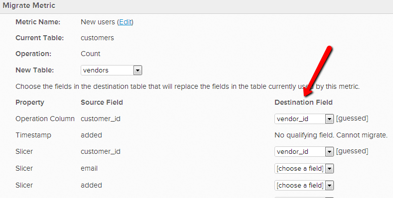

# De operationele tabel van een metrische waarde wijzigen

In bepaalde gevallen, kunt u besluiten om de gegevenslijst te veranderen die metrisch gebruikt om zijn verrichting uit te voeren. Als u bijvoorbeeld een nieuwe gebruikerstabel hebt, wilt u de gegevens die betrekking hebben op de gebruiker migreren uit de tabel `Users\_Old` om in plaats daarvan de tabel `Users\_New` te gebruiken.

1. Ga naar **[!UICONTROL Data]** > **[!UICONTROL Metrics]**
1. Klik op **[!UICONTROL Edit]** naast de metrische waarde waarvoor u de tabel `operational` wilt wijzigen.
1. Klik in de editor op **[!UICONTROL Change]** .

   
1. Selecteer de nieuwe lijst die u deze metrisch op wilt baseren.
1. Pas de bestaande gegevensafmetingen aan de corresponderende in de nieuwe tabel aan. Als u bijvoorbeeld een kolom met de naam `User's registration date` hebt, selecteert u gewoon welke kolom in de nieuwe tabel dezelfde datumgegevens bevat. (Zie de volgende stap als de nieuwe tabel geen overeenkomende kolommen bevat.)

   

1. Als u geen passende kolom in de nieuwe lijst hebt, kunt u of **tot het in uw gegevenslijst** of [ contactsteun ](https://experienceleague.adobe.com/docs/commerce-knowledge-base/kb/troubleshooting/miscellaneous/mbi-service-policies.html?lang=nl-NL) leiden als het een berekeningskolom of dimensie is die door [!DNL Commerce Intelligence] wordt gemaakt. U kunt ook **de afmeting van metrisch** schrappen. Als u een dimensie wilt verwijderen die u niet meer nodig hebt, gaat u gewoon terug naar de metrische editor en selecteert u de afmetingen die u onder `Dimensions` wilt verwijderen.

   
