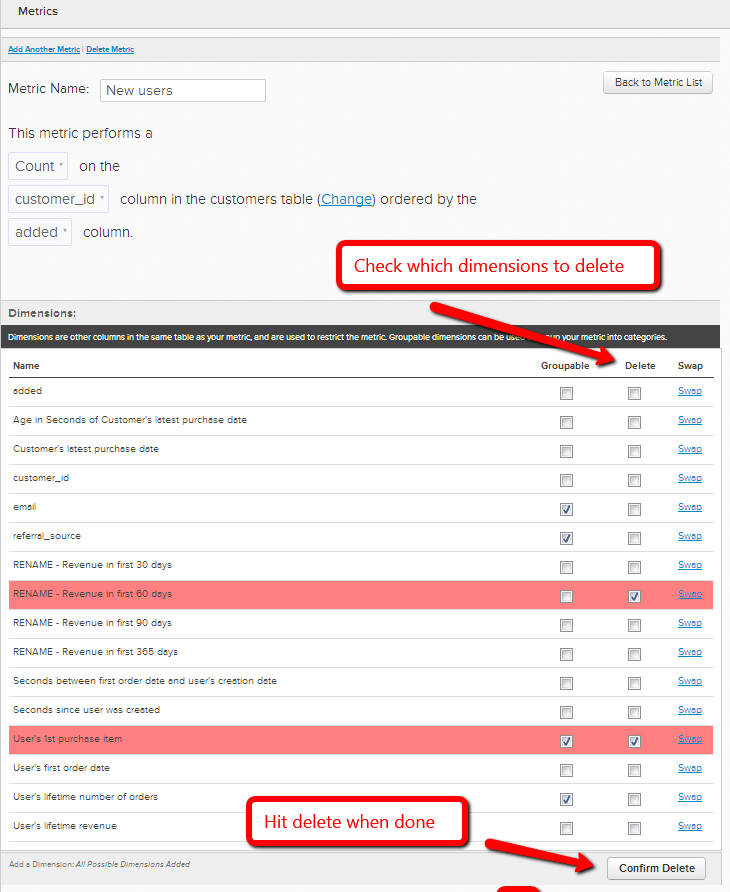

# De operationele tabel van een metrische waarde wijzigen

In bepaalde gevallen, kunt u besluiten om de gegevenslijst te veranderen die metrisch gebruikt om zijn verrichting uit te voeren. Als u bijvoorbeeld een nieuwe gebruikerstabel hebt, wilt u de gegevens die betrekking hebben op de gebruiker migreren uit de tabel &quot;Gebruikers\_Oud&quot; om in plaats daarvan de tabel &quot;Gebruikers\_Nieuw&quot; te gebruiken.

1. Ga naar **[!UICONTROL Data]** > **[!UICONTROL Metrics]**
1. Klikken **[!UICONTROL Edit]** naast metrisch waarvoor u zou willen schakelen `operational` tabel.
1. Klik in de editor op **[!UICONTROL Change]**.

   
1. Selecteer nu de nieuwe lijst die u deze metrisch op wilt baseren.
1. Vervolgens moet u de bestaande gegevensafmetingen aanpassen aan de corresponderende in de nieuwe tabel. Als u bijvoorbeeld een kolom hebt met de naam `User's registration date`selecteert u gewoon welke kolom in de nieuwe tabel dezelfde datumgegevens bevat. (Zie de volgende stap als de nieuwe tabel geen overeenkomende kolommen bevat.)

   

1. Als de nieuwe tabel geen overeenkomende kolom bevat, kunt u **maken in uw datatabel** of [contactondersteuning](https://experienceleague.adobe.com/docs/commerce-knowledge-base/kb/troubleshooting/miscellaneous/mbi-service-policies.html?lang=en) als het een berekeningskolom of -dimensie betreft, gemaakt door [!DNL MBI]). U kunt ook **de dimensie verwijderen uit de metrische**. Om een afmeting te schrappen die u niet meer nodig hebt, ga eenvoudig terug naar de metrische redacteur en selecteer welke afmetingen onder te schrappen `Dimensions`.

   
