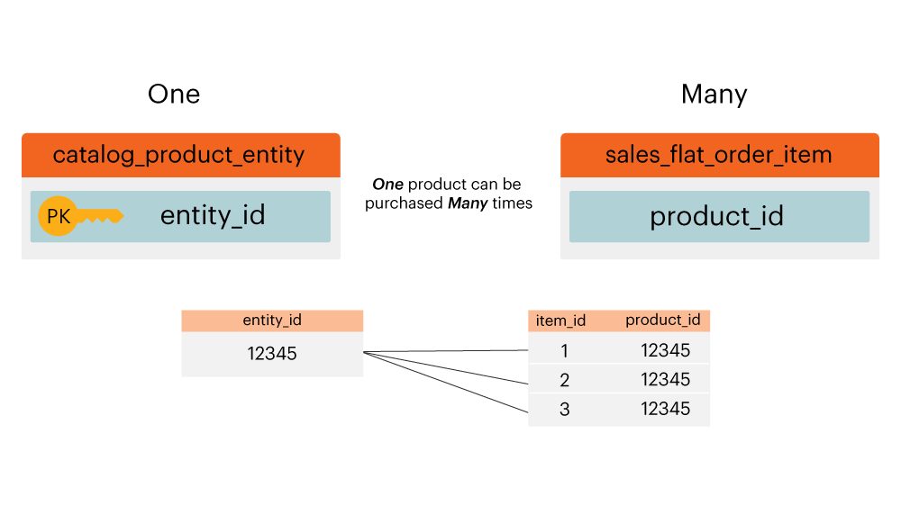

# Relatiediagram voor entiteit

Wat is een **[!UICONTROL entity relationship (ER) diagram]**? An `ER` Het diagram is een visualisatie van lijsten binnen een gegevensbestand en hoe zij op elkaar betrekking hebben. Dit artikel bevat een paar ER diagrammen om u te helpen de verhouding tussen een handvol gemeenschappelijke het gegevensbestandlijsten van de Handel visualiseren.

>[!NOTE]
>
>In dit artikel worden de woorden weergegeven **join**, **relatie** en **pad**. Deze woorden worden allen gebruikt om te beschrijven hoe twee lijsten worden verbonden.

## Kernhandel `ER` Diagram

Dit `ER` Het diagram vertegenwoordigt de verhoudingen onder de kernlijsten binnen een gegevensbestand van de Handel. Door veelvoudige verhoudingen tegelijkertijd te bekijken, kunt u zien hoe de gegevens over vele lijsten zouden betrekking hebben.

De onderstaande secties bevatten `ER` diagrammen die specifiek zijn voor twee tabellen tegelijk. Als u een diagram en de bijbehorende beschrijving wilt weergeven, klikt u op de koptekst voor die sectie.

## `customer\_entity & sales\_flat\_order`

Eén klant kan veel bestellingen plaatsen. De relatie tussen deze twee tabellen is `customer\_entity.entity\_id = sales\_flat\_order.customer\_id`

>[!IMPORTANT]
>
>`customer\_entity.entity\_id` is niet gelijk aan `sales\_flat\_order.entity\_id`. De eerste kan worden beschouwd als een `customer\_id` en de tweede kan worden beschouwd als een `order\_id.` Meer informatie hierover vindt u in het gedeelte [`entity\_id` sectie](https://support.magento.com/hc/en-us/articles/360016729951) van onze _[!DNL Magento]: Algemene misvattingen_ artikel.

Within [!DNL MBI]Als het pad tussen deze twee tabellen nog niet bestaat, kunt u [het pad maken](../data-warehouse-mgr/create-paths-calc-columns.md) op het tabblad Data Warehouse. Wanneer u klaar bent om het pad te maken, wordt het als volgt gedefinieerd:

## `sales\_flat\_order & sales\_flat\_order\_item`

Eén bestelling kan veel items bevatten. De relatie tussen deze twee tabellen is `sales\_flat\_order.entity\_id = sales\_flat\_order\_item.order\_id`.

Within [!DNL MBI]Als het pad tussen deze twee tabellen nog niet bestaat, kunt u [het pad maken](../data-warehouse-mgr/create-paths-calc-columns.md) op het tabblad Data Warehouse. Wanneer u klaar bent om het pad te maken, wordt het als volgt gedefinieerd:

## `catalog\_product\_entity & sales\_flat\_order\_item`

Eén product kan vele objecten aanschaffen. De relatie tussen deze twee tabellen is `catalog\_product\_entity.entity\_id = sales\_flat\_order\_item.product`.

Within [!DNL MBI]Als het pad tussen deze twee tabellen nog niet bestaat, kunt u [het pad maken](../data-warehouse-mgr/create-paths-calc-columns.md) op het tabblad Data Warehouse. Wanneer u klaar bent om het pad te maken, wordt het als volgt gedefinieerd:

