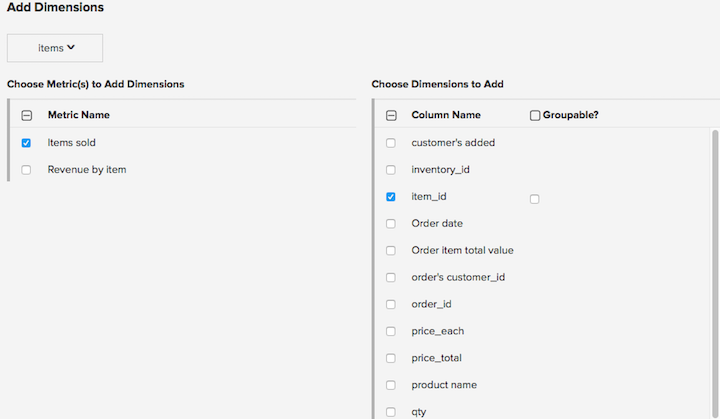

# Gegevensafmetingen beheren

>[!NOTE]
>
>Vereist [&#x200B; toestemmingen Admin &#x200B;](../../administrator/user-management/user-management.md).

Een dimensie is een gebied in de zelfde lijst zoals metrisch die aan filter of segmentgrafieken kan worden gebruikt die op dat metrisch worden gebaseerd. Een maatstaf voor inkomsten kan bijvoorbeeld stad, staat, land, orderstatus, couponcode en andere typen afmetingen bevatten.

## Afmetingen toevoegen aan meerdere metriek

Een of meer afmetingen tegelijk toevoegen aan meerdere metriek:

1. Ga naar **[!UICONTROL Manage Data > Metrics]** .

1. Klik op **[!UICONTROL Add Dimensions To Metric(s)]**.

1. Kies de tabel die de afmetingen bevat.

1. Selecteer in de kolom `Choose Metric(s) to Add Dimensions` de metriek waaraan u afmetingen wilt toevoegen. Als deze optie is geselecteerd, wordt de kolom `Choose Dimensions to Add` aan de rechterkant weergegeven. Controleer de afmetingen die u aan geselecteerde metrisch wilt toevoegen.

   

1. Als u door om het even welke gegevensdimensies op rapporten zou willen segmenteren of groeperen, zorg ervoor om erop te wijzen zij _groeperbaar_ zijn.

1. Klik op **[!UICONTROL Add]**.

## Afmetingen van meerdere meeteenheden verwijderen

Een of meer afmetingen uit meerdere meeteenheden verwijderen:

1. Ga naar **[!UICONTROL Data > Metrics]** .

1. Klik op **[!UICONTROL Remove Dimensions From Metric(s)]**.

1. Kies de tabel die de afmetingen bevat.

1. Selecteer de afmetingen die u links wilt verwijderen en de afmetingen die u wilt verwijderen aan de rechterkant.

1. Klik op **[!UICONTROL Remove]**.

1. Als de afmetingen in gebruik zijn in rapporten, wordt een waarschuwing weergegeven met de lijst met grafieken die de afmetingen gebruiken. Klik op **[!UICONTROL Delete]** om de geselecteerde afmetingen en alle afhankelijke personen, inclusief rapporten, te verwijderen.

## Dimensies beheren in metriek

**om afmeting(en) in metrisch toe te voegen:**

1. Ga naar **[!UICONTROL Data > Metrics]** .

1. Klik **[!UICONTROL Edit]** op metrisch u een nieuwe afmeting wilt.

1. Gebruik in de sectie `Dimensions` het vervolgkeuzemenu `Add a dimension` om een dimensie te selecteren die u wilt toevoegen.

>[!NOTE]
>
>Elke dimensie waarop u wilt filteren of groeperen, moet al worden bijgehouden in [!DNL Commerce Intelligence] . Als u niet de gewenste afmeting vindt, kunt u een nieuwe gegevenskolom in uw gegevensbestand via de [&#x200B; Data Warehouse &#x200B;](../data-warehouse-mgr/tour-dwm.md) pagina moeten beginnen te volgen.

**om afmeting(en) van metrisch te schrappen:**

1. Ga naar **[!UICONTROL Manage Data > Metrics]** .

1. Klik **[!UICONTROL Edit]** op metrisch u een nieuwe afmeting wilt.

1. Schakel onder de sectie `Dimensions` het selectievakje in de kolom Verwijderen in naast de dimensie(s) die u wilt verwijderen.

>[!NOTE]
>
>Zelfs na het schrappen van een afmeting, bestaat het nog als kolom op uw lijst in uw Data Warehouse. U kunt het aan om het even welke metrisch toevoegen, en nieuwe metriek bouwen gebruikend deze dimensies. Om de gegevenskolom te verwijderen die een afmeting aan van [!DNL Commerce Intelligence] beantwoordt, untrack eenvoudig de gegevenskolom via de [&#x200B; Data Warehouse &#x200B;](../data-warehouse-mgr/tour-dwm.md) pagina.

## Gerelateerde documentatie

* [Aanbevolen procedures voor segmentatie en filteren](../../best-practices/segment-filter.md)
