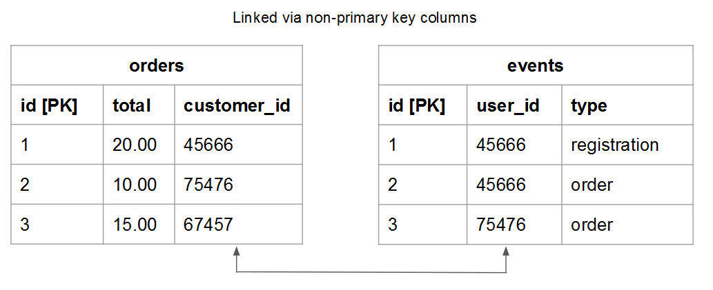

# Tabelrelaties begrijpen en evalueren

Wanneer u de relatie tussen twee gegeven tabellen beoordeelt, moet u begrijpen hoeveel mogelijke voorvallen in een tabel tot een entiteit in een andere tabel kunnen behoren, en omgekeerd. Gebruik bijvoorbeeld een `users` tabel en een `orders` tabel. In dit geval wilt u weten hoeveel **orders** een gegeven **user** heeft geplaatst en hoeveel mogelijk **gebruikers** een **bestellen** kan tot behoren.

Inzicht in relaties is van essentieel belang voor het behoud van gegevensintegriteit, omdat dit van invloed is op de nauwkeurigheid van uw [berekende kolommen](../data-warehouse-mgr/creating-calculated-columns.md) en [afmetingen](../data-warehouse-mgr/manage-data-dimensions-metrics.md). Zie voor meer informatie [relatietypen](#types) en [hoe te om de lijsten in uw Data Warehouse te evalueren.](#eval)

## Relatietypen {#types}

Er zijn drie soorten relaties die tussen twee tabellen kunnen bestaan:

1. [&quot;one-to-one&quot;](#onetoone)
1. [&quot;one-to-many&quot;](#onetomany)
1. [&quot;many-to-many&quot;](#manytomany)

### `One-to-One` {#onetoone}

In een `one-to-one` relatie, een record in tabel `B` behoort tot slechts één record in de tabel `A`. En een record in de tabel `A` behoort tot slechts één record in tabel `B`.

In de relatie tussen personen en de rijbewijsnummers kan een persoon bijvoorbeeld slechts één rijbewijsnummer hebben, terwijl het rijbewijsnummer alleen aan de persoon toebehoort.

### `One-to-Many` {#onetomany}

In een `one-to-many` relatie, een record in tabel `A` kan mogelijk tot meerdere records in de tabel behoren `B`. Denk na over de relatie tussen `orders` en `items` - een bestelling kan veel items bevatten, maar een item behoort tot één bestelling. In dit geval worden de `orders` de ene kant en de andere kant `items` tafel is de vele kant .

### `Many-to-Many` {#manytomany}

In een `many-to-many` relatie, een record in tabel `B` kan mogelijk tot meerdere records in de tabel behoren `A`. En vice versa, een verslag in lijst `A` kan mogelijk tot verscheidene verslagen in Lijst behoren `B`.

Denk na over de relatie tussen **producten** en **categorieën**: een product kan tot veel categorieën behoren en een categorie kan veel producten bevatten.

## Uw tabellen evalueren {#eval}

Gezien de soorten verhoudingen die tussen lijsten bestaan, kunt u leren hoe te om de lijsten in uw Data Warehouse te evalueren. Aangezien deze verhoudingen vormen hoe multi-table berekende kolommen worden bepaald, is het belangrijk dat u begrijpt hoe te om lijstverhoudingen te identificeren en welke kant - `one` of `many` - de tabel behoort tot.

Er zijn twee methodes die u kunt gebruiken om het verband van een bepaald paar lijsten binnen uw Data Warehouse te evalueren. De eerste methode gebruikt een [conceptueel kader](#concept) daarbij wordt gekeken hoe de tabelentiteiten met elkaar communiceren . De tweede methode gebruikt de [tabelschema](#schema).

### Het conceptuele kader gebruiken {#concept}

Deze methode gebruikt een conceptueel kader om te beschrijven hoe de entiteiten in de twee lijsten met elkaar kunnen communiceren. Het is belangrijk te begrijpen dat dit kader beoordeelt wat mogelijk is, gezien de relatie.

Wanneer u bijvoorbeeld nadenkt over gebruikers en bestellingen, moet u rekening houden met alles wat mogelijk is in de relatie. Een geregistreerde gebruiker kan binnen zijn levensduur geen bestellingen, slechts één bestelling of meerdere bestellingen plaatsen. Als u uw zaken hebt gelanceerd en geen orden geplaatst, is het mogelijk dat een bepaalde gebruiker vele orden in hun leven kan plaatsen. De tabellen zijn hierop afgestemd.

Deze methode gebruiken:

1. Identificeer de entiteit die in elke tabel wordt beschreven. **Tip: het is meestal een zelfstandig naamwoord**. Bijvoorbeeld de `user` en `orders` in tabellen worden gebruikers en bestellingen expliciet beschreven.

1. Identificeer een of meer werkwoorden die beschrijven hoe deze entiteiten op elkaar inwerken. Wanneer gebruikers bijvoorbeeld met bestellingen vergelijken, plaatsen gebruikers bestellingen. In de andere richting zijn de bestellingen &quot;van&quot; gebruikers.

Dit type framework kan worden toegepast op elke koppeling van tabellen in uw Data Warehouse. Zo kunt u gemakkelijk het type relatie identificeren en zien welke tabel één zijde heeft en welke tabel een vele zijde heeft.

Zodra u de terminologie hebt geïdentificeerd die beschrijft hoe de twee lijsten interactie aangaan, kader de interactie in beide richtingen door te overwegen hoe één bepaalde geval van de eerste entiteit op de tweede betrekking heeft. Hier zijn enkele voorbeelden van elke relatie:

### `One-to-One`

Eén persoon kan slechts één rijbewijsnummer hebben. Een bepaald rijbewijsnummer behoort alleen tot de persoon.

Dit is een `one-to-one` relatie waarbij elke tabel één kant heeft.

### `One-to-Many`

Een bepaalde volgorde kan veel items bevatten. Eén gegeven item behoort tot slechts één bestelling.

Dit is een `one-to-many` relatie waarbij de tabel met orders de ene kant is en de tabel met items de vele kant.

### `Many-to-Many`

Eén bepaald product kan tot veel categorieën behoren. Een bepaalde categorie kan vele producten bevatten.

Dit is een `many-to-many` relatie waarbij elke tabel een vele kant heeft.

### Het schema van de tabel gebruiken {#schema}

De tweede methode gebruikt het tabelschema. Het schema bepaalt welke kolommen de kolommen zijn [`Primary`](https://en.wikipedia.org/wiki/Unique_key) en [`Foreign`](https://en.wikipedia.org/wiki/Foreign_key) toetsen. U kunt deze sleutels gebruiken om lijsten samen te verbinden en hulp bepalen relatietypen.

Zodra u de kolommen identificeert die twee lijsten samen verbinden, gebruik de kolomtypes om de lijstverhouding te evalueren. Hier volgen enkele voorbeelden:

### `One-to-one`

Als de tabellen zijn gekoppeld met de `primary key` van beide tabellen wordt in elke tabel dezelfde unieke entiteit beschreven en de relatie is `one-to-one`.

Bijvoorbeeld een `users` de tabel kan de meeste gebruikerskenmerken (zoals de naam) vastleggen terwijl een aanvullende tabel `user_source` in de tabel worden bronnen voor gebruikersregistratie vastgelegd. In elke tabel staat een rij voor één gebruiker.

### `One-to-many`

>[!NOTE]
>
>Accepteer je gastorders? Zie [Gastbestellingen](../data-warehouse-mgr/guest-orders.md) om te leren hoe de gastorden uw lijstverhoudingen kunnen beïnvloeden.

Wanneer tabellen worden gekoppeld met een `Foreign key` die verwijzen naar een `primary key`, deze instelling beschrijft een `one-to-many` relatie. De ene kant is de tabel met de `primary key` en de vele kanten zijn de tabel met de `foreign key`.

### `Many-to-many`

Als één van beiden van het volgende waar is, is de verhouding `many-to-many`:

* `Non-primary key` kolommen worden gebruikt om twee tabellen te koppelen
  
* Deel van een samenstelling `primary key` wordt gebruikt om twee tabellen te koppelen

## Volgende stappen

Het correct beoordelen van lijstverhoudingen is essentieel om uw gegevens nauwkeurig te modelleren. Nu u begrijpt hoe tabellen aan elkaar zijn gerelateerd, raadpleegt u [wat u met de Manager van de Data Warehouse kunt doen](../data-warehouse-mgr/tour-dwm.md).
