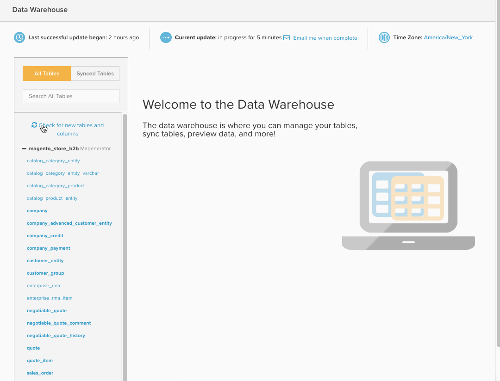

# Data Warehouse Manager

>[!NOTE]
>
>Vereist [ toestemmingen Admin ](../../administrator/user-management/user-management.md)

De manager van de Data Warehouse, die door **[!UICONTROL Manage Data > Data Warehouse]** wordt betreden te klikken, is de portaal aan uw [!DNL Adobe Commerce Intelligence] Data Warehouse. Gebruikend de Manager van de Data Warehouse, kunt u lijst en kolomsync montages beheren, neer in het schema van een lijst boren, en berekende kolommen tot stand brengen in rapporten te gebruiken.

Dit onderwerp omvat:

* [Leer je weg](#learning)
* [Tabellen en kolommen synchroniseren](#syncing)
* [Berekende kolommen maken](#calculated)
* [Tabellen neerzetten en kolommen verwijderen](#delete)
* [Nieuwe tabellen op de achtergrond synchroniseren](#syncnew)
* [Wanneer kan ik mijn nieuwe kolommen gebruiken?](#when)

## Leer je weg {#learning}

De linkerzijde van de pagina `Data Warehouse Manager` bevat de lijst met tabellen, zodat u gemakkelijk kunt schakelen tussen tabellen. Wanneer u een tabel in de lijst selecteert, wordt het tabelbeheergebied gevuld met het schema van de tabel waarin u de geselecteerde tabel kunt wijzigen.

Binnen de lijst van de lijst, worden de lijsten gegroepeerd door hun verbindingsbron. Deze bronnen worden toegevoegd onder [!UICONTROL Manage Data > Integrations] en kunnen of een gegevensbestand, [ API ](https://developer.adobe.com/commerce/services/reporting/), of een derdeschakelaar zijn. Boven aan de lijst met tabellen bevindt zich een zoekvak waarmee u gemakkelijk de gewenste tabellen kunt vinden.

Onder het zoekvak ziet u twee opties: `All Tables` en `Synced Tables` . De optie `All Tables` bevat een lijst met alle tabellen die u beschikbaar hebt gemaakt voor uw Data Warehouse. Deze tabellen bevatten zowel gesynchroniseerde als niet-gesynchroniseerde tabellen.

Met de optie `Synced Tables` worden alle tabellen weergegeven die al in de Data Warehouse zijn toegevoegd en waarvan gegevens uit de geselecteerde kolommen worden gerepliceerd.

Zie de tabel die u zoekt niet in de lijst `All Tables` ? Hiervoor zijn enkele redenen te vinden:

* De gegevensbron is nog niet toegevoegd
* De gegevensbron is een database en de gebruiker die u hebt gemaakt, heeft geen toegang tot deze database. [!DNL Commerce Intelligence] In dit geval moet u of uw databasebeheerder toegang verlenen.
* De gegevensbron of tabel is onlangs toegevoegd en nog niet gesynchroniseerd

## Tabellen en kolommen synchroniseren {#syncing}

### Nieuwe tabellen en native kolommen synchroniseren

De Manager van de Data Warehouse geeft u niet alleen de capaciteit om uw gegevensbronnen gemakkelijk te bekijken en te beheren, u hebt ook de vrijheid om de individuele lijsten en de kolommen te selecteren u wilt synchroniseren.

1. Klik op de optie `All Tables` en zoek de tabel die u wilt synchroniseren.
1. Klik op de naam van de tabel om een voorvertoning van het schema weer te geven. Als de tabel nieuw is, worden alle kolommen weergegeven als `Unsynced` .
1. Controleer de kolommen die u wilt synchroniseren.

   >[!NOTE]
   >
   >Kolommen die eigen zijn aan een tabel, zijn afkomstig uit uw database in de kolom `Location` .

1. Controleer of de kolommen `Primary Key` staan. Deze kolommen hebben een sleutelsymbool naast de kolomnaam. Een `Primary Key` is vereist om gegevens correct te synchroniseren in de Data Warehouse.

   Als u een tabel synchroniseert die rechtstreeks afkomstig is uit uw database, is het mogelijk dat `Primary Keys` niet wordt aangegeven. In dit geval neemt u contact op met de databasebeheerder om te vragen of een primaire sleutel of sleutels aan de tabel moet worden toegevoegd.
1. Wanneer gebeëindigd, klik de .

A *Succes!* wordt weergegeven en de status verandert in `Pending` voor de geselecteerde kolommen. Nadat de volgende volledige update is voltooid, zijn de nieuw gesynchroniseerde tabellen en kolommen beschikbaar voor gebruik in rapporten. U kunt nieuwe [ replicatiemethodes ](./cfg-replication-methods.md) na de aanvankelijke synchronisatie ook plaatsen.

Hieronder volgt een kort overzicht van het hele proces:

### Nieuwe tabellen synchroniseren op de achtergrond {#syncnew}

Wanneer u een grote lijst voor het eerst synchroniseert, moet uw Data Warehouse alle gegevenspunten in de lijst terugwerkende kracht vangen alvorens nieuwe gegevens op een lopende basis te vangen. Als uw lijst groot is, kunt u niet die aanvankelijke synchrone looppas met uw **updatecyclus** willen hebben. In deze situatie, wilt u de aanvankelijke synchronisatie op de achtergrond voorkomen, in *parallel* met om het even welke momenteel lopende update.

Om ervoor te zorgen dat dit gebeurt, selecteert u de optie `Save and Sync Data Immediately` waarmee die tabel voor het eerst wordt gesynchroniseerd.

### Controleren op nieuwe tabellen en kolommen {#forceupdate}

Uw Data Warehouse ontdekt automatisch geen nieuwe bronnen, lijsten, of kolommen het ogenblik zij worden toegevoegd. Een synchronisatieproces loopt door de week om nieuwe toevoegingen te vinden en hen ter beschikking te stellen, maar u kunt een structuursynchronisatie dwingen als u tot onlangs toegevoegde lijsten en kolommen wilt toegang hebben alvorens het proces loopt.

Onder de zoekbalk in de tabellijst bevindt zich een koppeling `Check for new tables and columns` . Als u op deze koppeling klikt, wordt de structuursynchronisatie geforceerd gestart. Nieuwe toevoegingen zijn doorgaans na 10 minuten beschikbaar. Vernieuw de pagina om de nieuwe bron, tabel of kolom te zien.

## Berekende kolommen maken {#calculated}

Eenvoudig het kunnen gegevens van al uw bronnen zien en beheren maakt het verkrijgen van inzicht in uw zaken veel gemakkelijker. Maar binnen de Manager van de Data Warehouse, kunt u een stap verder gaan door berekende kolommen binnen uw lijsten te creëren. `Calculated` -kolommen leiden nieuwe informatie af van bestaande gegevens.

Stel dat u `user's lifetime revenue` aan de `users` -tabel wilt toevoegen om gebruikers met een hoge waarde te zoeken. Of als u inkomsten wilt segmenteren op basis van geslacht, kunt u `customer's gender` toevoegen aan uw `orders` -tabel.

Voor meer informatie, controleer dit [ leerprogramma ](../../data-analyst/data-warehouse-mgr/creating-calculated-columns.md).

## Tabellen neerzetten en kolommen verwijderen {#delete}

Net zoals u tabellen en kolommen kunt selecteren die u met de Data Warehouse wilt synchroniseren, kunt u ze ook neerzetten of verwijderen.

>[!NOTE]
>
>Als u een tabel neerzet of kolommen verwijdert, worden afhankelijke rapporten, metriek, filtersets en kolommen verwijderd zodra u de verwijdering hebt bevestigd. Ben zeker u dit wilt doen - **deze actie kan niet ongedaan worden gemaakt.**

Maak u geen zorgen als u per ongeluk op **[!UICONTROL Delete]** klikt. Een gebiedsdeelcontrole loopt alvorens om het even wat wordt geschrapt, zodat hebt u de kans om alles te herzien alvorens te bevestigen.

Als u kolommen wilt verwijderen, klikt u op de tabel waartoe de kolom behoort. Controleer de kolommen die u wilt verwijderen en klik de  knoop.

Om een gesynchroniseerde lijst te verwijderen, selecteer alle kolommen in de lijst, en klik opnieuw de  knoop. Hierdoor worden alle native en berekende kolommen die deze tabel gebruiken, uit de Data Warehouse verwijderd.

### Wijzigingen bevestigen

Of u een lijst laat vallen of kolommen verwijdert, een looppas van de gebiedsdeelcontrole alvorens het schrappingsproces voltooit. Afhankelijkheden zijn berekende kolommen, metriek, filterreeksen en rapporten die de tabel of kolom(men) gebruiken die worden verwijderd. Om het even welke ontdekte gebiedsdelen tonen - op dit punt, kunt u of het proces annuleren of **[!UICONTROL Confirm Changes]** klikken om de lijst te laten vallen/de kolom(men) verwijderen.

Terwijl de geschrapte gebiedsdelen niet kunnen worden hersteld, zullen de lijsten en de kolommen nog beschikbaar zijn als u om het even welke inheemse kolommen in de toekomst opnieuw moet synchroniseren.

Hier volgt een snelle blik bij het verwijderen van een kolom:

## Wanneer kan ik mijn nieuwe kolommen gebruiken? {#when}

Nieuwe gesynchroniseerde kolommen en nieuwe/bijgewerkte berekende kolommen zijn klaar voor gebruik nadat de volgende volledige update is voltooid. Als er nog geen update wordt uitgevoerd, kunt u een update afdwingen door op **[!UICONTROL Force update]** boven aan de pagina `Data Warehouse` of `Integrations` te klikken. U kunt ook een e-mailmelding plannen wanneer de update is voltooid door op **[!UICONTROL Email me when complete]** te klikken.

Wanneer u bereid bent om uw nieuwe kolommen in rapporten te gebruiken, [ moet u hen aan metriek eerst toevoegen ](../data-warehouse-mgr/manage-data-dimensions-metrics.md). Hoewel gegevens pas beschikbaar zijn nadat een update is voltooid, kunt u nog steeds nieuwe kolommen in rapporten gebruiken. De gegevens binnen het rapport worden weergegeven wanneer de update is voltooid.

## Omloop

Dit artikel bedekte veel materiaal. Ondertussen, zou u een stevig inzicht in wat een gegevensbestand is, hoe de gegevens worden georganiseerd, hoe de lijsten met elkaar betrekking hebben, en wat u met de Manager van de Data Warehouse kunt doen.

Ga uw kennis testen door [ een berekende kolom ](../data-warehouse-mgr/creating-calculated-columns.md) te creëren of [ die sommige interessante rapporten ](../../tutorials/using-visual-report-builder.md) maken.
