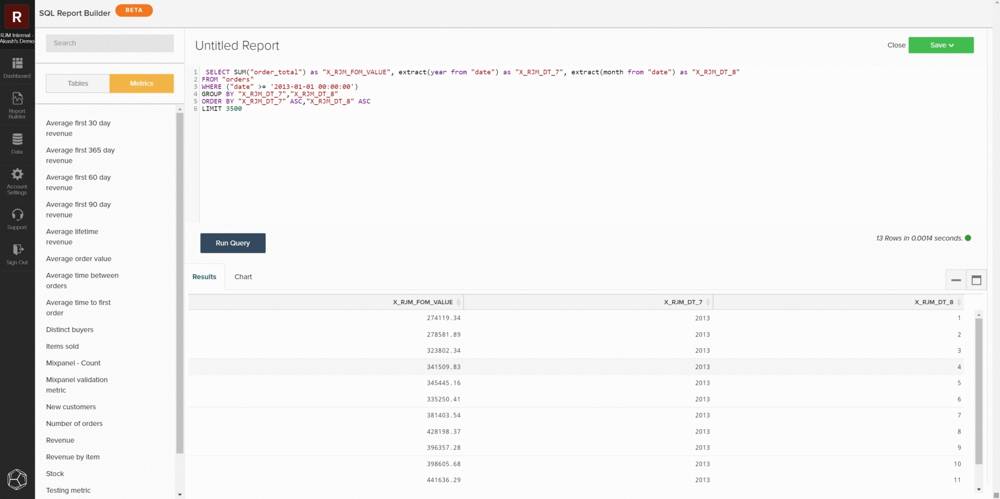

# `SQL Report Builder`

De `SQL Report Builder` wordt hoofdzakelijk gebruikt om nieuwe rapporten te bouwen en op analyses te herhalen, maar het kan ook worden gebruikt om gegevens en metriek effectief te controleren. De volgende informatie verklaart hoe te om gegevens en metriek te controleren gebruikend `SQL Report Builder` zodat u de resultaten kunt vergelijken met de gegevens uit uw lokale database.

## Metrisch zoeken

Om aan de slag te gaan, opent u de `SQL Report Builder` door te navigeren naar **[!UICONTROL Report Builder > SQL Report Builder > Create Report]**. U kunt sidebar in de SQL redacteur gebruiken om metrisch direct in uw vraag op te nemen door over metrisch te hangen en te klikken **[!UICONTROL Insert]**. Dit zal de vraagdefinitie van dat metrisch aan de redacteur toevoegen. De definitie omvat de volgende componenten:

- De **metrische bewerking** uitgevoerd, aangegeven door SUM() in het onderstaande voorbeeld.
- De **tabel op** die metrisch wordt gebouwd, door VAN clausule wordt vermeld.
- Alle **filters (en filtersets)** die aan metrisch zijn toegevoegd, die door WHERE clausule in het hieronder voorbeeld wordt vermeld.
- De component van de **tijdstempel** (jaar, maand) waarop de gegevens moeten worden besteld, zoals aangegeven door de ORDER BY-component in het onderstaande voorbeeld.

Als u een duidelijkere mening van de vraag zou willen hebben, kunt u opnieuw formatteren hoe het op het vraaggebied wordt getoond. Wanneer u klaar bent, selecteert u `Run Query`. De resultaten zullen als lijst in het rapportpaneel onder de vraag bevolken.

## De query beperken

Als u probeert om een specifieke discrepantie of een reeks gegevens te identificeren, zou u de vraag tot een specifieke steekproef moeten beperken om tegen uw lokale gegevensbestand te controleren. U kunt dit doen door de vraag uit te geven om uw gewenste beperkingen aan te passen. In het volgende voorbeeld, beperken wij de vraag om slechts opbrengst van 1 Januari, 2013 of later te omvatten. Nadat u de query hebt bijgewerkt, selecteert u **[!UICONTROL Run Query]** om de resultaten bij te werken.

## Opslaan en exporteren

Wanneer het rapport aan uw behoeften voldoet, slaat u het op een dashboard door het rapport een andere naam te geven en op **[!UICONTROL Save]** en selecteert u het type rapport dat u wilt opslaan en het dashboard. Bij de controle van metriek, adviseren wij sparen het rapport als a `Table` en het opslaan naar een testdashboard.

Nadat het rapport is opgeslagen, navigeert u naar dat dashboard door `Go to Dashboard`. Van daar kunt u de gegevens uitvoeren door het rapport te vinden en te selecteren **[!UICONTROL Options gear > Full `.csv`Exporteren]** of **[!UICONTROL Full Excel Export]**.

## Aangepaste query&#39;s

U kunt ook aangepaste query&#39;s schrijven en de resultaten exporteren die u wilt vergelijken met uw lokale database. Na de [richtlijnen voor queryoptimalisatie](../../best-practices/optimizing-your-sql-queries.md), schrijft u een query in de SQL-editor. U kunt de knoppen boven aan het zijpaneel gebruiken om te schakelen tussen lijsten met tabellen en metriek die beschikbaar zijn voor gebruik in het dialoogvenster `SQL Report Builder` en voeg deze toe aan uw query. Wanneer uw douanequery uw behoeften past, kunt u het rapport opslaan en die gegevens van het dashboard uitvoeren.

### Nog steeds gestompt?

Als u na het controleren van uw gegevens een discrepantie vindt, neemt u een blik bij [Contact opnemen met ondersteuning: Gegevensdiscrepanties](https://support.magento.com/hc/en-us/articles/360016505312) artikel voor meer informatie over wat te doen volgende.
