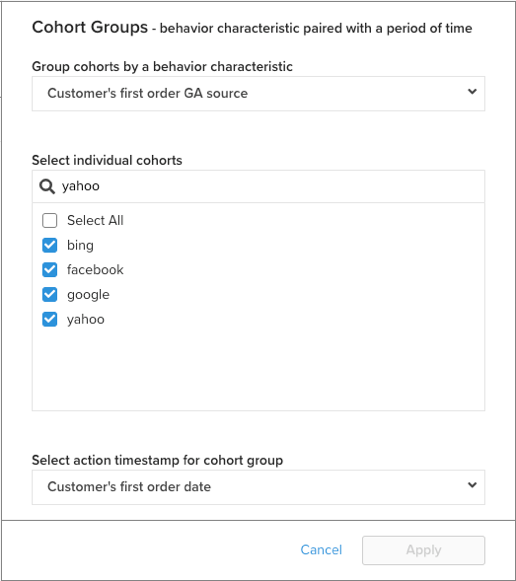

# `Cohort Report Builder for Non-Date-Based Cohorts`

Ons [`Cohort Report Builder`](../dev-reports/cohort-rpt-bldr.md) is geweldig in het helpen van handelaren om te bestuderen hoe verschillende subsets van gebruikers zich in de loop der tijd gedragen. In het verleden `Cohort Report Builder` is vooral geoptimaliseerd voor het groeperen van gebruikers door een gemeenschappelijke `cohort date` (bijvoorbeeld de set van alle klanten die hun eerste aankoop in een bepaalde maand hebben gedaan). De `Non-Date Based Cohort` biedt u nu de mogelijkheid gebruikers te groeperen met een vergelijkbare activiteit of kenmerk. Bekijk een paar gebruiksgevallen voor deze functie.

## Gevallen gebruiken

Dit is geen uitgebreide lijst, maar er zijn enkele potentiële analyses die met deze functie kunnen worden uitgevoerd:

* Onderzoek van de inkomsten van klanten die zijn verkregen uit [!DNL Google] versus [!DNL Facebook]
* Klanten wier eerste aankoop in de VS en Canada is gedaan, analyseren
* Kijken naar het gedrag van klanten die via verschillende advertentiecampagnes zijn aangeschaft

## Uw analyse maken

1. Klikken **[!UICONTROL Report Builder]** op de linkertab of **[!UICONTROL Add Report** > **Create Report]** in een dashboard.

1. In de `Report Builder Selection` scherm, klikken **[!UICONTROL Create Report]** naast de `Visual Report Builder` optie.

### Metrisch toevoegen

Nu bevinden we ons in de `Report Builder`, voegen wij metrisch toe dat wij de analyse op (voorbeeld willen uitvoeren: `Revenue` of `Orders`).

>[!NOTE]
>
>Oorspronkelijk [!DNL Google Analytics] metriek is niet compatibel met de `Cohort Report Builder`. Ons doel voor dit voorbeeld is om na verloop van tijd te kijken naar de inkomsten van klanten van eerste bestelling die via verschillende GA-bronnen zijn aangeschaft.

### Schakelen `Metric View` tot `Cohort`

Dit opent een nieuw venster waar wij de details van het Rapport van het Cohort kunnen vormen.

Er zijn vijf specificaties nodig om een verslag van Cohort op te stellen:

1. De cohorten groeperen
1. Cohorten selecteren
1. Tijdstempel voor handeling
1. Tijdbereik eerste handeling van Cohort
1. Tijdbereik na cohort-instantie

{: width=&quot;200&quot; height=&quot;224&quot;}

{: width=&quot;400&quot; height=&quot;554&quot;}

#### 1. Groepering `cohorts`

`Cohorts` worden gegroepeerd op een gedragskenmerk, in dit voorbeeld `Customer's first order GA source`. Merk op dat de hier beschikbare opties kolommen zijn die reeds als worden aangewezen `groupable` voor de metrische waarde.

#### 2. Cohorten selecteren

U kunt alle resultaten voor het gegeven kenmerk weergeven. Omdat dit kan leiden tot een groot aantal `cohorts`, kunt u de specifieke `cohorts` (komt overeen met de verschillende beschikbare waarden voor `Customer's first order GA source`) die u nodig hebt.

<!--{: width="300" height="338"}-->

#### 3. `Action timestamp`

Hierdoor kunt u een andere op datum gebaseerde kolom kiezen dan de kolom waarop de metrische waarde is gemaakt. Hieronder bekijken we de keuze van het tijdbereik dat van toepassing is op het gegeven `action timestamp`.

#### 4. `Cohort first action time range`

Hier selecteert u het datumbereik dat de `cohorts action timestamp` (dus klanten die de eerste bestelling hadden van november 2017 tot oktober 2018). Dit kan een bewegend datumbereik of een vast datumbereik zijn.

#### 5. `Time range after cohort occurrence`

Wilt u de knop `cohorts` in tijd per maand, week, of jaar? Hier maakt u deze selecties. Onder die sectie selecteert u de optie `time range` na de `cohort action timestamp` is opgetreden. Dit toont u bijvoorbeeld twaalf maanden aan gegevens voor de klanten die de eerste orde tijdens de actietermijn hebben geplaatst.

<!--{: width="400" height="557"}-->

### Overige opmerkingen

* [!UICONTROL Filters]: toegepast op uw metriek blijft intact wanneer u schakelt tussen `Standard` en `Cohort` views
* Zie [`Perspectives`](../../data-analyst/dev-reports/cohort-rpt-bldr.md).
