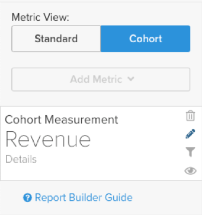

# [!DNL Cohort Report Builder] voor niet-datumgebaseerde cohorten

De [`Cohort Report Builder`](../dev-reports/cohort-rpt-bldr.md) is ideaal om handelaren te helpen onderzoeken hoe verschillende subsets van gebruikers zich in de loop der tijd gedragen. In het verleden `Cohort Report Builder` is geoptimaliseerd voor het groeperen van gebruikers door een algemene `cohort date` (bijvoorbeeld de set van alle klanten die hun eerste aankoop in een bepaalde maand hebben gedaan). De `Non-Date Based Cohort` biedt u nu de mogelijkheid gebruikers te groeperen met een vergelijkbare activiteit of kenmerk. Bekijk een paar gebruiksgevallen voor deze functie.

## Gevallen gebruiken

Dit is geen uitgebreide lijst, maar er zijn enkele potentiële analyses die met deze functie kunnen worden uitgevoerd.

* Onderzoek van de inkomsten van klanten die zijn verkregen uit [!DNL Google] versus [!DNL Facebook]
* Klanten wier eerste aankoop in de VS en Canada is gedaan, analyseren
* Kijken naar het gedrag van klanten die via verschillende advertentiecampagnes zijn aangeschaft

## Uw analyse maken

1. Klikken **[!UICONTROL Report Builder]** op de linkertab of **[!UICONTROL Add Report** > **Create Report]** in een dashboard.

1. In de `Report Builder Selection` scherm, klikken **[!UICONTROL Create Report]** naast de `Visual Report Builder` optie.

### Metrisch toevoegen

Nu ben je in de `Report Builder`voegt u de metrische waarde toe waarop u de analyse wilt uitvoeren (voorbeeld: `Revenue` of `Orders`).

>[!NOTE]
>
>Oorspronkelijk [!DNL Google Analytics] metriek is niet compatibel met de `Cohort Report Builder`. Het doel voor dit voorbeeld is om opbrengst in tijd voor eerste-ordeklanten te bekijken die door verschillende werden verworven [!DNL Google Analytics] bronnen.

### Schakelen `Metric View` tot `Cohort`

Dit opent omhoog een nieuw venster waar u de details van het Rapport van het Cohort kunt vormen.

Er zijn vijf specificaties nodig om een verslag van Cohort op te stellen:

1. De cohorten groeperen
1. Cohorten selecteren
1. Tijdstempel voor handeling
1. Tijdbereik eerste handeling van Cohort
1. Tijdbereik na cohort-instantie

<!--{: width="200" height="224"}-->

!![cohort-first-action-time-range]<!--(../../assets/3-cohort-first-action-time-range.png){: width="400" height="554"}-->

#### 1. Groepering `cohorts`

`Cohorts` worden gegroepeerd op een gedragskenmerk, in dit voorbeeld `Customer's first order GA source`. De hier beschikbare opties zijn kolommen die al zijn aangewezen als `groupable` voor de metrische waarde.

#### 2. Cohorten selecteren

U kunt alle resultaten voor het gegeven kenmerk tonen. Omdat dit tot veel `cohorts`, kunt u de specifieke `cohorts` (komt overeen met de verschillende beschikbare waarden voor `Customer's first order GA source`) die u nodig hebt.

<!--{: width="300" height="338"}-->

#### 3. `Action timestamp`

Dit staat u toe om een op datum-gebaseerde kolom buiten de kolom te kiezen waarop metrisch wordt gecreeerd. Hieronder ziet u hoe u het tijdbereik selecteert dat van toepassing is op het opgegeven object `action timestamp`.

#### 4. `Cohort first action time range`

Hier selecteert u het datumbereik dat het dialoogvenster `cohorts action timestamp` (dus klanten die de eerste bestelling hadden van november 2017 tot oktober 2018). Dit kan een bewegend datumbereik of een vast datumbereik zijn.

#### 5. `Time range after cohort occurrence`

Wilt u de knop `cohorts` in tijd per maand, week, of jaar? Hier maakt u deze selecties. Onder die sectie selecteert u de optie `time range` na de `cohort action timestamp` is opgetreden. Bijvoorbeeld, toont dit u 12 maanden van gegevens voor de klanten die de eerste orde tijdens de waaier van de actietermijn plaatsten.

<!--{: width="400" height="557"}-->

>[!NOTE]
>
>[!UICONTROL Filters] toegepast op uw metriek blijven intact wanneer u schakelt tussen `Standard` en `Cohort` weergaven.

### Verwante

Zie [`Perspectives`](../../data-analyst/dev-reports/cohort-rpt-bldr.md).
