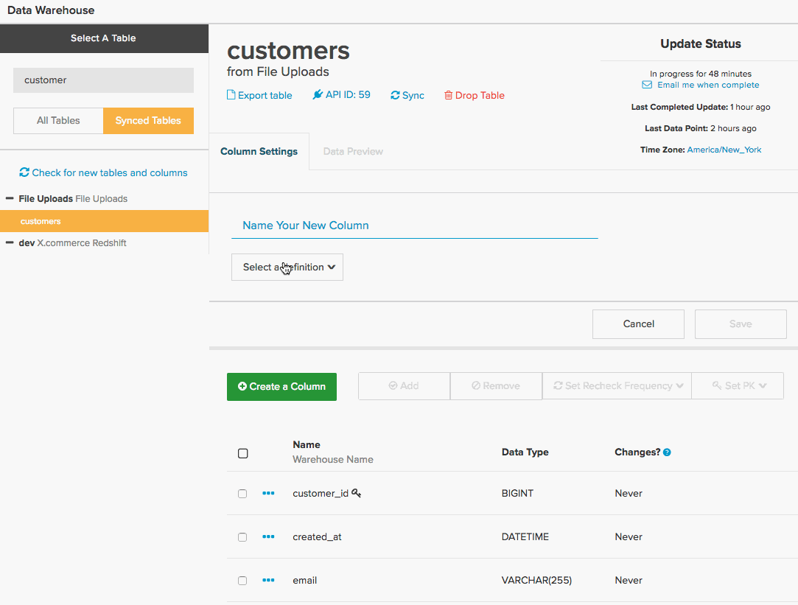

# SQL-query&#39;s vertalen in Commerce Intelligence

ooit vroeg zich af hoe SQL-query&#39;s vertaald worden in de [berekende kolommen](../data-warehouse-mgr/creating-calculated-columns.md), [cijfers](../../data-user/reports/ess-manage-data-metrics.md), en [rapporten](../../tutorials/using-visual-report-builder.md) u gebruikt in [!DNL Commerce Intelligence]? Als u een zware SQL-gebruiker bent, begrijpen hoe SQL wordt vertaald in [!DNL Commerce Intelligence] biedt u de mogelijkheid om slimmer te werken in de [Data Warehouse Manager](../data-warehouse-mgr/tour-dwm.md) en het beste uit de [!DNL Commerce Intelligence] platform.

Aan het einde van dit onderwerp vindt u een **vertaalmatrix** voor SQL-queryclausules en [!DNL Commerce Intelligence] elementen.

Begin door een algemene vraag te bekijken:

| | |
|--- |--- |
| `SELECT` |  |
| `a,` | Rapport `group by` |
| `SUM(b)` | `Aggregate function` (kolom) |
| `FROM c` | `Source` table |
| `WHERE` |  |
| `d IS NOT NULL` | `Filter` |
| `AND time < X`   `AND time >= Y` | Rapport `time frame` |
| `GROUP BY a` | Rapport `group by` |

In dit voorbeeld worden de meeste gevallen van vertaling behandeld, maar er zijn enkele uitzonderingen. Induiken, beginnend met hoe `aggregate` functie is omgezet.

## Samengevoegde functies

Samengevoegde functies (bijvoorbeeld `count`, `sum`, `average`, `max`, `min`) bij vragen in de vorm van **metrische aggregaten** of **kolomaggregaties** in [!DNL Commerce Intelligence]. De differentiërende factor is of een verbinding wordt vereist om de samenvoeging uit te voeren.

Bekijk een voorbeeld voor elk van bovenstaande.

## Metrische aggregaten {#aggregate}

Metrisch is vereist bij aggregatie `within a single table`. Bijvoorbeeld de `SUM(b)` de gezamenlijke functie van de vraag hierboven zou hoogstwaarschijnlijk door metrisch worden vertegenwoordigd die kolom sommen `B`. 

Bekijk een specifiek voorbeeld van hoe een `Total Revenue` Metrisch kan worden gedefinieerd in [!DNL Commerce Intelligence]. Bekijk de query hieronder die u probeert te vertalen:

| | |
|--- |--- |
| `SELECT` |  |
| `SUM(order_total) as "Total Revenue"` | `Metric operation` (kolom) |
| `FROM orders` | `Metric source` table |
| `WHERE` |  |
| `email NOT LIKE '%@magento.com'` | Metrisch `filter` |
| `AND created_at < X`  `AND created_at >= Y` | Metrisch `timestamp` (en rapportage `time range`) |

Navigeer naar de metrische bouwer door te klikken **[!UICONTROL Manage Data** > ** Metrisch **> **Nieuwe metrisch maken]** moet u eerst de juiste `source` de tabel, die in dit geval de `orders` tabel. Dan zou metrisch opstelling zoals hieronder getoond zijn:

## Kolomaggregaties

Een berekende kolom wordt vereist wanneer het samenvoegen van een kolom die van een andere lijst wordt aangesloten. U kunt bijvoorbeeld een kolom in uw `customer` table called `Customer LTV`, die de totale waarde opsommen van alle orders die aan die klant in de `orders` tabel.

De query voor deze aggregatie kan er ongeveer als volgt uitzien:

|  |  |
|--- |--- |
| `Select` | |
| `c.customer_id` | Geaggregeerde eigenaar |
| `SUM(o.order_total) as "Customer LTV"` | Samengevoegde bewerking (kolom) |
| `FROM customers c` | Aggregate owner table |
| `JOIN orders o` | Aggregatiebrontabel |
| `ON c.customer_id = o.customer_id` | Pad |
| `WHERE o.status = 'success'` | Samenvoegen, filter |

Deze instelling instellen in [!DNL Commerce Intelligence] vereist het gebruik van uw manager van de Data Warehouse, waar u een weg tussen uw bouwt `orders` en `customers` tabel maakt vervolgens een kolom met de naam `Customer LTV` in de tabel van uw klant.

Kijk hoe u een nieuw pad kunt instellen tussen de `customers` en `orders`. Het uiteindelijke doel is om een nieuwe samengevoegde kolom te maken in de `customers` tabel, ga dus eerst naar de `customers` tabel in uw Data Warehouse en klik vervolgens op **[!UICONTROL Create a Column** > ** Een definitie selecteren **> **SUM]**.

Vervolgens moet u de brontabel selecteren. Als er een pad naar uw `orders` in de vervolgkeuzelijst. Als u echter een nieuw pad maakt, klikt u op **[!UICONTROL Create new path]** en u ziet hieronder het scherm:

Hier moet u zorgvuldig het verband tussen de twee lijsten overwegen u probeert om zich aan te sluiten. In dit geval kunnen er `Many` orders gekoppeld aan `One` de klant `orders` tabel staat in de lijst `Many` aan de `customers` tabel geselecteerd op `One` zijde.

>[!NOTE]
>
>In [!DNL Commerce Intelligence], `path` is gelijk aan een `Join` in SQL.

Als het pad eenmaal is opgeslagen, kunt u het `Customer LTV` kolom! Zie hieronder:

Nu hebt u de nieuwe `Customer LTV` kolom in uw `customers` tabel, kunt u een [metrische aggregatie](#aggregate) deze kolom gebruiken (bijvoorbeeld om de gemiddelde LTV per klant te vinden). U kunt `group by` of `filter` door de berekende kolom in een rapport gebruikend bestaande metriek die op de `customers` tabel.

>[!NOTE]
>
>Voor de laatste kolom moet u altijd een nieuwe berekende kolom maken [de dimensie toevoegen aan bestaande metriek](../data-warehouse-mgr/manage-data-dimensions-metrics.md) voordat het beschikbaar is als `filter` of `group by`.

Zie [berekende kolommen maken](../data-warehouse-mgr/creating-calculated-columns.md) met uw Data Warehouse Manager.

## `Group By` clausules

`Group By` functies in query&#39;s worden vaak weergegeven in [!DNL Commerce Intelligence] als kolom die wordt gebruikt om een visueel rapport te segmenteren of te filteren. Als voorbeeld kunnen we de `Total Revenue` vraag die u eerder verkende, maar dit tijdsegment de opbrengst door `coupon\_code` om beter te begrijpen welke coupons de meeste inkomsten genereren.

Begin met de onderstaande query:

| | |
|--- |--- |
| `SELECT coupon_code,` | Rapport `group by` |
| `SUM(order_total) as "Total Revenue"` | `Metric operation`(kolom) |
| `FROM orders` | `Metric source` table |
| `WHERE` |  |
| `email NOT LIKE '%@magento.com'` | Metrisch `filter` |
| `AND created_at < '2016-12-01'`   `AND created_at >= '2016-09-01'` | Metrisch `timestamp` (en rapportage `time range`) |
| `GROUP BY coupon_code` | Rapport `group by` |

>[!NOTE]
>
>Het enige verschil met de query waarmee u eerder bent begonnen, is de toevoeging van de &#39;coupon\_code&#39; als groep door._

Hetzelfde gebruiken `Total Revenue` Metrisch die u eerder creeerde, bent u nu bereid om uw rapport van opbrengst tot stand te brengen die door couponcode wordt gesegmenteerd! Kijk hieronder naar de gif die toont hoe te opstelling dit visuele rapport die gegevens van september tot november bekijkt:

## Formulas

Soms, kan een vraag veelvoudige samenvoegingen impliceren om het verband tussen afzonderlijke kolommen te berekenen. U kunt bijvoorbeeld op twee manieren de gemiddelde orderwaarde in een query berekenen:

* `AVG('order\_total')` OF
* `SUM('order\_total')/COUNT('order\_id')`

De eerste methode zou de creatie van een nieuwe metrieke omvatten die een gemiddelde op de `order\_total` kolom. Nochtans kon de laatstgenoemde methode direct in de rapportbouwer worden gecreeerd veronderstellend u reeds metriek opstelling hebt om te berekenen `Total Revenue` en `Number of orders`.

Neem een stap terug en bekijk de algemene vraag voor `Average order value`:

| | |
|--- |--- |
| `SELECT` |  |
| `SUM(order_total) as "Total Revenue"` | Metrisch `operation` (kolom) |
| `COUNT(order_id) as "Number of orders"` | Metrisch `operation` (kolom) |
| `SUM(order_total)/COUNT(order_id) as "Average order value"` | Metrisch `operation` (kolom) / Metrische bewerking (kolom) |
| `FROM orders` | Metrisch `source` table |
| `WHERE` |  |
| `email NOT LIKE '%@magento.com'` | Metrisch `filter` |
| `AND created_at < '2016-12-01'`  `AND created_at >= '2016-09-01'` | Metrische tijdstempel (en tijdbereik van rapportage) |

Stel nu dat u al metriek hebt ingesteld om de `Total Revenue` en `Number of orders`. Aangezien deze metriek bestaan, kunt u eenvoudig openen `Report Builder` en een berekening op aanvraag maken met de `Formula` functie:

## Omloop omhoog

Als u een zware SQL-gebruiker bent, moet u nadenken over hoe query&#39;s worden vertaald in [!DNL Commerce Intelligence] laat u toe om berekende kolommen, metriek, en rapporten te bouwen.

Voor een snelle referentie kunt u de onderstaande matrix uitchecken. Dit toont het equivalent van een SQL-component [!DNL Commerce Intelligence] element en hoe het aan meer dan één element kan in kaart brengen, afhankelijk van hoe het in de vraag wordt gebruikt.

## Commerce Intelligence Elements

| **`SQL Clause`** | **`Metric`** | **`Filter`** | **`Report group by`** | **`Report time frame`** | **`Path`** | **`Calculated column inputs`** | **`Source table`** |
|---|---|---|---|---|---|---|---|
| `SELECT` | X | - | X | - | - | X | - |
| `FROM` | - | - | - | - | - | - | X |
| `WHERE` | - | X | - | - | - | - | - |
| `WHERE` (met tijdelementen) | - | - | - | X | - | - | - |
| `JOIN...ON` | - | X | - | - | X | X | - |
| `GROUP BY` | - | - | X | - | - | - | - |
