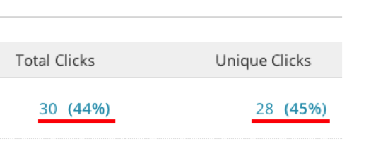

# [!DNL Mailchimp] -gegevens importeren

Als u een uitgebreid beeld wilt krijgen van uw campagnes, kunt u uw [!DNL Mailchimp] e-mailcampagnegegevens importeren in [!DNL Commerce Intelligence] . Als u het importeren wilt voltooien, moet u het volgende doen voor elke [!DNL Mailchimp] -campagne die u hebt:

## Gegevens voor openen exporteren {#opens}

1. Nadat u zich hebt aangemeld bij [!DNL Mailchimp] , gaat u naar de tab `Campaigns` .

   

1. Klik op **[!UICONTROL View Report]** naast de naam van de campagne.

   

1. Klik op het **[!UICONTROL Opened]** nummer.

   

1. Klik op **[!UICONTROL Export]** en sla het `.csv` -bestand op.

   U moet kolommen `primary key` , `date (mm/dd/yyyy)` en `campaign name` aan dit bestand toevoegen. Zorg ervoor dat `primary keys` uniek is voor elke rij.

   

## Klikgegevens exporteren {#clicks}

1. Navigeer terug naar het `View Report` -scherm voor de campagne.

1. Klik op het nummer dat `Clicked` bevat.

   

1. Klik op het nummer onder de kolom `Total Clicks` OR `Unique Clicks` .

   

1. Klik op **[!UICONTROL Export]** en sla het `.csv` -bestand op.

   U moet kolommen `Primary Key` , `date (mm/dd/yyyy)` , `campaign name` en `URL` aan dit bestand toevoegen. U hoeft niet de volledige URL toe te voegen, alleen iets dat u laat weten wat er is geklikt.

   

1. Herhaal stap 3 en 4 voor elke URL waarop u in uw e-mail hebt geklikt, waarbij alle gegevens na afloop in hetzelfde `.csv` -bestand worden gecombineerd.

## Verzonden gegevens exporteren {#sent}

1. Ga naar de tab `Campaigns` van [!DNL Mailchimp] .

1. Klik op **[!UICONTROL View Report]** naast de naam van de campagne.

1. Klik op het nummer naast `Recipients` .

   

1. Klik op **[!UICONTROL Export]** en sla het `.csv` -bestand op.

   U moet kolommen `Primary Key` , `date (mm/dd/yyyy)` en `campaign name` aan dit bestand toevoegen.

   

## Bestanden voorbereiden voor uploaden naar [!DNL Commerce Intelligence] {#upload}

Elk bestand - `Opens` , `Clicks` en `Sent` - moet in [!DNL Commerce Intelligence] als afzonderlijk bestand worden geüpload. Adobe raadt u aan de bestanden een naam te geven met deze naamgevingsconventie: `MailChimp\_ACTION\_DATE` . Vervang `ACTION` door `Open` , `Click` of `Sent` en vervang `DATE` door de datum van export.

Wanneer u klaar bent om de bestanden te uploaden, gebruikt u de [`File Upload` functie &#x200B;](../connecting-data/using-file-uploader.md) om de gegevens over te brengen naar uw Data Warehouse.
