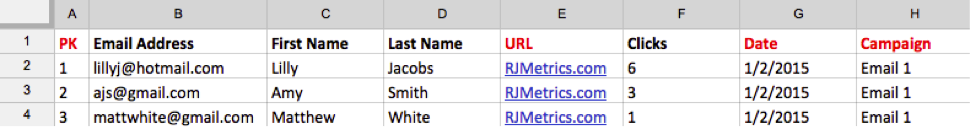

# Importeren `MailChimp` data

Om een volledig beeld te krijgen van uw campagnepogingen, kunt u uw invoeren `MailChimp` gegevens van e-mailcampagne naar [!DNL MBI]. Als u het importeren wilt voltooien, moet u voor elke instantie het volgende doen `MailChimp` campagne die u hebt:

## Gegevens voor openen exporteren {#opens}

1. Nadat u zich hebt aangemeld `MailChimp`, ga naar de `Campaigns` tab.

   

1. Klikken **[!UICONTROL View Report]**, naast de naam van de campagne.

   

1. Klik op de knop **[!UICONTROL Opened]** getal.

   

1. Klikken **[!UICONTROL Export]** en sla de `.csv` bestand.

   U moet toevoegen `primary key`, `date (mm/dd/yyyy)`, en `campaign name` kolommen naar dit bestand. Zorg ervoor dat de `primary keys` zijn uniek voor elke rij.

   

## Klikgegevens exporteren {#clicks}

1. Ga terug naar de `View Report` scherm voor de campagne.

1. Klik op het nummer dat `Clicked`.

   

1. Klik op een van de nummers onder de `Total Clicks` OF `Unique Clicks` kolom.

   

1. Klikken **[!UICONTROL Export]** en sla de `.csv` bestand.

   U moet toevoegen `Primary Key`, `date (mm/dd/yyyy)`, `campaign name`, en `URL` kolommen naar dit bestand. U hoeft niet de volledige URL toe te voegen, alleen iets dat u laat weten wat er is geklikt.

   

1. Herhaal stap 3 en 4 voor elke URL waarop u in uw e-mail hebt geklikt, waarbij alle gegevens in dezelfde URL worden gecombineerd `.csv` bestand als u klaar bent.

## Verzonden gegevens exporteren {#sent}

1. Ga naar de `Campaigns` tabblad van MailChimp.

1. Klikken **[!UICONTROL View Report]** naast de naam van de campagne.

1. Klik op het nummer naast `Recipients`.

   

1. Klikken **[!UICONTROL Export]** en sla de `.csv` bestand.

   U moet toevoegen `Primary Key`, `date (mm/dd/yyyy)`, en `campaign name` kolommen naar dit bestand.

   

## Bestanden voorbereiden voor uploaden naar [!DNL MBI] {#upload}

Elk bestand - `Opens`, `Clicks`, en `Sent` - moet worden geüpload naar [!DNL MBI] als een afzonderlijk bestand. Adobe raadt u aan de bestanden een naam te geven met behulp van deze naamgevingsconventie: `MailChimp\_ACTION\_DATE`. Vervangen `ACTION` with `Open`, `Click`, of `Sent`en vervangen `DATE` met de datum van uitvoer.

Wanneer u klaar bent om de bestanden te uploaden, gebruikt u de [`File Upload` functie](../connecting-data/using-file-uploader.md) om de gegevens in uw Data Warehouse te brengen.
