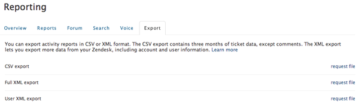

# Audit Zendesk-gegevens

Vond iets vreemd in uw [[!DNL Zendesk]  gegevens ](../integrations/exp-zendesk-data.md)? Om de kwestie te identificeren, moet u uw gegevens onderzoeken. Dit kan worden gedaan door uw [!DNL Zendesk] gegevens naar een downloadbaar dossier te exporteren.

## Gegevens exporteren inschakelen

Gegevensexport is momenteel niet ingeschakeld voor alle [!DNL Zendesk] -accounts. Om deze eigenschap te activeren, [ voorleggen een steunkaartje ](https://experienceleague.adobe.com/docs/commerce-knowledge-base/kb/troubleshooting/miscellaneous/mbi-service-policies.html), die uw [!DNL Zendesk] subdomeinnaam noemen.

>[!NOTE]
>
>Alleen `Enterprise` - en `Plus` -plannen hebben momenteel toegang tot deze functie.

Nadat het exporteren van gegevens is ingeschakeld, kunnen alleen beheerders in een specifiek e-maildomein gegevens van uw [!DNL Zendesk] -account exporteren. Dit e-maildomein is doorgaans hetzelfde e-maildomein als uw [!DNL Zendesk] . Het e-maildomein van de eigenaar van de account wordt als standaard gebruikt, maar u kunt het domein desgewenst wijzigen.

## Exporteren naar een downloadbaar bestand

1. Klik op het pictogram Beheerder (tandwiellogo) op de zijbalk en kies **[!UICONTROL Manage** > **Reports]** .
1. Klik op de tab **[!UICONTROL Export]** .
1. Klik op **[!UICONTROL Request file]** naast Volledige XML-export zoals in de onderstaande afbeelding.

   Op dit punt, begint een bouwstijl; u wordt meegedeeld via e-mail wanneer het voltooit.
   

1. Klik op de koppeling in uw e-mailbericht om een ZIP-bestand met het rapport te downloaden.

   Deze downloadkoppeling is ten minste drie dagen geldig.

Dit proces bouwt een dossier van XML dat alle informatie bevat die in uw huidige [!DNL Zendesk] rekening, met inbegrip van kaartgegevens (met commentaren), gebruikersgegevens, en rekeningsgegevens wordt opgeslagen. Op dit punt, kunt u [ een steunkaartje ](https://experienceleague.adobe.com/docs/commerce-knowledge-base/kb/troubleshooting/miscellaneous/mbi-service-policies.html) voorleggen (ben zeker om dit dossier vast te maken!) zodat kunt u een dichtere blik naar uw gegevens nemen. Als het bestand te groot is, deelt u het bestand via [!DNL Commerce Intelligence] of [!DNL Dropbox] met het team van [!DNL Google Drive] .

Voor meer informatie over [!DNL Zendesk] dossieruitvoer, verwijs naar de officiële [[!DNL Zendesk]  uitvoerdocumentatie ](https://support.zendesk.com/hc/en-us/articles/4408886165402-Exporting-data-to-a-JSON-CSV-or-XML-file).
