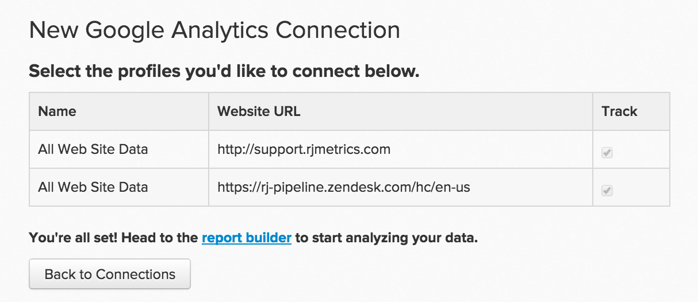

# Verbinden [!DNL Google Analytics]

>[!NOTE]
>
>Vereisten [Beheerdersmachtigingen](../../../administrator/user-management/user-management.md).

[!DNL Google Analytics] is de meest gebruikte webanalysedienst op internet. Implementatie [!DNL Google Analytics] op uw website kunt u bijhouden hoe bezoekers uw site gebruiken, welke inhoud aantrekkelijk is, waar bezoekers vertrekken en nog veel meer. Deze gegevens analyseren in [!DNL Commerce Intelligence], en andere gegevens, verbetert de algehele gezondheid en bruikbaarheid van uw site.

Ga aan de slag met je [!DNL Google Analytics] inloggegevens [!DNL Commerce Intelligence]:

1. Ga naar **[!UICONTROL Manage Data** > **Integrations]**.

1. Klikken **[!UICONTROL Add Integration]**, die zich aan de rechterkant van het scherm bevindt.

1. Klik op de knop [!DNL Google Analytics] pictogram. Hierdoor wordt het [!DNL Google Analytics] aanmeldingspagina.

1. Voer uw [!DNL Google Analytics] referenties. Als het autorisatieproces is voltooid, wordt u teruggeleid naar [!DNL Commerce Intelligence].

1. Een lijst met profiel-id&#39;s. Controleer de profielen waarmee u verbinding wilt maken [!DNL Commerce Intelligence]. Als u meerdere profielen hebt en hulp nodig hebt bij het identificeren van welke profielen, raadpleegt u het dialoogvenster Meerdere verbindingen [!DNL Google Analytics] in de onderstaande sectie Profielen.

   <!--{: width="600px"}-->

1. Wijzigingen worden automatisch opgeslagen, dus klik op **Terug naar Verbindingen** als u klaar bent.

## Meerdere verbindingen maken [!DNL Google Analytics] profielen

U hebt mogelijk meerdere websites verbonden met één [!DNL Google Analytics] eigen rekening [!DNL Google Analytics] profiel-id. In dit geval kunt u al uw profiel-id&#39;s opnemen in [!DNL Commerce Intelligence]. Controleer de profiel-id&#39;s die u wilt opnemen tijdens de stap voor profielselectie.

Om een bepaalde website te identificeren [!DNL Google Analytics] Profiel-id:

1. Aanmelden [!DNL Google Analytics]
1. Ga naar de specifieke website [!DNL Google Analytics] dashboard
1. Kijk naar de URL. De profiel-id komt overeen met de volgende acht nummers `p` aan het einde van de regel:

   `www.google.com/analytics/web/#home/a11345062w43527078p**XXXXXXXX**/`

## Verbinding verbreken [!DNL Google Analytics] van [!DNL Commerce Intelligence] {#disconnect}

1. Bezoek uw [!DNL Google Analytics] [accountinstellingen](https://accounts.google.com/) pagina.
1. Onder de `Security` en klik op **[!UICONTROL edit]** naast `Authorizing` toepassingen en sites.
1. Klikken **[!UICONTROL revoke access]** naast [!DNL Commerce Intelligence].

## Verwante:

* [Integraties opnieuw verifiëren](https://experienceleague.adobe.com/docs/commerce-knowledge-base/kb/how-to/mbi-reauthenticating-integrations.html)
* [Verbinding maken [!DNL Google Adwords]](../integrations/google-adwords.md)
* [Websiteactiviteiten en conversietarieven van klanten analyseren](../../analysis/web-act-cust-conversion.md)
* [Verzamelingsgegevens van gebruikers bijhouden met [!DNL Google Analytics] cookies](../../analysis/google-track-user-acq.md)
