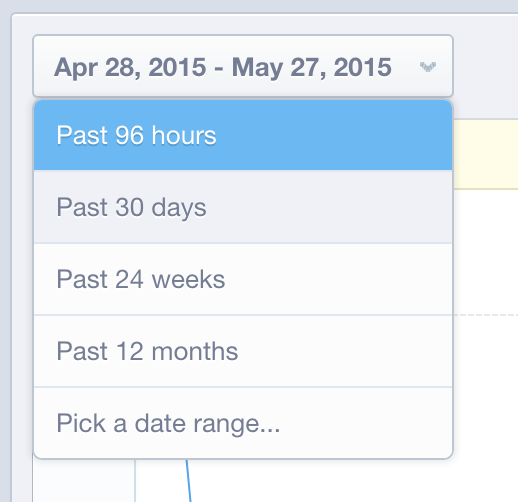

# Gegevensvalidatie in `Mixpanel`

Wanneer [!DNL MBI] maakt eerst verbinding met uw [!DNL Mixpanel] gegevens, kan uw accountmanager of analist u vragen gegevens te exporteren vanuit Mixpanel voor validatiedoeleinden. Zo kunt u bevestigen dat u alle gegevens hebt gesynchroniseerd die direct binnen beschikbaar zijn [!DNL Mixpanel].

## Gegevensuitvoerproces: `Events`

1. Bezoek uw `Segmentation` sectie en weergave `Your Top Events`.

   

1. Selecteren `Past 96 Hours` voor het tijdbereik

   

1. De rol aan het laag-juiste gedeelte van het rapport en voert a uit `.csv` bestand:

   

1. Verzend de `.csv` bestand naar de accountmanager of -analist waarmee u werkt aan dit validatieproces.
