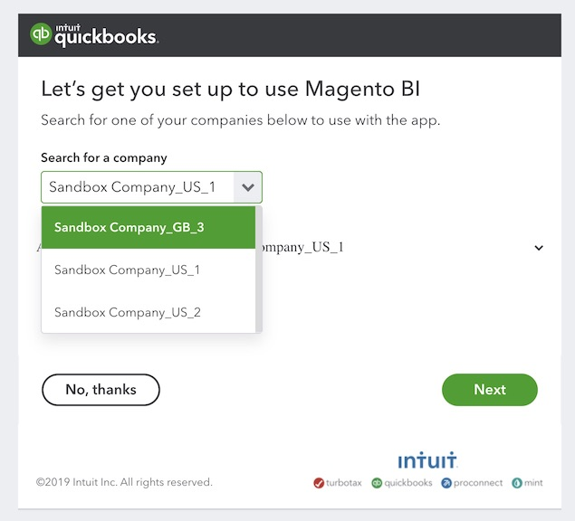

# Verbinden [!DNL QuickBooks]

>[!NOTE]
>
>Vereisten [Beheerdersmachtigingen](../../../administrator/user-management/user-management.md).

Met de [!DNL QuickBooks] integratie, kunnen uw bedrijfsfinanciën nu naast uw verkoop en marketing gegevens leven, die u toestaan om snel en gemakkelijk lusjes op uw uitgaven te houden, overbesteding, en meer te identificeren.

## Toevoegen [!DNL QuickBooks] als gegevensbron in [!DNL MBI]

1. Ga naar de `Integrations` pagina onder **[!UICONTROL Manage Data** > **Data Sources]**.
1. Klikken **[!UICONTROL Add Integration]**, die zich aan de rechterkant van het scherm boven het `Data Sources` tabel.
1. Klik op de knop `QuickBooks` pictogram.
1. Klikken **[!UICONTROL Connect to Quickbooks]**.

## Subsidie [!DNL MBI] toegang tot uw [!DNL QuickBooks] data

Na klikken **[!UICONTROL Connect to Quickbooks]**, meldt u zich aan bij uw [!DNL Intuit] account en autoriseer de verbinding:

1. In de `Search for a company` en selecteer uw bedrijf.
1. Klikken **[!UICONTROL Next]**. U wordt omgeleid naar [!DNL MBI] en *Verbinding gelukt!* verschijnt boven aan het scherm.

## Verwante

* [Verwacht [!DNL QuickBooks] data](../integrations/quickbooks-data.md)
* [Integraties opnieuw verifiëren](https://experienceleague.adobe.com/docs/commerce-knowledge-base/kb/how-to/mbi-reauthenticating-integrations.html?lang=en)
