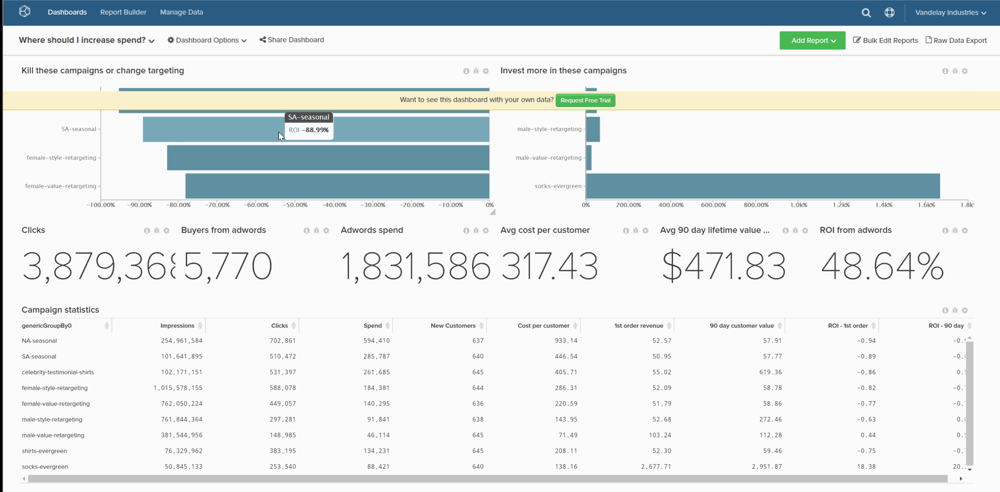

# Een dashboard verwijderen

Als u wilt voorkomen dat de dashboardlijst te onoverzichtelijk wordt, kunt u een dashboard verwijderen als dit niet langer nodig is. Dit kan op twee manieren worden verwezenlijkt:

1. [Via de `Account Settings` page](#account) - deze methode vereist [Beheerdersmachtigingen](../../administrator/user-management/user-management.md).

1. [Via de `Dashboard Options` menu](#do) - deze methode vereist dat u eigenaar bent van het dashboard of `Edit` machtigingen.

## Het dashboard verwijderen via het dialoogvenster `Account Settings` page {#account}

1. Klik op **[!UICONTROL Account Settings** > **Dashboards]**.

1. Klik in de lijst met dashboards op het dashboard dat u wilt verwijderen.

1. Klik op **[!UICONTROL Delete Dashboard]**.

Voorbeeld:

<!--{: width="703" height="346"}-->

## Het dashboard verwijderen via het dialoogvenster `Dashboard Options` menu {#do}

1. Klik op de knop **[!UICONTROL Dashboard Options]** boven aan het scherm.

1. Klik in de vervolgkeuzelijst op **[!UICONTROL Delete]**.

1. Klik wanneer u wordt gevraagd om te bevestigen **[!UICONTROL Delete]**.

Voorbeeld:

<!--{: width="703" height="347"}-->
