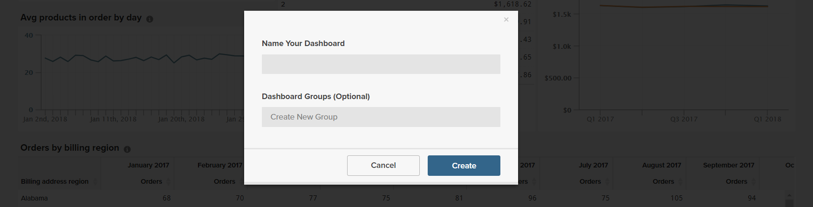

# Dashboards

[!DNL Adobe Commerce Intelligence] Dashboards geven u een snel overzicht van de prestaties en verkoopactiviteiten van uw winkel in één oogopslag. Individuele dashboards kunnen met andere gebruikers worden gedeeld en in logische groepen worden georganiseerd. U kunt ook verschillende machtigingsniveaus instellen voor andere gebruikers.

Het is gemakkelijk om een rapport te creëren, het aan een dashboard toe te voegen, en de gegevens uit te voeren naar Excel. Grafieken en rapporten kunnen worden vergroot of verkleind en naar de gewenste positie op het dashboard worden gesleept.

## Dashboards maken {#createdash}

De dashboards zijn sharable, themed emmers voor de analyses u in de Bouwers van het Rapport creeert. Op deze manier kunt u uw team aanmoedigen om samen te werken en één bron van waarheid in uw organisatie te onderhouden.

*als u Admin of een Standaardgebruiker* bent, kunt u een dashboard tot stand brengen door `Dashboard Options` dropdown te klikken en `Create New dashboard` te kiezen.

Hoe de dashboards die u maakt er uitzien, is volledig aan u. U kunt de elementen in het dashboard op elke gewenste manier rangschikken en de grootte ervan wijzigen.

### Een dashboard maken

1. Klik in het menu op **[!UICONTROL Dashboards]** .

1. De naam van het standaarddashboard verschijnt in de linkerbovenhoek van de dashboardkopbal. Klik de benedenpijl () om de beschikbare opties te tonen.

   

1. Klik op **[!UICONTROL Create Dashboard]**. Voer vervolgens de volgende handelingen uit:

   * Voer een `Name` voor het dashboard in.

   * Voer de naam van de groep in als u een `Group` voor het dashboard wilt maken.

     Als uw Commerce-installatie bijvoorbeeld meerdere winkelweergaven bevat, kunt u een groep maken voor elke winkelweergave.

   * Klik op **[!UICONTROL Create]**.

   

   * De naam van het nieuwe dashboard wordt in de linkerbovenhoek weergegeven. Klik de benedenpijl () om de opties te tonen. Als u een groep hebt gemaakt, wordt het nieuwe dashboard onder de groep in de lijst weergegeven.

### Een rapport toevoegen

1. Voer een van de volgende handelingen uit om een rapport toe te voegen:

   * Klik op de vraag **[!UICONTROL Add a report]** op de pagina.

   * Klik in de dashboardkoptekst op **[!UICONTROL Add Report]** .

      toe

1. Klik op **[!UICONTROL Create Report]** om de **[!UICONTROL Report Builder Options]** weer te geven.

   

## Items op een dashboard ordenen

* Als u het formaat van een diagram of rapport wilt wijzigen, sleept u de rechterbenedenhoek naar de nieuwe grootte.

* Als u een grafiek of rapport wilt verplaatsen, houdt u de muisaanwijzer boven de titel of koptekst totdat de cursor verandert in een kruis. Sleep het vervolgens naar de gewenste positie.

## Uw dashboards beheren {#managedash}

In **[!DNL Manage Data** > **Dashboards]** kunt u gebruikersmachtigingen beheren voor dashboards die u hebt, dashboards verwijderen die u niet meer nodig hebt en een standaarddashboard instellen.

### Uw dashboards delen {#sharingdash}

Adobe raadt u aan dashboards die u maakt met andere teamleden te delen, zodat u [!DNL Commerce Intelligence] in uw hele organisatie kunt schalen en waardevolle inzichten kunt bieden. *u kunt dashboards delen u* bezit door de `Share Dashboard` optie bij de bovenkant van de pagina te klikken.

Wanneer u een dashboard deelt, kunt u toestemmingen over uw organisatie OF op een individuele basis toewijzen, betekenend kunt u beslissen wie uw rapporten kan bekijken en uitgeven.

>[!NOTE]
>
>`Read-Only` -gebruikers hebben alleen toegang tot dashboards die rechtstreeks met hen worden gedeeld. Ze kunnen zelf geen dashboards zoeken en toevoegen. Vergeet niet ze in de lus te houden!

### Gedeelde dashboards openen {#accessshared}

*als u een Admin of Standaardgebruiker* bent en een gedeeld dashboard aan uw rekening wilt toevoegen, kunt u dit doen door **[!UICONTROL Dashboard Options]** te klikken en dan **[!UICONTROL Find]** in dropdown te klikken.

<!--{: width="1000" height="535"}-->

### Dashboardinstellingen beheren

1. Klik in het menu op **[!DNL Manage Data** > **Dashboards]** .

1. Voer indien van toepassing een nieuwe `Dashboard Name` in.

1. Als u het dashboard aan een specifieke `Dashboard Group` wilt toewijzen, kiest u een optie in de lijst met groepen.

   **`Permissions`**

   Ga als volgt te werk om alle gebruikers hetzelfde toegangsniveau tot het dashboard te bieden:

   1. Kies onder **`Shared with`** een van de volgende opties:

      * `View`
      * `Edit`
      * `None`

   1. Klik op **[!UICONTROL OK]** wanneer u om bevestiging wordt gevraagd om het machtigingsniveau voor elke gebruiker bij te werken.

   1. Als u het machtigingsniveau van een individu wilt wijzigen, zoekt u de gebruiker in de lijst naar een ander machtigingsniveau. De wijziging wordt automatisch opgeslagen.

   **`Default`**

   1. Als u van dit dashboard de standaardinstelling voor uw [!DNL Commerce Intelligence] -account wilt maken, klikt u op **[!UICONTROL Make Default]** .

   **`Remove`**

   1. Klik op **[!UICONTROL Delete Dashboard]** om het dashboard te verwijderen.
