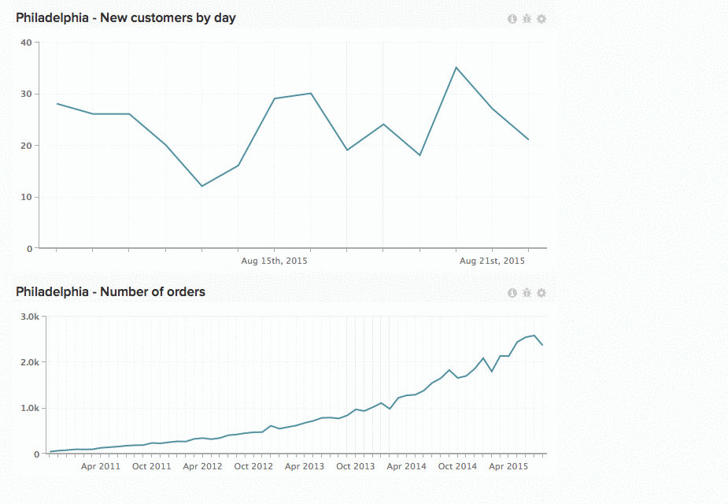

# Werken met diagrammen in dashboards

Schaalgetallen. Staafgrafieken. Grafieken die zich uitstrekken over lange perioden. Op elk diagram wordt informatie anders weergegeven. Dit betekent dat de grootte en locatie van grafieken geen standaard oplossing is. In [!DNL MBI]kunt u grafieken aanpassen en de grootte ervan wijzigen om de ideale werkruimte te maken.

*Een diagram vergroten of verkleinen*, klikt en sleept u de rechterbenedenhoek van een diagram.

*Een diagram verplaatsen* Houd de muisaanwijzer boven de bovenkant van het diagram tot de `Move` cursorweergaven. Klik en houd, dan sleep de grafiek aan de gewenste plaats. Laat de klik los om de grafiek te plaatsen.

