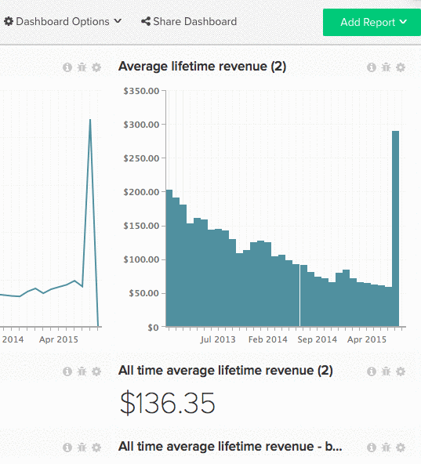

# Dashboards delen met andere gebruikers

Het delen van dashboards is een uitstekende manier om uw team in de loop te houden en samenwerkingsbespreking aan te moedigen. Door een centraal dashboard te creëren en te delen, kunt u uw team van de informatie voorzien zij terwijl het handhaven van controle nodig hebben. [[!DNL Adobe]  adviseert &#x200B;](../../best-practices/share-dashboard-best-practice.md){: target="_blank"} dat u `Edit` rechten op uitgezochte enkelen verleent om toevallige veranderingen te minimaliseren.

>[!NOTE]
>
>Als het dashboard dat u deelt rapporten bevat die zijn gebouwd met metriek die een specifieke gebruiker geen toegang tot heeft, tonen de rapporten een `Error Loading Data` bericht. Als u de gegevens aan de specifieke gebruiker wilt verschijnen, moet een [&#x200B; admin gebruiker &#x200B;](../../administrator/user-management/user-management.md) toegang tot alle metriek verlenen die in die rapporten wordt gebruikt.

## Een dashboard delen

1. Klik op **[!UICONTROL Share Dashboard]** boven aan het scherm.

   Er wordt een lijst weergegeven met alle gebruikers in uw [!DNL Commerce Intelligence] -account.

1. Als u een gebruiker wilt selecteren om het dashboard mee te delen, schakelt u het selectievakje links van de naam in.

   Als u alle gebruikers wilt selecteren/deselecteren, klikt u op **[!UICONTROL Select]** en selecteert u respectievelijk `Everyone` of `None` .

1. De toestemmingen kunnen op een gebruiker-door-gebruiker basis of en masse worden geplaatst.

   *om individuele toestemmingen* te plaatsen, klik **[!UICONTROL None]** rechts van de naam van de gebruiker. Selecteer in dit vervolgkeuzemenu het type machtigingen dat de gebruiker moet hebben.

   *om toestemmingen en masse* te plaatsen, klik **[!UICONTROL Set Permissions]**. Selecteer in dit vervolgkeuzemenu het type machtigingen dat de geselecteerde gebruikers moeten hebben.

   >[!NOTE]
   >
   >U kunt deze functie ook gebruiken om eerder ingestelde machtigingen bij te werken. Als u bijvoorbeeld wilt stoppen met het delen van het dashboard met iemand, stelt u de machtigingen in op `None` .

1. Klik op **[!UICONTROL Save Changes]** om het dashboard te delen. De geselecteerde gebruikers ontvangen een e-mail met een uitnodiging om het dashboard te bekijken.

Voorbeeld:

