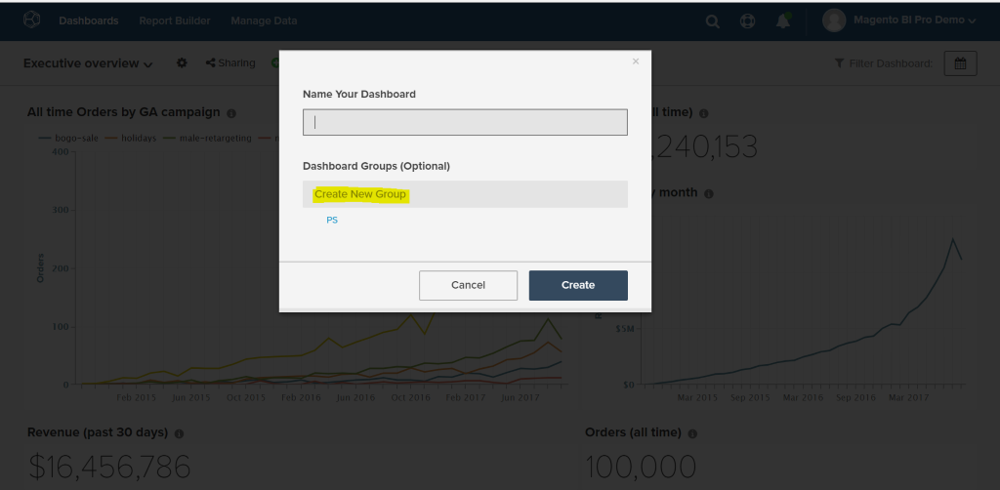

# Dashboardgroepen gebruiken

Met dashboardgroepen kunt u dashboards beter organiseren. Het meest gebruikte geval is het groeperen van vergelijkbare dashboards onder dezelfde &quot;groep&quot;. Alle dashboards die betrekking hebben op marketing kunnen bijvoorbeeld worden gegroepeerd onder een dashboardgroep &quot;Marketing&quot;.

In het vervolgkeuzemenu voor dashboardselectie worden dashboardgroepen in alfabetische volgorde weergegeven, waarbij alle dashboards onder &quot;Geen groep&quot; als laatste worden weergegeven. De dashboards onder de zelfde groep worden getoond samen en in alfabetische orde binnen elke groep.

## Delen van dashboardgroep

Dashboardgroepen kunnen niet rechtstreeks tussen gebruikers worden gedeeld. Wanneer een dashboard met gebruikers wordt gedeeld, wordt de dashboardgroep onder automatisch gecreeerd voor die gebruikers als het niet bestaat. Als de dashboardgroep bestaat, wordt het dashboard toegevoegd aan de lijst.

Wanneer de groep van een dashboard door zijn eigenaar wordt veranderd, wordt de verandering automatisch weerspiegeld voor alle gebruikers met wie het dashboard is gedeeld. Gebruikers kunnen de dashboardgroep niet wijzigen voor dashboards die ze niet hebben.

## Dashboardgroepen maken

U kunt op twee manieren dashboardgroepen maken:

1. Bij het maken van een dashboard:

   

1. Wanneer u de groep van een bestaand dashboard wijzigt, gaat u van de pagina `Manage Data > Dashboards` als volgt te werk:

   1. Klik op het dashboard waarvoor u de groep wilt maken.

   1. Onder `Dashboard Group (optional)` wordt de huidige dashboardgroep weergegeven.

   1. Als u een groep wilt maken, typt u de naam van de nieuwe groep en klikt u buiten het vak.

      

## Bestaande dashboards toevoegen aan bestaande groepen

1. Kies op de pagina `Manage Data > Dashboards` het dashboard waarvoor u de groep wilt wijzigen.

1. De tekst onder `Dashboard Group (optional)` toont de huidige dashboardgroep van het dashboard.

1. Als u de groep van het dashboard wilt wijzigen, kiest u een andere groep in de lijst - in dit geval `PS` , `Campaigns` .

   

## Dashboardgroepen verwijderen

Als er geen dashboardgroep in de dashboardgroep zit, wordt de groep automatisch verwijderd.
