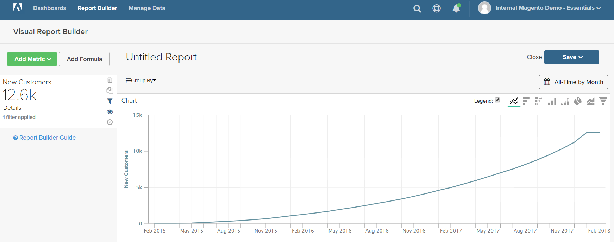

# Filters

Een of meer filters kunnen worden toegevoegd om de gegevens te beperken die worden gebruikt om een rapport te produceren. Elk filter is een expressie die een kolom uit de bijbehorende tabel, een operator en een waarde bevat. Bijvoorbeeld om slechts herhaalde klanten te omvatten, zou u een filter kunnen tot stand brengen dat slechts klanten omvat die meer dan één orde hebben geplaatst. Met logische `AND/OR` operatoren kunnen meerdere filters worden gebruikt om logica aan het rapport toe te voegen.

>[!TIP]
>
>Een rapport kan een maximum van 3.500 gegevenspunten hebben. Om het aantal gegevenspunten te verminderen, gebruik een filter om de hoeveelheid gegevens te verminderen die wordt gebruikt om het rapport te produceren.

[!DNL Adobe Commerce Intelligence] bevat een selectie van filters die u &quot;uit de doos (OTB)&quot; kunt gebruiken of kunt aanpassen om aan uw behoeften te voldoen. Het aantal filters dat u kunt maken, is onbeperkt.

## Een filter toevoegen:

1. Houd de muisaanwijzer boven elk gegevenspunt in het diagram.

   In dit rapport, toont elk gegevenspunt het totale aantal klanten voor de maand.

1. In het linkerpaneel, klik de Filters ().

    toe

1. Klik op **[!UICONTROL Add Filter]**.

   Filters worden alfabetisch genummerd en de eerste is `[A]` . De eerste twee delen van het filter zijn vervolgkeuzemogelijkheden en het derde deel is een waarde.

   

   * Klik op het eerste deel van het filter en kies de kolom die u als het onderwerp van de expressie wilt gebruiken.

     

   * Klik op het tweede deel van het filter en kies de operator.

     

   * Voer in het derde deel van het filter de waarde in die nodig is om de expressie te voltooien.

      in

   * Klik op **[!UICONTROL Apply]** wanneer het filter is voltooid.

     Het rapport omvat nu slechts herhaalde klanten, en het aantal klantenverslagen die voor het rapport zijn teruggewonnen is verminderd van 33.000 tot 12.600.

     <!--{: .zoom}-->

1. In sidebar, klik het perspectief ().

   <!--{: .zoom}-->

1. Kies `Cumulative` in de lijst met instellingen. Klik vervolgens op **[!UICONTROL Apply]** .

   

   Het perspectief `Cumulative` verdeelt de verandering in tijd, eerder dan het tonen van oneffen omhoog en downs voor elke maand.

1. Voer een `Title` voor het rapport in en klik op **[!UICONTROL Save]** het rapport als een `Chart` voor het dashboard.

   
