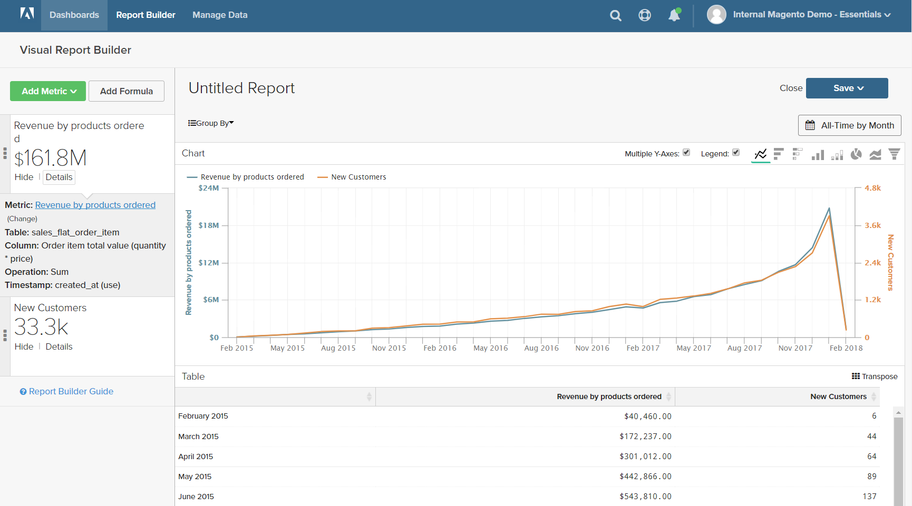

# Formulas

Een formule combineert meerdere meetgegevens en wiskundige logica om een vraag te beantwoorden. Bijvoorbeeld, hoeveel van de opbrengst per product tijdens het vakantieseizoen door nieuwe klanten werd geproduceerd?

## Stap 1: Maak het basisrapport

1. Kies `Report Builder` in het menu.

1. Klik **[!UICONTROL Add Metric]** en kies eerste metrisch voor het rapport.

   In dit voorbeeld wordt de metrische waarde `Revenue by products ordered` gebruikt.

1. Klik nogmaals op **[!UICONTROL Add Metric]** en kies de tweede metrische waarde voor het rapport.

   In dit voorbeeld wordt de metrische waarde `New Customers` gebruikt.

1. Klik in het zijpaneel op **[!UICONTROL Details]** om informatie over elke meting weer te geven.

   

1. Klik in het zijpaneel op de naam van elke metrische waarde om de instellingenpagina in een nieuw browsertabblad te openen. Schuif omlaag om elke component van metrisch, met inbegrip van de metrische vraag, de filter, en de afmetingen te zien.

   

1. Klik op het vorige browsertabblad om terug te keren naar uw rapport.

1. Houd de muisaanwijzer in de grafiek boven een paar gegevenspunten op elke regel om de aan elke meting gekoppelde hoeveelheden weer te geven.

## Stap 2: Een formule toevoegen

1. Klik boven aan het zijpaneel op **[!UICONTROL Add Formula]** .

   In het vak Formule worden de meetgegevens weergegeven als beschikbare invoer `A` en `B` en wordt een invoervak weergegeven waarin u de formule kunt invoeren.

   Ga als volgt te werk:

   * Voer in het invoervak `Enter your Formula` `A/B` in.

     Dit deelt de opbrengst door producten die door het aantal nieuwe klanten worden bevolen.

   * Stel `Select format` in op `123Number` .

   * Vervang `Untitled` in het zijpaneel door een naam voor de formule.

   

1. Klik op **[!UICONTROL Apply]** als de bewerking is voltooid.

   Het rapport heeft nu een nieuwe regel voor de formule, `New Customer Revenue`, en sidebar toont het totale bedrag van opbrengst die door nieuwe klanten wordt geproduceerd.

   

## Stap 3: Een datumbereik toevoegen

1. Klik op **[!UICONTROL Date Range]** in de rechterbovenhoek.

1. Ga als volgt te werk op het tabblad `Fixed Date Range` :

   * Kies in de kalenders het datumbereik.

     In dit voorbeeld loopt het feestseizoen van `November 1` tot en met `December 31` .

   * Kies onder `Select Time Interval` de optie `Day` .

     

   * Klik op **[!UICONTROL Apply]** als de bewerking is voltooid.

   Het verslag is nu beperkt tot het vakantieseizoen, met een datapunt voor elke dag.

   

## Stap 4: Sla het rapport op

In deze stap, slaat u het rapport als grafiek en ook als lijst op.

1. Klik op `Untitled Report` boven aan de pagina en voer een beschrijvende titel in. In dit voorbeeld is de rapporttitel `2017 Holiday Sales` .

   Voer vervolgens de volgende handelingen uit:

   * Klik in de rechterbovenhoek op **[!UICONTROL Save]** .

   * Accepteer de standaardinstelling `Chart` voor `Type` .

   * Kies de locatie `Dashboard` waar het rapport beschikbaar moet zijn.

   * Klik op **[!UICONTROL Save to Dashboard]**.

1. Klik op de rapporttitel en wijzig de naam. In dit voorbeeld is de rapporttitel gewijzigd in `2017 Holiday Sales Data` .

   Voer vervolgens de volgende handelingen uit:

   * Klik in de rechterbovenhoek op **[!UICONTROL Save a Copy]** .

   * Stel `Type` in op `Table` .

   * Kies de locatie `Dashboard` waar het rapport beschikbaar moet zijn.

   * Klik op **[!UICONTROL Save a Copy to Dashboard]**.

1. Voer een van de volgende handelingen uit om de rapporten in het dashboard weer te geven:

   * Klik op **[!UICONTROL Go to Dashboard]** in het bericht boven aan de pagina.

   * Kies **[!UICONTROL Dashboards]** in het menu. Klik de naam van het huidige dashboard om de lijst te tonen. Klik vervolgens op de naam van het dashboard waar het rapport is opgeslagen.
