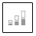

# [!DNL Visual Report Builder]

Met [!DNL Visual Report Builder] kunt u eenvoudig snelle rapporten maken op basis van vooraf gedefinieerde cijfers. Elke metrisch omvat een vraag die de reeks gegevens voor het rapport bepaalt.

Het volgende voorbeeld toont hoe te om een eenvoudig rapport tot stand te brengen, groepeert de gegevens door een extra afmeting, plaatst het datum en tijdinterval, verandert het grafiektype, en bewaart het rapport aan een dashboard.

## Een eenvoudig rapport maken:

1. Klik in het menu [!DNL Commerce Intelligence] op **[!UICONTROL Report Builder]** .

1. Klik onder [!UICONTROL Visual Report Builder] op **[!UICONTROL Create Report]** en voer de volgende handelingen uit:

   * Klik op **[!UICONTROL Add Metric]**.

     De beschikbare metriek kan alfabetisch of door lijst worden vermeld.

     

   * Kies metrisch  dat de reeks gegevens beschrijft die u voor het rapport wilt gebruiken.

     De metrische waarde `New Customers` die in dit voorbeeld wordt gebruikt telt alle klanten, en sorteert de lijst door de datum de klant die voor een rekening wordt aangemeld. Het eerste rapport bevat een eenvoudige lijngrafiek, gevolgd door de tabel met gegevens.

     Het overzicht op de linkerzijde toont de naam van huidige metrisch, die door het resultaat van om het even welke berekeningen op kolomgegevens wordt gevolgd die in metrisch worden gespecificeerd. In dit voorbeeld geeft het overzicht het totale aantal klanten weer.

     

1. Houd de muisaanwijzer boven elk gegevenspunt op de regel in het diagram. Elk gegevenspunt toont het totale aantal nieuwe klanten die zich tijdens die maand hebben aangemeld.

1. Volg deze instructies om de gegevens te groeperen, de datumwaaier, en grafiektype te veranderen.

   **`Group By`**

   Met het besturingselement `Group By` kunt u meerdere afmetingen per groep of segment toevoegen. Dimensies zijn kolommen in de tabel die kunnen worden gebruikt om de gegevens te groeperen.

   * Kies een van de beschikbare afmetingen in de lijst met `Group By` -opties.

     In dit voorbeeld heeft het systeem vijf couponcodes gevonden die door klanten werden gebruikt bij het plaatsen van hun eerste bestelling.

     

     In `Group By` worden alle coupons weergegeven die door klanten worden gebruikt. De coupons die zijn gebruikt om de eerste bestelling te plaatsen, zijn gemarkeerd met een selectievakje. Het diagram bevat nu meerdere gekleurde lijnen die elke coupon vertegenwoordigen die voor een eerste bestelling is gebruikt. De legenda heeft een kleurcode die overeenkomt met elke gegevensrij.

   * Klik op **[!UICONTROL Apply]** om het venster Groeperen op detail te sluiten.

     

   * Houd de muisaanwijzer boven een paar gegevenspunten op elke regel om het aantal klanten te zien dat de coupon tijdens het plaatsen van de eerste bestelling heeft gebruikt.

   * De tabel met gegevens heeft nu een extra dimensie, met een kolom voor elke maand en een rij voor elke couponcode.

     

   * Klik op het besturingselement Omwisselen () in de rechterbovenhoek van de tabel om de richting van de gegevens te wijzigen.

     De as van de gegevens wordt gespiegeld en de tabel heeft nu een kolom voor elke couponcode en een rij voor elke maand. Deze richting is misschien beter leesbaar.

     

   **`Date Range`**

   Het besturingselement `Date Range` geeft het huidige datumbereik en de instellingen voor het tijdinterval weer en bevindt zich vlak boven het diagram rechts.

   * Klik op het besturingselement `Date Range` , dat in dit voorbeeld is ingesteld op `All-Time by Month` .

     

   * Breng de volgende wijzigingen aan:

      * Als u wilt inzoomen voor een betere weergave, wijzigt u het datumbereik in `Last Full Quarter` .
      * Kies onder `Select Time Interval` de optie `Week` .
      * Klik op **[!UICONTROL Save]** als de bewerking is voltooid.

     Het verslag bevat nu alleen de gegevens voor het laatste kwartaal, per week.

     

   **Type van Grafiek**

   * Klik op de besturingselementen in de rechterbovenhoek om het beste diagram voor de gegevens te zoeken.

     Sommige diagramtypen zijn niet compatibel met multidimensionale gegevens.

     | | |
     |-----|-----|
     |  | Lijngrafiek |
     |  | Horizontale balk |
     |  | Horizontale gestapelde balk |
     |  | Verticale balk |
     |  | Verticale gestapelde balk |
     |  | Schijf |
     |  | Gebied |
     |  | Trechter |

     {style="table-layout:auto"}

1. Als u het rapport een `title` wilt geven, vervangt u de `Untitled Report` -tekst boven aan de pagina door een beschrijvende titel.

1. Klik in de rechterbovenhoek op **[!UICONTROL Save]** en voer de volgende handelingen uit:

   * Accepteer de standaardinstelling `Type` voor `Chart` .

   * Kies de locatie `Dashboard` waar het rapport beschikbaar moet zijn.

   * Klik op **[!UICONTROL Save to Dashboard]**.

     

1. Voer een van de volgende handelingen uit om de grafiek in een dashboard weer te geven:

   * Klik op **[!UICONTROL Go to Dashboard]** in het bericht boven aan de pagina.

   * Kies `Dashboards` in het menu en klik op de naam van het huidige dashboard om de lijst weer te geven. Klik vervolgens op de naam van het dashboard waar het rapport is opgeslagen.

     
