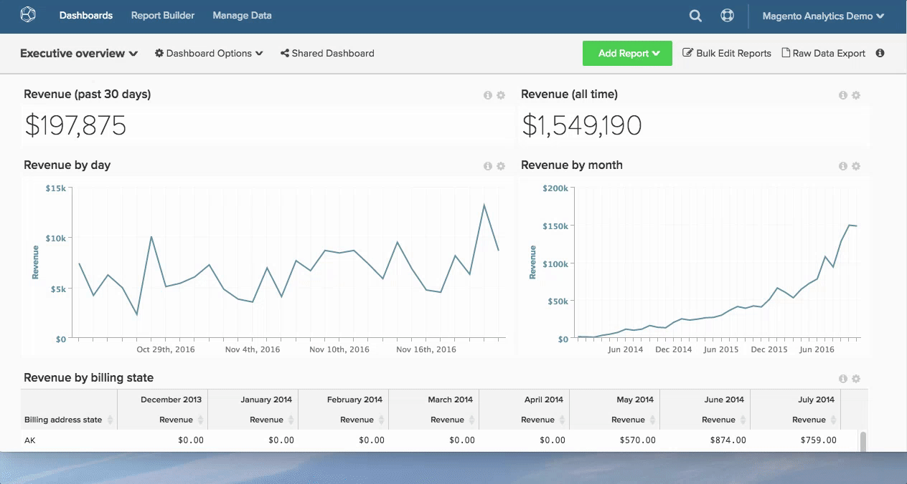

# Een rapport gebruiken

Gebruik rapporten in [!DNL Adobe Commerce Intelligence] om u te helpen bedrijfsvragen te beantwoorden - of u gewoon de inkomsten van deze maand wilt zien in vergelijking met vorig jaar, of uw aanschafkosten voor uw nieuwste [!DNL Google AdWords] -campagne wilt begrijpen.

Hoe ziet dat pad van vraag tot antwoord er precies uit?

Om u te helpen dit proces visualiseren, wordt die route hieronder in kaart gebracht. Dit onderwerp werpt licht op zowel hoe u een analytische vraag benadert, als de achterste logistiek die wordt vereist om u de gegevens te krijgen u nodig hebt.

## Beginnen met de vraag

U weet dat u constant vragen stelt om uw zaken te verbeteren, van het verhogen van klantentevredenheid aan het drukken van leveringskosten. U richt zich op hoe te om uw vragen in analyses te vertalen die u helpen besluiten drijven.

In dit voorbeeld gaat u ervan uit dat u de volgende vraag wilt beantwoorden:

* Hoe snel converteren mijn nieuwe registranten?

## Een meting identificeren

Het wordt tijd om een lijst van mogelijke analyses en metingen te identificeren om de vraag te helpen beantwoorden. Voor dit voorbeeld, nadruk op volgende metrisch:

* Gemiddelde tijd van registratie tot eerste aankoopdatum per gebruik.

Hieruit blijkt de gemiddelde tijd die verstrijkt tussen de registratiedatum en de eerste aankoopdatum van de gebruikers en geeft u een idee van hoe gebruikers zich gedragen in deze laatste stap in de conversie-funnel.

## De gegevens zoeken

Begrijpen wat je moet meten, brengt ons slechts een deel van de weg naar daar. Om de gemiddelde tijd van registratie aan eerste aankoopdatum per gebruiker te beoordelen, moet u alle gegevenspunten identificeren die uw maatregel van wordt samengesteld.

Verdeel uw maatstaf in de kerncomponenten. U moet het aantal personen weten dat zich heeft geregistreerd, het aantal personen dat een aankoop heeft gedaan en de tijd die is verstreken tussen deze twee gebeurtenissen.

Op een hoger niveau, moet u weten waar te om deze gegevens in het gegevensbestand te vinden, specifiek:

* De lijst die een rij gegevens registreert telkens als iemand registreert
* De lijst die een gegevensrij registreert die telkens als iemand een aankoop maakt
* De kolom die kan worden gebruikt om de tabel `purchase` aan te sluiten of naar de tabel `customer` te verwijzen - hiermee kunnen we weten wie een aankoop heeft gedaan

Op een meer korrelig niveau, moet u de nauwkeurige gegevensgebieden identificeren die voor deze analyse worden gebruikt:

* De datatabel en de kolom die de registratiedatum van een klant bevatten: bijvoorbeeld `user.created\_at`
* De datatabel en de kolom die een aankoopdatum bevatten, bijvoorbeeld `order.created\_at`

## Gegevenskolommen maken voor analyse

Naast de bovenstaande native gegevenskolommen hebt u ook een set berekende gegevensvelden nodig om deze analyse mogelijk te maken, waaronder:

* `Customer's first purchase date` dat de waarde van een specifieke gebruiker retourneert `MIN(order.created_at`

Dat wordt vervolgens gebruikt om:

* `Time between a customer's registration date and first purchase date` , dat de tijd van een specifieke gebruiker tussen registratie en eerste aankoopdatum verstreek. Dit is de basis voor metrisch later.

Beide velden moeten op gebruikersniveau worden gemaakt (bijvoorbeeld op de tabel `user` ). Hierdoor kan de gemiddelde analyse door de gebruikers worden genormaliseerd (met andere woorden, de noemer in deze gemiddelde berekening is het aantal gebruikers).

Hier wordt door [!DNL Commerce Intelligence] ingesprongen! U kunt uw [!DNL Commerce Intelligence] Data Warehouse gebruiken om de bovenstaande kolommen te maken. Neem contact op met het Adobe-analistenteam en geef ons de specifieke definitie van uw nieuwe kolommen voor het maken. U kunt de [&#x200B; Redacteur van de Kolom &#x200B;](../../data-analyst/data-warehouse-mgr/creating-calculated-columns.md) ook gebruiken.

Het is aan te raden te vermijden dat u deze berekende gegevensvelden rechtstreeks in uw database maakt, aangezien dit een onnodige belasting voor uw productieservers betekent.

## Metrisch maken

Nu u de vereiste gegevensgebieden voor de analyse hebt, is het tijd om relevante metrisch te vinden of tot stand te brengen om uw analyse te construeren.

Hier wilt u de volgende berekening uitvoeren:

_[SUM van `Time between a customer's registration date and first purchase date`] / [ Totaal aantal klanten dat registreerde en]_ kocht

En u wilt deze berekening in tijd, of trending, volgens de registratiedatum van een klant in kaart brengen. En hier is hoe te [&#x200B; deze metrische &#x200B;](../../data-user/reports/ess-manage-data-metrics.md) binnen [!DNL Commerce Intelligence] creëren:

1. Ga naar **[!UICONTROL Data]** en selecteer de tab `Metrics` .
1. Klik op **[!UICONTROL Add New Metric]** en selecteer de tabel `user` (waarin u de bovenstaande afmetingen hebt gemaakt).
1. Selecteer in het vervolgkeuzemenu de optie `Average` in de kolom `Time between a customer's registration date and first purchase date` in de tabel `user` die wordt gerangschikt door de kolom `Customer's registration date` .
1. Voeg relevante filters of filtersets toe.

Deze metrische waarde is nu klaar.

## Het rapport maken

Met de nieuwe metrische opstelling, kunt u het gebruiken om over de gemiddelde tijd tussen registratie en eerste aankoopdatum door registratiedatum te melden.

Ga eenvoudig naar om het even welk dashboard en [&#x200B; creeer een rapport &#x200B;](../../data-user/reports/ess-manage-data-metrics.md) gebruikend metrisch hierboven gecreeerd.

### `Visual Report Builder` {#visualrb}

[&#x200B; `Visual Report Builder`](../../data-user/reports/ess-rpt-build-visual.md) is de gemakkelijkste manier om uw gegevens te visualiseren. Als u niet vertrouwd met SQL bent of u een rapport wilt snel tot stand brengen, is Visual Report Builder uw beste weddenschap. Met slechts een paar klikken, kunt u metriek toevoegen, uw gegevens segmenteren, en rapporten tot stand brengen aan over uw organisatie. Deze optie is ideaal voor zowel beginners als deskundigen, aangezien hiervoor geen technische expertise vereist is.

|  |  |
|--- |--- |
| **dit is perfect voor...** | **dit is niet zo groot voor...** |
| - Alle niveaus van analyse/technologieervaring   - snel het creëren van rapporten   - het Creëren van analyses om met andere gebruikers te delen | - Analyseert die SQL-Specifieke functies   vereist - het Testen van nieuwe kolommen - de berekende kolommen hangen van updatecycli voor aanvankelijke gegevensbevolking af, terwijl die gecreeerd gebruikend SQL niet zijn. |

{style="table-layout:auto"}

### Beschrijvingen en afbeeldingen rapporteren

#### Beschrijvingen toevoegen aan rapporten

Bij het maken van rapporten die worden gedeeld met andere leden van uw team, raadt Adobe aan beschrijvingen toe te voegen waarmee andere gebruikers uw analyse beter kunnen begrijpen.

1. Klik op **[!UICONTROL i]** boven aan een willekeurig rapport.
1. Voer in het tekstvak een beschrijving in.
1. Klik op **[!UICONTROL Save Description]**.

Zie hieronder:

#### Rapporten exporteren als afbeeldingen

Wilt u een rapport opnemen in een presentatie of document? Elk rapport kan worden opgeslagen als een afbeelding (in de PNG-, PDF- of SVG-indeling) via het menu `Report Options` in de rechterbovenhoek van elk rapport.

1. Klik op het tandwielpictogram in de rechterbovenhoek van een rapport.
1. Selecteer `Enlarge` in het vervolgkeuzemenu.
1. Wanneer het rapport wordt vergroot, klikt u op **[!UICONTROL Download]** in de rechterbovenhoek van het rapport.
1. Selecteer de gewenste afbeeldingsindeling in het vervolgkeuzemenu. Het downloaden begint direct.

Zie hieronder:

