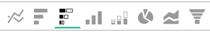

# Visualisatieopties

Het selecteren van de juiste visualisatie voor een bepaalde gegevensset is een essentieel onderdeel van het analyseproces. Elke gegevensset heeft een verhaal dat je moet vertellen, maar het effect van dat verhaal wordt benadrukt door zijn visuele impact en leesbaarheid.

De [!DNL Commerce Intelligence] [!DNL Visual Report Builder] biedt twaalf verschillende visualisatieopties, elk met hun eigen voordelen en gebruiksscenario&#39;s. In dit onderwerp worden de verschillende visualisatieopties besproken in [!DNL Commerce Intelligence], met inbegrip van vereiste rapportconfiguraties indien van toepassing, en een voorbeeld van een gebruiksgeval. De volgende visualisaties zijn beschikbaar in [!DNL Commerce Intelligence]:

* `Scalar`
* `Table`
* `Line`
* `Bar`
* `Stacked Bar`
* `Column`
* `Stacked Column`
* `Pie`
* `Area`
* `Funnel`
* `Scatter plot`
* `Bubble`
* `Heatmap`

## `Scalar`

`Scalar` rapporten worden weergegeven als één numerieke waarde. Meestal wordt dit gebruikt om de &quot;alle tijd&quot;waarde van zeer belangrijke metrische zoals opbrengst of orden te tonen, of om opbrengst te vergelijken met datum vs begroting met twee afzonderlijke scalaire rapporten. In het onderstaande voorbeeld toont dit eenvoudig het totale aantal orders voor het gegeven rapportageinterval:

Om een rapport als scalar te bewaren, vorm uw filters en tijdmontages, dan klik **[!UICONTROL Save]** of **[!UICONTROL Update]** in de rechterbovenhoek van het rapport. Onder de `Type` kiest u Nummer: Metrische naam om het rapport op te slaan als de waarde die op de linkerzijbalk wordt weergegeven.

**Vereisten**:

* `Time interval`: `None`
* `Group by`: `None`
* Alleen één metrisch

## `Table`

Zoals de naam suggereert, `table` rapporten zijn ideaal voor het tonen van tabeldetails. Wanneer er een behoefte is om vele groepen door waarden of metriek in één enkel rapport te tonen, is een lijst vaak de beste manier om te gaan. Hieronder ziet u bijvoorbeeld een tabel met &quot;klantgegevens&quot;, waarin bestellingen en inkomsten per e-mail van de klant worden gegroepeerd:

Net als scalaire rapporten kunt u een rapport opslaan als een tabel door op **[!UICONTROL Save]** of **[!UICONTROL Update]** binnen de rapportbouwer, dan selecterend de optie van de Lijst onder `Type` vervolgkeuzelijst.

**Eisen:**

* Hoewel er geen vereisten van de rapportconfiguratie zijn, is het belangrijk om op te merken dat de lijsten tot 3500 rijen beperkt zijn. Als uw gegevensset meer dan 3500 rijen bevat, moet u de resultaten filteren om het bereik te beperken of de resultaten exporteren naar `.csv` of `Excel` om de volledige gegevensset te zien.

## `Line`

`Line` grafieken zijn de perfecte keuze voor het vergelijken van de prestaties van vergelijkbare metrische cohorten. Bijvoorbeeld, het analyseren van de inkomsten van twee regio&#39;s over dezelfde periode, of het vergelijken van de groei van de behaalde bestellingen van jaar tot jaar, zoals hieronder getoond:

Elke metrisch en formule die aan het rapport wordt toegevoegd wordt vertegenwoordigd door zijn eigen lijn. Vergeet niet het selectievakje voor `Multiple Y-Axes` om alle metriek op dezelfde schaal weer te geven.

Om een rapport als lijngrafiek te bewaren, pas het rapport aan `Type` tot `Chart`en selecteer de gewenste visualisatie in de rapportbuilder, zoals hieronder wordt getoond:

**Eisen:**

* Geen

## `Bar`

`Bar` in grafieken worden uw gegevens weergegeven als een reeks horizontale balken. Deze diagrammen zijn het meest geschikt voor het weergeven van de algehele prestaties van een beperkt aantal metriek of groep op basis van waarden. Bijvoorbeeld, zou een bar grafiek kunnen worden gebruikt om de opbrengst per opslag te vergelijken:

Elke afzonderlijke metrische combinatie, groep door, en tijdintervalcombinatie wordt getoond als zijn eigen bar. Als u twee metriek met één hebt `group by`, met drie verschillende `group by` waarden, uw rapport bevat zes aparte balken.

Als u een rapport wilt opslaan als staafdiagram, past u het rapport aan `Type` tot `Chart` en selecteert u de `Bar` zoals hieronder weergegeven:

**Eisen:**

* Geen

## `Stacked Bar`

`Stacked bar` grafieken zijn vergelijkbaar met de diagrammen van de staafdiagrammen, met de extra mogelijkheid om de proportionele uitsplitsing van elke balk weer te geven. Meestal worden gestapelde staafdiagrammen ingesteld met twee of meer metriek en één groep per, zodat elke balk een unieke groep per waarde vertegenwoordigt die wordt opgesplitst tussen de metrische onderdelen.

Het rapport hieronder bevat bijvoorbeeld twee identieke inkomstenmetriek met één gefilterd voor eerste bestellingen en de andere gefilterd voor herhaalde bestellingen. Na groepering door opslag, kunt u zowel de totale opbrengstbijdrage voor elke opslag zien (die door de totale breedte van de bar wordt vertegenwoordigd) als de eerste keer versus herhaalde verdeling van opbrengst voor elke opslag.

Zorg ervoor dat de `Multiple Y-Axes` Schakel deze optie uit als u een rapport wilt instellen zoals hierboven beschreven.

Als u een rapport wilt opslaan als een gestapeld staafdiagram, past u het rapport aan `Type` tot `Chart` en selecteer de optie van de gestapelde bar van de rapportbouwer:

**Eisen:**

* Geen

## `Column`

`Column` grafieken vertegenwoordigen elk gegevenspunt als verticale kolom, en zijn beter voor het tonen van tijd-trending gegevens dan de horizontale visualisatie van het staafdiagram. Elke unieke metrische waarde en groep door combinatie wordt vertegenwoordigd in zijn eigen reeks bars. Een kolomrapport is best voor rapporten met drie of minder metriek of één metrisch met één enkele groep door 1-3 groep door waarden te bevatten.

In het onderstaande voorbeeld ziet u twee inkomstenmetriek, waarvan de ene gefilterd is voor de eerste omzet en de andere voor de volgende omzet, die in de loop van de tijd per maand trending:

Kolomrapporten kunnen worden opgeslagen door het rapport te wijzigen `Type` tot `Chart`en selecteert u de optie voor kolomvisualisatie:

**Eisen:**

* Geen

## `Stacked Column`

`Stacked column` rapporten zijn bijna identiek aan kolomgrafieken, behalve de gelijkaardige kolommen worden gestapeld bovenop elkaar zodat de totale hoogte de som waarden vertegenwoordigt. De gestapelde kolommen worden opnieuw het best visualiseerd met een beperkt aantal metriek of groepsbys.

Het gebruiken van de zelfde rapportconfiguratie zoals die in wordt beschreven `Column` in de bovenstaande sectie ziet een rapport met twee inkomstenmetriek (voor het eerst gefilterd en herhaald) er als volgt uit met een gestapelde kolomvisualisatie:

Ook hier is het belangrijk dat de `Multiple Y-Axes` Schakel dit selectievakje uit wanneer u meerdere maateenheden weergeeft met gestapelde kolomvisualisatie.

Om een rapport als gestapelde kolom te bewaren, plaats het rapport `Type` tot `Chart` en selecteert u de `stacked column` optie:

**Eisen:**

* Geen

## `Pie`

`Pie` grafieken zijn het meest geschikt voor het weergeven van één metrische waarde met een of meer groepsstralen of van meerdere metriek zonder groepsbys. In beide gevallen moet het tijdsinterval zijn ingesteld op Geen om gegevens in een cirkeldiagram weer te geven. In het onderstaande voorbeeld is één maateenheid voor bestellingen een groep op naam van de winkel om de indeling van bestellingen per winkel weer te geven:

Om een rapport als cirkeldiagram te bewaren, plaats het rapport `Type` tot `Chart` en selecteert u de `pie` zoals hieronder weergegeven:

**Eisen:**

* `Time interval`: `None`
* Een van de volgende mogelijkheden:
   * `Single metric with one or more group bys`
   * `Multiple metrics with no group bys`

## `Area`

`Area` grafieken zijn bijna identiek aan gestapelde kolomgrafieken, behalve de kolommen ononderbroken worden getoond. Net als bij gestapelde kolommen kunnen vlakgrafieken het best worden weergegeven met een beperkt aantal groepsvakken of metriek.

Hetzelfde voorbeeld uit het dialoogvenster `stacked column` in het onderstaande rapport wordt de eerste keer versus de tweede keer de opbrengst weergegeven met de gebiedsgrafiek visualisatie:

Als u een rapport wilt opslaan als een vlakdiagram, past u de `Type` tot `Chart` en selecteer de gebiedsoptie:

**Eisen:**

* Geen

## `Funnel`

`Funnel` grafieken zijn ideaal voor het visualiseren van conversie over een verwachte reeks gebeurtenissen. Een paar voorbeelden omvatten het analyseren van de potentiële opbrengst in uw verkooptrechter van lood aan gesloten overeenkomst, of het meten van de daling in klanten tussen hun eerste en tweede orden, tweede en derde orden, etc. Hieronder ziet u een voorbeeld van deze laatste:

In een trechter-rapport wordt de relatieve waarde van een bepaalde trede van de trechter weerspiegeld door de hoogte van de trede. De rapportconfiguratie bepaalt de orde waarin de stappen worden getoond. Er zijn twee manieren om een kanaalrapport te vormen:

* `Single metric with one group by`: - De volgorde van de stappen die wordt bepaald door de instelling Boven/Onder tonen van de groep door. Standaard worden treekstappen weergegeven op volgorde van de hoogste naar de laagste waarde, maar u kunt ze ook alfabetisch sorteren op naam.

* `Multiple metrics with no group by`: - Volgorde van stappen die worden bepaald door de volgorde waarin de metriek aan het rapport worden toegevoegd.

Als u een rapport wilt opslaan als een trechterdiagram, past u het rapport aan `Type` tot `Chart` en selecteer de aangewezen visualisatie van binnen de rapportbouwer.

**Eisen:**

* `Time interval`: `None`
* Een van de volgende mogelijkheden:
   * `Single metric with one group by`
   * `Multiple metrics with no group by`

## `Scatter plot`

A `scatter plot` wordt gebruikt om de relatie van een meting met twee verschillende variabelen te onderzoeken zodat u correlaties en uitschieters gemakkelijk kunt identificeren. Dit type visualisatie wordt het best gebruikt slechts met numerieke afmetingen - probeer het met metrische Orden en `Customer's lifetime number of coupons` en `Customer's lifetime revenue` afmetingen om te zien hoe het coupongebruik verwant is aan opbrengsten. U kunt kiezen tussen een spreidingsgrafiek met en zonder een trendline:

**Eisen:**

Optie 1:

* Twee `metrics`
* Eén `group by`
* `Time interval`: `None`

Optie 2:

* Twee `metrics`
* Nee `group by`
* Set `time interval`

## `Bubble` diagram

A `bubble` de grafiek kan tot vier afmetingen van gegevens tonen waar `X` en `Y` De assen specificeren de plaats van de bellen. De `Z` De as is de grootte van de bellen, en door twee groepenbys op te nemen kunt u kleur aan de bellen toevoegen. Dit type van visualisatie wordt het best gebruikt wanneer u veelvoudige afmetingen van gegevens in één enkele grafiek wilt plotten.

In het volgende diagram ziet u bijvoorbeeld het aantal klanten (bubble size) dat is gegroepeerd op een specifieke acquisitiebron (bubble color) en toestand (diverse bubbles in specifieke kleur), uitgezet tegen de totale omzet en de gemiddelde levensduurbestellingen.

In het volgende diagram wordt het aantal klanten (bubbelgrootte) weergegeven, gegroepeerd op aankoopbron (bubbelkleur) en toestand (verschillende bellen in specifieke kleur), uitgezet tegen de gemiddelde levenswaarde en de totale omzet.

**Eisen voor een luchtbellengrafiek van één serie:**

Optie 1

* Drie `metrics`
* Eén `group by`
* `Time interval`: `None`

Optie 2

* Drie `metrics`
* Nee `group by`
* Set `time interval`

**Voorschriften voor een uit meerdere reeksen bestaand luchtdiagram:**

* Drie `metrics`
* Twee `group by`
* `Time interval`: `None`

## `Heatmap`

Gebruiken `heatmaps` om hotspots in uw gegevens te visualiseren. Een verwarmingskaart kan bijvoorbeeld aangeven waar u routinematig een hoger volume krijgt. Door deze gegevens te visualiseren kunt u uw inventarisniveaus aanpassen om ervoor te zorgen dat u tijdens deze piekvensters aan de vraag voldoet.

De volgende warmtekaart toont de orders per dag van week door uur van dag in totaal, over verscheidene weken.

<!--{: width="650"}-->

**Eisen:**

Optie 1

* Eén `metric`
* Twee `group by`
* `Time interval`: `None`

Optie 2

* Eén `metric`
* Eén `group by`
* Set `time interval`
