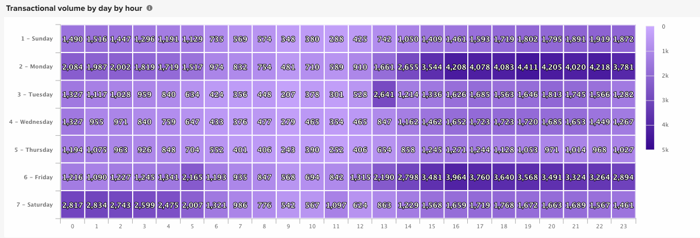

# Visualisatieopties

Het selecteren van de juiste visualisatie voor een bepaalde gegevensset is een essentieel onderdeel van het analyseproces. Elke gegevensset heeft een verhaal dat je moet vertellen, maar het effect van dat verhaal wordt benadrukt door zijn visuele impact en leesbaarheid.

[!DNL Commerce Intelligence] [!DNL Visual Report Builder] biedt 12 verschillende visualisatieopties, elk met hun eigen voordelen en gebruiksscenario&#39;s. Dit onderwerp bespreekt de diverse visualisatieopties in [!DNL Commerce Intelligence], met inbegrip van vereiste rapportconfiguraties wanneer toepasselijk, en een voorbeeld van een gebruiksgeval. De volgende visualisaties zijn beschikbaar in [!DNL Commerce Intelligence] :

* `Scalar`
* `Table`
* `Line`
* `Bar`
* `Stacked Bar`
* `Column`
* `Stacked Column`
* `Pie`
* `Area`
* `Funnel`
* `Scatter plot`
* `Bubble`
* `Heatmap`

## `Scalar`

`Scalar` -rapporten worden weergegeven als één numerieke waarde. Meestal wordt dit gebruikt om de &quot;alle tijd&quot;waarde van zeer belangrijke metrische zoals opbrengst of orden te tonen, of om opbrengst te vergelijken met datum vs begroting met twee afzonderlijke scalaire rapporten. In het onderstaande voorbeeld toont dit eenvoudig het totale aantal orders voor het gegeven rapportageinterval:

Als u een rapport wilt opslaan als scalair, configureert u uw filters en tijdinstellingen en klikt u vervolgens op **[!UICONTROL Save]** of **[!UICONTROL Update]** rechtsboven in het rapport. Kies onder het vervolgkeuzemenu `Type` het getal: metrische naam om het rapport op te slaan als de waarde die op de linkerzijbalk wordt weergegeven.

**Vereisten**:

* `Time interval`: `None`
* `Group by`: `None`
* Alleen één metrisch

## `Table`

Zoals de naam suggereert, zijn `table` -rapporten ideaal voor het weergeven van tabeldetails. Wanneer er een behoefte is om vele groepen door waarden of metriek in één enkel rapport te tonen, is een lijst vaak de beste manier om te gaan. Hieronder ziet u bijvoorbeeld een tabel met &quot;klantgegevens&quot;, waarin bestellingen en inkomsten per e-mail van de klant worden gegroepeerd:

Net als scalaire rapporten kunt u een rapport opslaan als een tabel door in de rapportbuilder op **[!UICONTROL Save]** of **[!UICONTROL Update]** te klikken en vervolgens de optie Tabel onder het vervolgkeuzemenu `Type` te selecteren.

**Vereisten:**

* Hoewel er geen vereisten van de rapportconfiguratie zijn, is het belangrijk om op te merken dat de lijsten tot 3500 rijen beperkt zijn. Als uw gegevensset meer dan 3500 rijen bevat, moet u de resultaten filteren om het bereik te beperken of de resultaten exporteren naar `.csv` of `Excel` om de volledige gegevensset te zien.

## `Line`

`Line` grafieken zijn de perfecte keuze voor het vergelijken van de prestaties van vergelijkbare metrische cohorten. Bijvoorbeeld, het analyseren van de inkomsten van twee regio&#39;s over dezelfde periode, of het vergelijken van de groei van de behaalde bestellingen van jaar tot jaar, zoals hieronder getoond:

Elke metrisch en formule die aan het rapport wordt toegevoegd wordt vertegenwoordigd door zijn eigen lijn. Wanneer u metrische gegevens vergelijkt met vergelijkbare eenheden en schalen, moet u het selectievakje `Multiple Y-Axes` uitschakelen om alle metrische gegevens op dezelfde schaal weer te geven.

Als u een rapport wilt opslaan als een lijndiagram, past u het rapport `Type` aan `Chart` aan en selecteert u de gewenste visualisatie in de rapportbuilder, zoals hieronder wordt getoond:

**Vereisten:**

* Geen

## `Bar`

In `Bar` worden uw gegevens in diagrammen weergegeven als een reeks horizontale balken. Deze diagrammen zijn het meest geschikt voor het weergeven van de algemene prestaties van een beperkt aantal metriek of groep op basis van waarden. Bijvoorbeeld, zou een bar grafiek kunnen worden gebruikt om de opbrengst per opslag te vergelijken:

Elke afzonderlijke metrische combinatie, groep door, en tijdintervalcombinatie wordt getoond als zijn eigen bar. Als u twee metriek met één `group by` hebt, die drie verschillende `group by` waarden bevat, toont uw rapport zes afzonderlijke bars.

Als u een rapport wilt opslaan als een staafdiagram, past u het rapport `Type` aan `Chart` aan en selecteert u de optie `Bar` (zie hieronder):

**Vereisten:**

* Geen

## `Stacked Bar`

`Stacked bar` grafieken zijn vergelijkbaar met de diagrammen van de staafdiagrammen, met de extra mogelijkheid om de proportionele uitsplitsing van elke balk weer te geven. Meestal worden gestapelde staafdiagrammen ingesteld met twee of meer metriek en één groep per, zodat elke balk een unieke groep per waarde vertegenwoordigt die wordt opgesplitst tussen de metrische onderdelen.

Het rapport hieronder bevat bijvoorbeeld twee identieke inkomstenmetriek met één gefilterd voor eerste bestellingen en de andere gefilterd voor herhaalde bestellingen. Na groepering door opslag, kunt u zowel de totale opbrengstbijdrage voor elke opslag zien (die door de totale breedte van de bar wordt vertegenwoordigd) als de eerste keer versus herhaalde verdeling van opbrengst voor elke opslag.

Zorg ervoor dat het selectievakje `Multiple Y-Axes` is uitgeschakeld wanneer u een rapport als het bovenstaande instelt.

Als u een rapport wilt opslaan als een gestapeld staafdiagram, past u het rapport `Type` aan `Chart` aan en selecteert u de optie Gestapelde balk in de rapportbuilder:

**Vereisten:**

* Geen

## `Column`

`Column` grafieken vertegenwoordigen elk gegevenspunt als verticale kolom, en zijn beter voor het tonen van tijd-trending gegevens dan de horizontale grafiekvisualisatie van de bar. Elke unieke metrische waarde en groep door combinatie wordt vertegenwoordigd in zijn eigen reeks bars. Een kolomrapport is best voor rapporten met drie of minder metriek of één metrisch met één enkele groep door 1-3 groep door waarden te bevatten.

In het onderstaande voorbeeld ziet u twee inkomstenmetriek, waarvan de ene gefilterd is voor de eerste omzet en de andere voor de volgende omzet, die in de loop van de tijd per maand trending:

 toont

Kolomrapporten kunnen worden opgeslagen door het rapport `Type` in `Chart` te wijzigen en de optie voor kolomvisualisatie te selecteren:

**Vereisten:**

* Geen

## `Stacked Column`

`Stacked column` -rapporten zijn bijna identiek aan kolomgrafieken, maar vergelijkbare kolommen worden op elkaar gestapeld zodat de totale hoogte de som van de waarden vertegenwoordigt. De gestapelde kolommen worden opnieuw het best visualiseerd met een beperkt aantal metriek of groepsbys.

Gebruikend de zelfde rapportconfiguratie zoals die in de `Column` sectie hierboven wordt beschreven, zou een rapport met twee omzettingsmetriek (die voor het eerst en herhaling wordt gefiltreerd) als hieronder met een gestapelde kolomvisualisatie kijken:

 toont

Ook hier is het belangrijk dat het selectievakje `Multiple Y-Axes` wordt uitgeschakeld wanneer u meerdere meetgegevens weergeeft met de gestapelde kolomvisualisatie.

Als u een rapport wilt opslaan als een gestapelde kolom, stelt u het rapport `Type` in op `Chart` en selecteert u de optie `stacked column` :

**Vereisten:**

* Geen

## `Pie`

`Pie` grafieken zijn het meest geschikt voor het weergeven van één metrische waarde met een of meer groepsstralen of van meerdere metriek zonder groepsbys. In beide gevallen moet het tijdsinterval zijn ingesteld op Geen om gegevens in een cirkeldiagram weer te geven. In het onderstaande voorbeeld is één maateenheid voor bestellingen een groep op naam van de winkel om de indeling van bestellingen per winkel weer te geven:

Als u een rapport wilt opslaan als een cirkeldiagram, stelt u het rapport `Type` in op `Chart` en selecteert u de optie `pie` zoals hieronder wordt weergegeven:

**Vereisten:**

* `Time interval`: `None`
* Een van de volgende mogelijkheden:
   * `Single metric with one or more group bys`
   * `Multiple metrics with no group bys`

## `Area`

`Area` -diagrammen zijn bijna identiek aan gestapelde kolomgrafieken, maar de kolommen worden continu weergegeven. Net als bij gestapelde kolommen kunnen vlakgrafieken het best worden weergegeven met een beperkt aantal groepsvakken of metriek.

In hetzelfde voorbeeld uit de sectie `stacked column` ziet u in het onderstaande rapport de eerste keer versus herhalingsinkomsten met behulp van de gebiedsdiagramvisualisatie:

Als u een rapport wilt opslaan als een vlakdiagram, past u de velden `Type` tot en met `Chart` aan en selecteert u de optie Gebied:

**Vereisten:**

* Geen

## `Funnel`

Grafieken van `Funnel` zijn perfect voor het visualiseren van conversie over een verwachte opeenvolging van gebeurtenissen. Een paar voorbeelden omvatten het analyseren van de potentiële opbrengst in uw verkooptrechter van lood aan gesloten overeenkomst, of het meten van de daling in klanten tussen hun eerste en tweede orden, tweede en derde orden, etc. Hieronder ziet u een voorbeeld van deze laatste:

In een funnel-rapport wordt de relatieve waarde van een bepaalde stap van de funnel weerspiegeld door de hoogte van de stap. De rapportconfiguratie bepaalt de orde waarin de stappen worden getoond. Er zijn twee manieren om een funnel-rapport te configureren:

* `Single metric with one group by`: - De volgorde van de stappen die wordt bepaald door de instelling Boven/Onder tonen van de groep door. Standaard worden funnel-stappen weergegeven op volgorde van de hoogste naar de laagste waarde, maar u kunt ze ook alfabetisch sorteren op naam.

* `Multiple metrics with no group by`: - De volgorde van de stappen die wordt bepaald door de volgorde waarin de metriek aan het rapport worden toegevoegd.

Als u een rapport wilt opslaan als een funnel-diagram, past u het rapport `Type` aan `Chart` aan en selecteert u de gewenste visualisatie in de rapportbuilder.

**Vereisten:**

* `Time interval`: `None`
* Een van de volgende mogelijkheden:
   * `Single metric with one group by`
   * `Multiple metrics with no group by`

## `Scatter plot`

Een `scatter plot` wordt gebruikt om de relatie van een meting met twee verschillende variabelen te onderzoeken zodat u gemakkelijk correlaties en uitschieters kunt identificeren. Dit type visualisatie kunt u het beste alleen gebruiken met numerieke afmetingen. Gebruik hiervoor de metrische waarden voor bestellingen en de `Customer's lifetime number of coupons` en `Customer's lifetime revenue` -afmetingen om te zien hoe het gebruik van coupons verhoudt tot inkomsten. U kunt kiezen tussen een spreidingsgrafiek met en zonder een trendline:

**Vereisten:**

Optie 1:

* Twee `metrics`
* Eén `group by`
* `Time interval`: `None`

Optie 2:

* Twee `metrics`
* Geen `group by`
* Instellen `time interval`

## `Bubble` -diagram

Een `bubble` -diagram kan maximaal vier gegevensafmetingen weergeven waarbij de `X` - en `Y` -as de locatie van de bellen aangeven. De `Z` -as is de grootte van de ballonnen en door twee groepsobjecten op te nemen kunt u kleur aan de bellen toevoegen. Dit type van visualisatie wordt het best gebruikt wanneer u veelvoudige afmetingen van gegevens in één enkele grafiek wilt plotten.

In het volgende diagram ziet u bijvoorbeeld het aantal klanten (bubble size) dat is gegroepeerd op een specifieke acquisitiebron (bubble color) en toestand (diverse bubbles in specifieke kleur), uitgezet tegen de totale omzet en de gemiddelde levensduurbestellingen.

 toont

In het volgende diagram wordt het aantal klanten (bubbelgrootte) weergegeven, gegroepeerd op aankoopbron (bubbelkleur) en toestand (verschillende bellen in specifieke kleur), uitgezet tegen de gemiddelde levenswaarde en de totale omzet.

**Vereisten voor enige grafiek van de reeksbel:**

Optie 1

* Drie `metrics`
* Eén `group by`
* `Time interval`: `None`

Optie 2

* Drie `metrics`
* Geen `group by`
* Instellen `time interval`

**Vereisten voor multiseries bubbelgrafiek:**

* Drie `metrics`
* Twee `group by`
* `Time interval`: `None`

## `Heatmap`

Gebruik `heatmaps` om hotspots in uw gegevens te visualiseren. Een verwarmingskaart kan bijvoorbeeld aangeven waar u routinematig een hoger volume krijgt. Door deze gegevens te visualiseren kunt u uw inventarisniveaus aanpassen om ervoor te zorgen dat u tijdens deze piekvensters aan de vraag voldoet.

De volgende warmtekaart toont de orders per dag van week door uur van dag in totaal, over verscheidene weken.

<!--{: width="650"}-->

**Vereisten:**

Optie 1

* Eén `metric`
* Twee `group by`
* `Time interval`: `None`

Optie 2

* Eén `metric`
* Eén `group by`
* Instellen `time interval`
