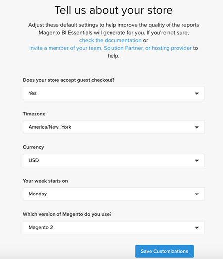

# Activeer uw [!DNL MBI] Account voor `Cloud Starter` Abonnementen

Om te activeren [!DNL MBI] for `Cloud Starter` projecten, maakt eerst een [!DNL MBI] account, dan een `SSH` sleutel, dan verbindt definitief met uw gegevensbestand van de Handel. Zie [activeren van abonnementen op locatie](../getting-started/onpremise-activation.md).

>[!NOTE]
>
>Voor hulp bij activering [!DNL MBI] for `Cloud Pro` projecten, neemt u contact op met uw Adobe-accountteam of technische adviseur van de klant.

1. Maak uw [!DNL MBI] Account.

   - Ga naar [Aanmelden bij Adobe Commerce-account](https://account.magento.com/customer/account/login)

   - Ga naar **[!UICONTROL My Account** > **My [!DNL MBI] Instances]**.

   - Klikken **[!UICONTROL Create Instance]**. Neem contact op met uw Adobe-accountteam of technische adviseur van de klant als deze knop niet wordt weergegeven.

   - Selecteer uw `Cloud Starter` abonnement. Als u alleen een `cloud starter` -abonnement, dit is de standaardselectie.

   - Klikken **[!UICONTROL Continue]**.

   - Voer uw gegevens in om uw account te maken.

   

   - Ga naar je postvak IN en verifieer je e-mailadres.

   

   - Maak uw wachtwoord.

   

   - Nadat u uw account hebt gemaakt, kunt u gebruikers toevoegen aan uw nieuwe account. Technische beheerders kunnen nu worden toegevoegd om de volgende stappen uit te voeren.

   

1. Voer gegevens in over de winkel om uw voorkeuren in te stellen.

   

   Verzamel enkele informatie voordat u uw database kunt verbinden voor de derde stap in de instapkaartstroom. U voltooit de `Connect your database` in Stap 9.

1. Speciaal maken [!DNL MBI] Gebruiker.

   - Maak een gebruiker in uw [Adobe Commerce-account](https://account.magento.com/customer/account/login).

   - _Waarom een nieuwe gebruiker?_ [!DNL MBI] heeft een gebruiker nodig die aan het project wordt toegevoegd om voortdurend nieuwe gegevens te halen die naar de rekening moeten worden overgebracht [!DNL MBI] Data Warehouse. Deze gebruiker fungeert als die verbinding. Het toevoegen van deze gebruiker aan het project is behandeld in Stap 4.

   - De reden waarom er een speciale [!DNL MBI] gebruiker moet voorkomen dat de toegevoegde gebruiker per ongeluk wordt gedeactiveerd of verwijderd en de [!DNL MBI] verbinding.

1. Voeg de nieuw gecreëerde gebruiker aan het primaire milieu van het project als toe `Contributor`.

   

1. Uw [!DNL MBI] `SSH` toetsen.

   - Ga naar de `Connect your database` pagina van de [!DNL MBI] gebruikersinterface instellen en omlaag schuiven naar `Encryption settings`.

   - Voor de `Encryption Type` veld, kies `SSH Tunnel`.

   - Vanuit het vervolgkeuzemenu kunt u de meegeleverde [!DNL MBI] `Public Key`.

   

1. Uw nieuwe toevoegen [!DNL MBI] `Public key` aan de [!DNL MBI] in Stap 5 wordt gemaakt.

   - Ga naar [uw cloud Adobe Commerce-account](https://account.magento.com/cloud/customer/login/). Meld u aan met uw aanmeldingsgegevens voor uw account voor de nieuwe [!DNL MBI] door de gebruiker gemaakt. Ga vervolgens naar de `Account Settings` tab.

   - De pagina omlaag schuiven en de vervolgkeuzelijst uitvouwen voor `SSH` toetsen. Klik vervolgens op **[!UICONTROL Add a public key]**.

   

   - Voeg de [!DNL MBI] `SSH Public Key` vanaf boven.

   

1. Verlenen [!DNL MBI] MySQL-referenties.

   - Werk uw `.magento/services.yaml`

   ```sql
   mysql:
       type: mysql:10.0
       disk: 2048
       configuration:
           schemas:
               - main
           endpoints:
               mysql:
                   default_schema: main
                   privileges:
                       main: admin
               mbi:
                   default_schema: main
                   privileges:
                       main: ro
   ```

   - Werk uw `.magento.app.yaml`

   ```sql
           relationships:
               database: "mysql:mysql"
               mbi: "mysql:mbi"
               redis: "redis:redis"
   ```

1. Haal informatie op voor het verbinden van uw database met [!DNL MBI].

   Uitvoeren
   `echo $MAGENTO_CLOUD_RELATIONSHIPS | base64 --decode | json_pp`

   om informatie te krijgen over het verbinden van uw gegevensbestand.

   U ontvangt informatie die vergelijkbaar is met de onderstaande uitvoer:

   ```json
           "mbi" : [
                 {
                    "scheme" : "mysql",
                    "rel" : "mbi",
                    "cluster" : "vfbfui4vmfez6-master-7rqtwti",
                    "query" : {
                       "is_master" : true
                    },
                    "ip" : "169.254.169.143",
                    "path" : "main",
                    "host" : "[!DNL MBI].internal",
                    "hostname" : "3m7xizydbomhnulyglx2ku4wpq.mysql.service._.magentosite.cloud",
                    "username" : "mbi",
                    "service" : "mysql",
                    "port" : 3306,
                    "password" : "[password]"
                 }
              ],
   ```

1. Verbind uw Gegevensbestand van de Handel

   

   - `Integration Name`: [Kies een naam voor uw integratie.]

   - `Host`: `[!DNL MBI].internal`

   - `Port`: `3306`

   - `Username`: `mbi`

   - `Password`: [invoerwachtwoord opgegeven in de uitvoer voor Stap 8.]

   - `Database Name`: `main`

   - `Table Prefixes`: [leeg laten als er geen tabelvoorvoegsels zijn]

1. Stel de tijdzone-instellingen in.

   

   - `Database`: `Timezone: UTC`

   - `Desired Timezone`: [Kies de tijdzone waarin u de gegevens wilt weergeven.]

1. Verkrijg informatie voor uw encryptie montages.

   - Het project UI verstrekt een `SSH` toegangstekenreeks. Deze tekenreeks kan worden gebruikt voor het verzamelen van de informatie die nodig is voor `Remote Address` en `Username` bij het instellen van uw `Encryption` instellingen. Gebruik de `SSH Access` tekenreeks gevonden door te klikken op de knop voor de toegangssite in de primaire vertakking van de projectgebruikersinterface en uw `User Name` en `Remote Address` zoals hieronder weergegeven.

   

   

1. Invoerinformatie voor uw `Encryption` instellingen

   

   **Invoer**

   - `Encryption Type`: `SSH Tunnel`

   - `Remote Address`: `ssh.us-3.magento.cloud`

   - `Username`: `vfbfui4vmfez6-master-7rqtwti--mymagento`

   - `Port`: `22`

1. Klikken **[!UICONTROL Save Integration]**.

1. U hebt nu verbinding met uw [!DNL MBI] account.

1. Nadat u verbinding hebt gemaakt [!DNL MBI] aan uw gegevensbestand van de Handel, contacteer uw Team van de Rekening van de Adobe om de volgende stappen, zoals opstellings integraties en andere configuratiestappen te coördineren.

1. Wanneer u klaar bent met configuratie, kunt u [aanmelden](../getting-started/sign-in.md) aan uw [!DNL MBI] account.
