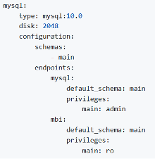

# Uw [!DNL Commerce Intelligence] -account activeren voor abonnementen op locatie en starter

Als u [!DNL Commerce Intelligence] voor on-premise abonnementen wilt activeren, maakt u eerst een [!DNL Commerce Intelligence] -account, voert u uw instellingsgegevens in en maakt u vervolgens verbinding met [!DNL Commerce Intelligence] de [!DNL Commerce] -database. <!-- For information about activation in `Cloud Starter` projects, see [Activating your [!DNL Commerce Intelligence] Account for `Cloud Starter` Subscriptions](../getting-started/cloud-activation.md).-->

## Uw [!DNL Commerce Intelligence] -account maken

Neem contact op met het accountteam van de Adobe of de technische adviseur van de klant om uw account te maken.

## Uw wachtwoord maken

Nadat uw account is gemaakt, controleert u uw e-mail op een e-mail met accountmeldingen vanuit [!DNL The Magento BI Team@rjmetrics.com] . Gebruik de koppeling in de e-mail om toegang te krijgen tot uw [!DNL Commerce Intelligence] -account en uw wachtwoord te maken. Ga naar je postvak IN en verifieer je e-mailadres.

Als u geen e-mail ontving, [ contactsteun ](https://experienceleague.adobe.com/docs/commerce-knowledge-base/kb/troubleshooting/miscellaneous/mbi-service-policies.html?lang=nl-NL).

## Uw winkelvoorkeuren instellen

Vul het formulier met opslaggegevens in voordat u de databaseverbinding configureert. Deze informatie is vereist om de installatie van **[!UICONTROL Connect your Database]** te voltooien.

## [!DNL Commerce Intelligence] gebruikers toevoegen

Nadat u het wachtwoord hebt ingesteld en u hebt aangemeld bij [!DNL Commerce Intelligence] , kunt u andere gebruikers toevoegen aan uw [!DNL Commerce Intelligence] -account. Voeg bij het toevoegen van gebruikers de juiste machtigingen toe aan de beheerder om het activeringsproces te voltooien.

## Een toegewijde [!DNL Commerce Intelligence] gebruiker maken in de [!DNL Commerce] -beheerder

Als u [!DNL Commerce Intelligence] wilt gebruiken, moet u een permanente en toegewijde gebruiker toevoegen aan het [!DNL Commerce] -project. Deze toegewijde gebruiker fungeert als permanente verbinding met [!DNL Commerce] waarmee nieuwe gegevens kunnen worden opgehaald en overgedragen naar de [!DNL Commerce Intelligence] -Data Warehouse van de account.

Als u een toegewijde [!DNL Commerce Intelligence] -gebruiker configureert, wordt de account niet gedeactiveerd of verwijderd, waardoor de [!DNL Commerce Intelligence] -verbinding wordt gestopt.

>[!NOTE]
>
>Adobe stimuleert het gebruik van een accountnaam die de permanente status ervan aangeeft (bijv. ACI-toegewezen, ACI-database-connector enzovoort).

Nadat u de toegewijde gebruiker voor [!DNL Commerce Intelligence] in Admin hebt gemaakt, voegt u dezelfde gebruiker toe aan de primaire omgeving van het [!DNL Commerce] -project met de instelling **[!UICONTROL Master]** `Contributor` .

## Commerce Intelligence SSH-toetsen ophalen

1. Ga naar de pagina [!UICONTROL Connect your database] voor [!DNL Commerce Intelligence] instellen en selecteer **[!UICONTROL Encryption settings]** .

1. Voor **Type van Encryptie**, uitgezochte `SSH Tunnel`.

1. Kopieer in de vervolgkeuzelijst de openbare sleutel die u hebt opgegeven.

   

## Voeg uw openbare sleutel aan [!DNL Commerce Intelligence] toe

1. Meld u vanuit de [!DNL Commerce Admin] aan met de aanmeldingsgegevens voor de [!DNL Commerce Intelligence] -gebruiker die u net hebt gemaakt.

1. Selecteer het **lusje van de Montages van de Rekening**.

1. Schuif omlaag en vouw de vervolgkeuzelijst **[!UICONTROL SSH Keys]** uit. Selecteer vervolgens **[!UICONTROL Add a public key]** .

   

1. Plak de openbare sleutel die u in de bovenstaande stap [!DNL Encryption Type] hebt gekopieerd.

   

## Geef [!DNL Commerce Intelligence] Essentials `MySQL` -referenties op

1. Werk uw `.magento/services.yaml` bij.

   

1. Werk uw `.magento.app.yaml` bij.

   

## Gegevens over databaseverbinding ophalen

De verbindingsgegevens van de database ophalen naar de [!DNL Commerce] -database [!DNL Commerce Intelligence]

1. Voer de volgende handelingen uit om uw gegevens op te halen.

   `echo $MAGENTO_CLOUD_RELATIONSHIPS | base64 --decode | json_pp`

1. Herzie de gegevensbestandinformatie, die aan het volgende voorbeeld zou moeten kijken.

   

## Verbind [!DNL Commerce Intelligence] met uw [!DNL Commerce] gegevensbestand gebruikend een gecodeerde verbinding

>[!NOTE]
>
>Adobe raadt u ten zeerste aan een [`SSH tunnel`](../data-analyst/importing-data/integrations/mysql-via-ssh-tunnel.md) -tunnel te gebruiken om de databaseverbinding tot stand te brengen. Als deze methode echter geen optie is, kunt u [!DNL Commerce Intelligence] nog steeds aan uw database koppelen met een [`direct connection`](../data-analyst/importing-data/integrations/mysql-via-a-direct-connection.md) -bestand.

Voer de [!DNL Commerce Intelligence] -gegevens in het [!UICONTROL Connect your Magento Database] -scherm in.

**Inputs:**

[!UICONTROL Integration Name]: [kies een naam voor uw [!DNL Commerce Intelligence] -instantie]

[!UICONTROL Host]: `mbi.internal`

[!UICONTROL Port]: `3306`

[!UICONTROL -gebruikersnaam]: `mbi`

[!UICONTROL Password]: [ invoerwachtwoord dat in de vorige sectie ] wordt getoond

[!UICONTROL Database Name]: `main`

[!UICONTROL Table Prefixes]: [ verlaten leeg als er geen lijstvoorvoegsels ] zijn

## Plaats uw **montages van de Tijdzone van 0&rbrace;**

**Inputs:**

[!UICONTROL Database Timezone]: `UTC`

[!UICONTROL Desired Timezone]: [ kies de tijdzone waarvoor u uw gegevens wilt tonen ]

## Verkrijg uw gegevens over de versleutelingsinstellingen

Het project UI verstrekt een SSH toegangstekenreeks. Dit koord kan voor het verzamelen van de informatie nodig voor het [!UICONTROL **Verre Adres**] en [!UICONTROL **Gebruikersnaam**] worden gebruikt. Gebruik het koord van de Toegang van SSH door de knoop van de toegangsplaats op de Hoofd tak van UI van het Project te selecteren. Zoek vervolgens de [!UICONTROL User Name] en [!UICONTROL Remote Address] zoals hieronder wordt weergegeven.

## Voer uw [!DNL Encryption] -instellingen in

**Inputs:**

[!UICONTROL Encryption Type]: `SSH Tunnel`

[!UICONTROL Remote Address]: `ssh.us-3.magento.cloud` [ van de vorige stap ]

[!UICONTROL Username]: `vfbfui4vmfez6-master-7rqtwti—mymagento` [ van de vorige stap ]

[!UICONTROL Port]: `22`

## Sla uw integratie op.

Na de voltooiing van de configuratiestappen, pas de veranderingen toe door [!UICONTROL **te selecteren sparen Integratie**].

U hebt de [!DNL Commerce] -database nu verbonden met uw [!DNL Commerce Intelligence] -account.

>[!NOTE]
>
>Als u een [!DNL Adobe Commerce Intelligence Pro] -klant bent, neemt u contact op met de succesmanager van de klant of de technische adviseur van de klant om de volgende stappen te coördineren.

Nadat u de configuratie voltooit, [ teken binnen ](../getting-started/sign-in.md) aan uw [!DNL Commerce Intelligence] rekening.

<!---# Activate your [!DNL Commerce Intelligence] Account 

To activate [!DNL Commerce Intelligence] for on-premise or `Cloud Pro` subscriptions, [contact support](https://experienceleague.adobe.com/docs/commerce-knowledge-base/kb/troubleshooting/miscellaneous/mbi-service-policies.html?lang=nl-NL).

>[!NOTE]
>
>Adobe no longer supports new `Cloud Starter` subscriptions.--->
