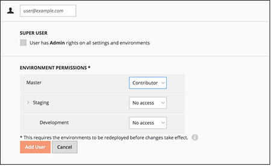

# Activeer uw [!DNL Commerce Intelligence] Account voor abonnementen op locatie en starter

Om te activeren [!DNL Commerce Intelligence] voor on-premise abonnementen, creeer eerst een [!DNL Commerce Intelligence] -account, voer uw instellingen in en maak vervolgens verbinding [!DNL Commerce Intelligence] aan uw [!DNL Commerce] database. <!-- For information about activation in `Cloud Starter` projects, see [Activating your [!DNL Commerce Intelligence] Account for `Cloud Starter` Subscriptions](../getting-started/cloud-activation.md).-->

## Maak uw [!DNL Commerce Intelligence] account

Neem contact op met het accountteam van de Adobe of de technische adviseur van de klant om uw account te maken.

## Uw wachtwoord maken

Nadat uw account is gemaakt, controleert u uw e-mail op een accountmelding via e-mail [!DNL The Magento BI Team@rjmetrics.com]. Gebruik de koppeling in de e-mail voor toegang tot uw [!DNL Commerce Intelligence] en maak uw wachtwoord. Ga naar je postvak IN en verifieer je e-mailadres.

Als je geen e-mail hebt ontvangen, [contactondersteuning](https://experienceleague.adobe.com/docs/commerce-knowledge-base/kb/troubleshooting/miscellaneous/mbi-service-policies.html?lang=en).

## Uw winkelvoorkeuren instellen

Vul het formulier met opslaggegevens in voordat u de databaseverbinding configureert. Deze informatie is vereist om de **[!UICONTROL Connect your Database]** instellen.

## Toevoegen [!DNL Commerce Intelligence] gebruikers

Nadat u uw wachtwoord hebt ingesteld en u hebt aangemeld [!DNL Commerce Intelligence]kunt u andere gebruikers toevoegen aan uw [!DNL Commerce Intelligence] account. Voeg bij het toevoegen van gebruikers de juiste machtigingen toe aan de beheerder om het activeringsproces te voltooien.

## Een toegewezen [!DNL Commerce Intelligence] gebruiker in de [!DNL Commerce] admin

Te gebruiken [!DNL Commerce Intelligence], moet u een permanente en toegewijde gebruiker toevoegen aan de [!DNL Commerce] project. Deze specifieke gebruiker fungeert als permanente verbinding met [!DNL Commerce] dat het ophalen en overdragen van nieuwe gegevens naar de account [!DNL Commerce Intelligence] Data Warehouse.

Een speciale configuratie maken [!DNL Commerce Intelligence] de gebruiker ervoor zorgt dat de account niet wordt gedeactiveerd of verwijderd, zodat de [!DNL Commerce Intelligence] verbinding.

>[!NOTE]
>
>Adobe stimuleert het gebruik van een accountnaam die de permanente status ervan aangeeft (bijv. ACI-toegewezen, ACI-database-connector enzovoort).

Nadat u de specifieke gebruiker voor creeerde [!DNL Commerce Intelligence] in Admin, voeg de zelfde gebruiker aan het primaire milieu van toe [!DNL Commerce] project met een **[!UICONTROL Master]** instellen van `Contributor`.

## Haal de SSH-sleutels van de Commerce Intelligence

1. Op de [!UICONTROL Connect your database] pagina voor [!DNL Commerce Intelligence] instellen, omlaag schuiven en selecteren **[!UICONTROL Encryption settings]**.

1. Voor **Type codering**, selecteert u `SSH Tunnel`.

1. Kopieer in de vervolgkeuzelijst de openbare sleutel die u hebt opgegeven.

   

## Voeg uw openbare sleutel aan toe [!DNL Commerce Intelligence]

1. Van de [!DNL Commerce Admin], meldt u zich aan met de aanmeldingsgegevens voor de [!DNL Commerce Intelligence] gebruiker die u zojuist hebt gemaakt.

1. Selecteer de **Accountinstellingen** tab.

1. Omlaag schuiven en de **[!UICONTROL SSH Keys]** vervolgkeuzelijst. Selecteer vervolgens **[!UICONTROL Add a public key]**.

   

1. Plak de openbare sleutel die u in het dialoogvenster [!DNL Encryption Type] stap hierboven.

   

## Verlenen [!DNL Commerce Intelligence] Essentiële elementen `MySQL` geloofsbrieven

1. Werk uw `.magento/services.yaml`.

   

1. Werk uw `.magento.app.yaml`.

   

## Gegevens over databaseverbinding ophalen

Hiermee worden de gegevens van de databaseverbinding naar de [!DNL Commerce] database naar [!DNL Commerce Intelligence]

1. Voer de volgende handelingen uit om uw gegevens op te halen.

   `echo $MAGENTO_CLOUD_RELATIONSHIPS | base64 --decode | json_pp`

1. Herzie de gegevensbestandinformatie, die aan het volgende voorbeeld zou moeten kijken.

   

## Verbinden [!DNL Commerce Intelligence] aan uw [!DNL Commerce] database die een gecodeerde verbinding gebruikt

>[!NOTE]
>
>Adobe raadt u ten zeerste aan een [`SSH tunnel`](../data-analyst/importing-data/integrations/mysql-via-ssh-tunnel.md) tunnel om de gegevensbestandverbinding te maken. Als deze methode echter geen optie is, kunt u toch een koppeling maken [!DNL Commerce Intelligence] naar uw database via een [`direct connection`](../data-analyst/importing-data/integrations/mysql-via-a-direct-connection.md).

Voer uw [!DNL Commerce Intelligence] informatie in de [!UICONTROL Connect your Magento Database] scherm.

**Invoer:**

[!UICONTROL Integration Name]: [kies een naam voor uw [!DNL Commerce Intelligence] instantie]

[!UICONTROL Host]: `mbi.internal`

[!UICONTROL Port]: `3306`

[!UICONTROL-gebruikersnaam]: `mbi`

[!UICONTROL Password]: [invoerwachtwoord weergegeven in de vorige sectie]

[!UICONTROL Database Name]: `main`

[!UICONTROL Table Prefixes]: [leeg laten als er geen tabelvoorvoegsels zijn]

## Stel uw [!UICONTROL **Tijdzone**] instellingen

**Invoer:**

[!UICONTROL Database Timezone]: `UTC`

[!UICONTROL Desired Timezone]: [kies de tijdzone waarvoor u uw gegevens wilt tonen]

## Verkrijg uw gegevens over de versleutelingsinstellingen

Het project UI verstrekt een SSH toegangstekenreeks. Deze tekenreeks kan worden gebruikt voor het verzamelen van de informatie die nodig is voor de [!UICONTROL **Extern adres**] en [!UICONTROL **Gebruikersnaam**]. Gebruik het koord van de Toegang van SSH door de knoop van de toegangsplaats op de Hoofd tak van UI van het Project te selecteren. Zoek vervolgens uw [!UICONTROL User Name] en [!UICONTROL Remote Address] zoals hieronder weergegeven.

## Voer uw [!DNL Encryption] instellingen

**Invoer:**

[!UICONTROL Encryption Type]: `SSH Tunnel`

[!UICONTROL Remote Address]: `ssh.us-3.magento.cloud`  [uit de vorige stap]

[!UICONTROL Username]: `vfbfui4vmfez6-master-7rqtwti—mymagento`  [uit de vorige stap]

[!UICONTROL Port]: `22`

## Sla uw integratie op.

Nadat u de configuratiestappen hebt voltooid, past u de wijzigingen toe door [!UICONTROL **Integratie opslaan**].

U hebt nu verbinding met uw [!DNL Commerce] database naar uw [!DNL Commerce Intelligence] account.

>[!NOTE]
>
>Als u een [!DNL Adobe Commerce Intelligence Pro] de klant, neemt u contact op met uw Customer Success Manager of Customer Technical Advisor om de volgende stappen te coördineren.

Nadat u de configuratie hebt voltooid, [aanmelden](../getting-started/sign-in.md) aan uw [!DNL Commerce Intelligence] account.

<!---# Activate your [!DNL Commerce Intelligence] Account 

To activate [!DNL Commerce Intelligence] for on-premise or `Cloud Pro` subscriptions, [contact support](https://experienceleague.adobe.com/docs/commerce-knowledge-base/kb/troubleshooting/miscellaneous/mbi-service-policies.html).

>[!NOTE]
>
>Adobe no longer supports new `Cloud Starter` subscriptions.--->
