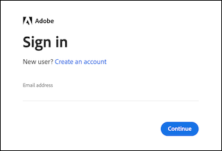

# Toegang tot uw geactiveerde [!DNL MBI] account

Nadat u uw [!DNL MBI] account of [op locatie](../getting-started/onpremise-activation.md) of [wolk](../getting-started/cloud-activation.md) en hebben samengewerkt met uw Customer Success Manager om de configuratiestappen af te ronden, kunt u zich nu aanmelden bij uw account.

U kunt zich aanmelden met uw [!DNL Adobe ID] of uw [!DNL MBI] e-mailadres en wachtwoord.

## Meld u aan met uw [!DNL Adobe ID]

1. Klikken **[!UICONTROL Sign in with Adobe ID]**.

   

1. Voer het e-mailadres in dat u hebt gebruikt bij het maken van uw [!DNL MBI] account. Als u nog geen Adobe-account hebt, klikt u op **[!UICONTROL Create an account]** en voer uw gegevens in. Gebruik het e-mailadres dat u hebt gebruikt bij het maken van uw [!DNL MBI] account. Het e-mailadres is de sleutel die u nodig hebt voor toegang tot uw Adobe-account.

>[!NOTE]
>
>Als u zich aanmeldt met uw [!DNL Adobe ID], kunt u uw [!DNL MBI] profielwachtwoord.

## Aanmelden met uw gebruikersnaam en wachtwoord

Voer uw e-mailadres en wachtwoord in en klik op **[!UICONTROL Sign In]**.

U hebt nu toegang tot [!DNL MBI].
