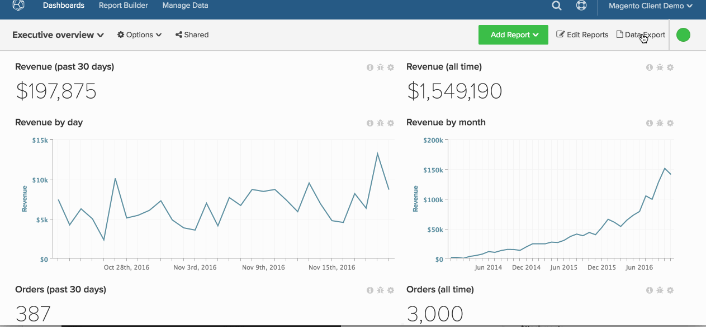

# Raw-gegevens exporteren

Met onbewerkte gegevens kunt u records uit uw [!DNL MBI] Data Warehouse om nader te bekijken wat uw dashboard aandrijft. Bovendien kunt u met onbewerkte gegevens exporteren [discrepanties tussen puntgegevens](https://experienceleague.adobe.com/docs/commerce-knowledge-base/kb/troubleshooting/miscellaneous/using-data-exports-to-pinpoint-discrepancies.html?lang=en).

De uitvoer van ruwe gegevens verleent toegang tot extra kolommen en dimensies die door de-normalisatie en pre-samenvoeging van relevante metriek worden geproduceerd. Bijvoorbeeld: `User's first order date` is een dimensie die u voor elke gebruiker binnen kunt uitvoeren [!DNL MBI], terwijl deze mogelijk niet beschikbaar is in uw database.

Deze zelfstudie behandelt het volgende:

* [Te exporteren gegevens selecteren](#select)
* [De exportbewerking downloaden (](#download)
* [Toegang tot historische exportbewerkingen](#historical)

## Stap 1: Te exporteren gegevens selecteren {#select}

U kunt onbewerkte gegevens op twee manieren exporteren [!DNL MBI]: op diagramniveau of op tabelniveau.

### Exporteren op tabelniveau in uw `Manage Data` Tab

Als u de tabel wilt exporteren `Manage Data` tab, hebt u [Beheer](../administrator/user-management/user-management.md) machtigingen.

1. Klikken **[!UICONTROL Manage Data** > ** Gegevens exporteren **> **Raw-gegevens exporteren]** om aan de slag te gaan.
1. U ziet een `Export List` van recent gecreëerde uitvoer van gegevens, indien van toepassing. Klikken **[!UICONTROL Add Export]** om een nieuwe exportbewerking te maken.
1. De `New Raw Data Export` wordt weergegeven. Hier kunt u het exporteren aanpassen door kolommen en filters te selecteren of te deselecteren:

   * `Table` - de `Table` selecteert de tabel waaruit gegevens worden geëxporteerd. Standaard wordt hiermee de tabel weergegeven waarin u hebt genavigeerd.
   * `Export Name` - Voer in dit veld de naam van de exportbewerking in. Bijvoorbeeld: `Philadelphia - Daily Revenue`.
   * `Available Columns` - In dit veld worden de kolommen (afmetingen) in de database weergegeven die u kunt opnemen in de exportbewerking. Klik op de naam van een kolom om deze toe te voegen.
   * `Selected Columns` - In dit veld worden de kolommen (afmetingen) weergegeven die momenteel zijn opgenomen in de exportbewerking. Klik op de naam van een kolom om deze te verwijderen.
   * `Filter` - In deze sectie worden de filters weergegeven die momenteel op het exporteren worden toegepast. Deze filters kunnen worden gewijzigd; nieuwe filters kunnen ook worden toegevoegd om een bepaalde dataset uit te voeren.
   * Als u klaar bent, klikt u op **[!UICONTROL Export Data]**.

### Exporteren op grafiekniveau vanaf het dashboard

1. Klik op het tandwielpictogram in de rechterbovenhoek van een diagram.
1. Selecteren `Raw Export` van de vervolgkeuzelijst om de `Raw Export` .
1. U kunt de exportbewerking aanpassen door de opdracht `table`, `columns`, en `filters` op te nemen of uit te sluiten. Raadpleeg de vorige sectie voor meer informatie over de velden in deze module.
   >[!NOTE]
   >
   >De tabel die wordt weergegeven in het dialoogvenster `Table` field is, door gebrek, de lijst die de grafiek aandrijft.

1. Als u klaar bent, klikt u op **[!UICONTROL Export Data]**.

Laten we eens kijken naar het hele proces op diagramniveau.

## Stap 2: De exportbewerking downloaden {#download}

Het exporteren wordt direct verwerkt nadat u de selecties in het dialoogvenster `Raw Data Export` . Omdat sommige exporten groot kunnen zijn, zijn ze beperkt tot 10 miljoen rijen en kunnen ze enige tijd in beslag nemen.

Klik op **[!UICONTROL Raw Data Exports]** in de rechterbovenhoek van het scherm. Klikken **[!UICONTROL Download]** om een gecomprimeerd bestand te downloaden `.csv` bestand van uw exportbewerking.

## Stap 3: Toegang tot historische exportbewerkingen {#historical}

Klik op **[!UICONTROL Raw Data Export]** in de rechterbovenhoek van het scherm. Rapporten die in behandeling zijn en die voltooid zijn, zijn maximaal zeven dagen toegankelijk.

Gefeliciteerd! U bent klaar.
