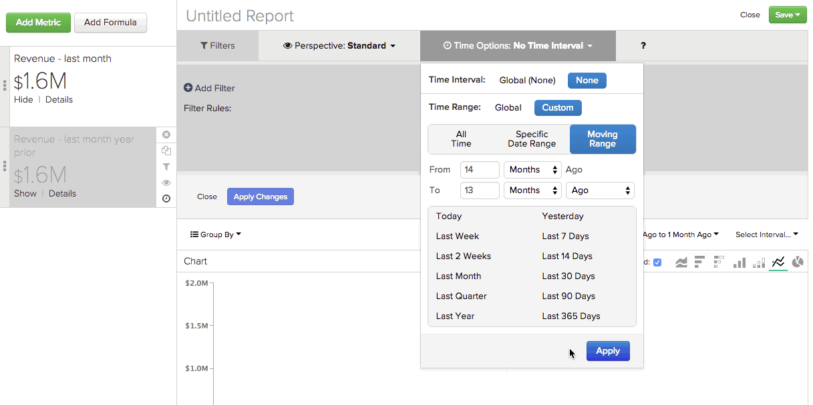

# [!DNL Time] Opties gebruiken in [!DNL Visual Report Builder]

Een van de functies van de [!DNL Visual Report Builder] is de algemene instellingen `Time Range` en `Interval` . Met deze instellingen kunt u de gegevens in uw rapport gedurende een bepaalde periode analyseren.

Voor sommige analyses moet u echter rekening houden met verschillende tijdsintervallen of tijdsintervallen in hetzelfde rapport. Dat is waar `Time` opties binnenkomen. In deze zelfstudie worden de volgende gebruiksgevallen besproken, zodat u een beter idee krijgt van het gebruik van `Time` -opties in uw rapporten:

* [Metrische gegevens analyseren zonder tijdstempels](#notimestamp)
* [Eén metrische waarde een onafhankelijk tijdinterval geven](#independenttimeinterval)
* [Dezelfde metrische waarde vergelijken over verschillende tijdbereiken](#difftimerange)

Als u enkele voorbeeldrapporten wilt volgen die in dit onderwerp worden besproken, opent u [[!DNL Visual Report Builder]](../data-user/reports/ess-rpt-build-visual.md) voordat u doorgaat.

## Metrische gegevens analyseren zonder tijdstempels {#notimestamp}

Sommige metriek kan zich eenvoudig niet in tijd aangezien de gegevens niet met een bijbehorende timestamp worden verzameld of worden opgeslagen. Bijvoorbeeld, bevat een inventarislijst vaak slechts één rij voor elke SKU. In dat geval, zou u metrisch [ moeten creëren zonder timestamp te specificeren.](../data-user/reports/ess-manage-data-metrics.md)

Wanneer u een dergelijke metrische waarde gebruikt in de rapportage, ziet u dat bij het toevoegen van deze metrische waarde aan een rapport automatisch een onafhankelijke `Time Interval` van `None` en `Time Range` van `Global` wordt ingesteld:

## Eén metrische waarde een onafhankelijk tijdinterval geven {#independenttimeinterval}

Met de opties van `Time` kunt u op tijd gebaseerde 100%-diagrammen maken om te bepalen welke dag, week, maand of jaar tijdens een bepaald tijdbereik de meeste waarde heeft bijgedragen. In deze sectie, creeert u een grafiek die u het percentage van opbrengst toont die in elke kalendermaand van een jaar wordt geproduceerd.

Dit soort verslagen kan nuttig zijn als u de opbrengst over jaar wilt vergelijken. Bijvoorbeeld, heb u een grafiek voor 2015 onthulde dat Januari 18 percenten van opbrengst voor het jaar bijdroeg en een grafiek voor 2016 toonde slechts 8 percenten. Je zou kunnen beginnen te onderzoeken wat er mogelijk gebeurd is.

1. Voeg de metrische waarde van `Revenue` toe aan het rapport.
1. Klik op **[!UICONTROL Duplicate]** om een kopie van de metrische waarde te maken.
1. Klik op de optie Algemeen **[!UICONTROL Time Range]** en vervolgens op **[!UICONTROL Moving Time Range]** . Stel deze in op `Last Year` .
1. Klik op de optie global **[!UICONTROL Time Interval]** en stel deze in op `Monthly` .
1. Report Builder voegt automatisch een tweede Y-as toe voor een tweede meting. Hef de selectie van het vak `Multiple Y-Axes` op.
1. Vervolgens past u een onafhankelijke `Time Interval` toe op de eerste metrische waarde. Klik op **[!UICONTROL Time Options]** (klokpictogram) rechts van `first Revenue metric` .
1. Klik op **[!UICONTROL Time Options]** in het uitgebreide venster dat boven het rapport wordt weergegeven.
1. Stel in de vervolgkeuzelijst het volgende in:

   * `Time Interval` : stel deze in op `None` .

   * `Time Range` : stel dit in op `Last Year` door eerst op **[!UICONTROL Custom]** en vervolgens op **[!UICONTROL Moving Range]** te klikken en ten slotte de optie `Last Year` te selecteren.

   * Klik op **[!UICONTROL Apply]** om de instellingen voor interval en bereik op te slaan. Dit leidt tot een metrisch die de totale inkomsten voor het vorige jaar berekent. Vervolgens gebruikt u deze metrische waarde als noemer in een formule.

   * Om het percentage van opbrengst voor elke maand te zien, moet u een formule aan het rapport toevoegen. Klik op **[!UICONTROL Add Formula]**.

   * Voer `B/A` in het formuleveld in en selecteer `% Percent` in het vervolgkeuzemenu naast het tekstveld. Deze formule verdeelt het bedrag van de ontvangsten van een bepaalde maand van het afgelopen jaar door het totale bedrag van de inkomsten van het afgelopen jaar.

   * Klik op **[!UICONTROL Apply Changes]**.

   * Verberg beide invoermeetgegevens en wijzig de naam van de formule.

Nu kun je zien hoe impact elke maand vorig jaar was:

## Dezelfde metrische waarde vergelijken over verschillende tijdbereiken {#difftimerange}

In dit voorbeeld wordt een aangepaste dimensie met de naam `Day number of the month` gebruikt. Als u dit rapport wilt tot stand brengen en deze dimensie niet reeds in uw Data Warehouse hebben, [ contactsteun ](https://experienceleague.adobe.com/docs/commerce-knowledge-base/kb/troubleshooting/miscellaneous/mbi-service-policies.html?lang=nl-NL) voor hulp.

De twee meest voorkomende voorbeelden in deze categorie zijn (1) het vergelijken van groeicijfers (omzet jaar-over-jaar of maand-over-maand) en (2) het beter begrijpen van recente trends in voorraden of verkoop van artikelen.

Om dit geval van gebruik aan te tonen, bekijk de dagelijkse inkomsten voor de vorige maand vergeleken met dezelfde maand van het voorgaande jaar. Stel dat u naar de inkomsten voor elke dag van januari 2016 wilt kijken en die vervolgens wilt vergelijken met januari 2015, januari 2014, enzovoort. Dit verslag zou ons dat laten zien.

1. Voeg de metrische waarde van `Revenue` toe aan het rapport.
1. Klik op **[!UICONTROL Duplicate]** om een kopie van de metrische waarde te maken.
1. Wijzig de naam van de eerste metrische waarde in `Items sold last 7 days` en de tweede metrische waarde in `Items sold last 28 days` .
1. Klik op **[!UICONTROL Time Range]** en vervolgens op **[!UICONTROL Moving Time Range]** . Stel deze in op `Last Month` .
1. Klik op **[!UICONTROL Time Interval]** en stel deze in op `None` .
1. Klik op **[!UICONTROL Time Options]** (klokpictogram) naast de tweede metrische waarde van `Revenue` .
1. Klik op **[!UICONTROL Time Options]** in het uitgebreide venster dat boven het rapport wordt weergegeven.
1. Stel in de vervolgkeuzelijst het volgende in:

   * `Time Interval` : stel deze in op `None` .

   * `Time Range` : stel deze in op `From 14 Months Ago To 13 Months Ago` door eerst op **[!UICONTROL Custom]** en vervolgens op **[!UICONTROL Moving Range]** te klikken. Gebruik de velden en vervolgkeuzelijsten boven aan het menu om het bereik in te stellen. Op die manier kunnen we de inkomsten van de vorige maand zien, maar in het voorgaande jaar.

   Maak zich geen zorgen als metrisch uit het rapport verdwijnt - plaatsend een onafhankelijke tijdoptie verbergt automatisch metrisch van het rapport. Klik op **[!UICONTROL Show]** naast de metrische waarde als u deze opnieuw wilt weergeven.

   

   * Klik op **[!UICONTROL Apply]** om de instellingen voor interval en bereik op te slaan.

   * Vervolgens voegt u de aangepaste `Day number of the month` -dimensie toe door op **[!UICONTROL Group By]** te klikken en de dimensie te selecteren. Hiermee wordt het dagnummer van de maand van een bestelling geretourneerd. Een bestelling die op 2 maart wordt geplaatst, retourneert bijvoorbeeld `2` .

   * Selecteer `Group By` in het vervolgkeuzemenu `Show All` en klik op **[!UICONTROL Apply]** . Dit leidt tot de x-aswaarden voor het rapport:

   

   * Wijzig de naam van de metriek. In het voorbeeld is de eerste metrische waarde `Revenue - 2015` en de tweede waarde `Revenue - 2014` .

Een andere algemene toepassing van aangepaste `Time Options` is het bepalen van weken van levering. Vooral tijdens de vakantieperiode of een speciale promotieperiode, kunt u punten overwegen die in de afgelopen week, maand, en vorige promotieperiode worden verkocht om geïnformeerde aankoopbesluiten te nemen.

Herinner me om de tijdwaaiers aan te plaatsen wat u wanneer het bouwen van dit rapport zelf nodig hebt.

1. Voeg de metrische waarde van `Items Sold` toe aan het rapport.
1. Klik op **[!UICONTROL Duplicate]** om een kopie van de metrische waarde te maken.
1. Wijzig de naam van de metriek. U kunt dezelfde namen gebruiken of iets gelijkaardigs gebruiken:
   1. Wijzig de naam van de eerste metrische waarde in `Items sold last 7 days` .
   1. Wijzig de naam van de tweede metrische waarde in `Items sold last 28 days` .
1. Klik op de metrische waarde `Items sold last 7 days` vervolgens op de algemene optie **[!UICONTROL Time Range]** en **[!UICONTROL Moving Time Range]** . In dit voorbeeld stelt u deze in op `Last 7 Days` .
1. Klik op **[!UICONTROL Time Interval]** en stel deze in op `None` .
1. Vervolgens definieert u de waarde `Time Options` voor de metrische waarde `Items sold last 28 days` . Klik op **[!UICONTROL Time Options]** (klokpictogram) rechts van de metrische waarde van `second Items sold` .
1. Klik op **[!UICONTROL Time Options]** in het uitgebreide venster dat boven het rapport wordt weergegeven.
1. Stel in de vervolgkeuzelijst het volgende in:

   * `Time Interval` : stel deze in op `None` .
   * `Time Range` : stel deze in op `From 29 days to 1 day ago` door eerst op **[!UICONTROL Custom]** en vervolgens op **[!UICONTROL Moving Range]** te klikken. Gebruik de velden en vervolgkeuzelijsten boven aan het menu om het bereik in te stellen.
   * Klik op **[!UICONTROL Apply]** om de instellingen voor interval en bereik op te slaan.
   * Dupliceer de `Items sold last 28 days` metrische waarde en open de nieuwe metrische waarde `Time Options`. Stel de opties als volgt in:

      * `Time Interval` : geef deze waarde op als `None` .
      * `Time Range`: verander dit in het datumbereik dat overeenkomt met de aanbieding waarin u geïnteresseerd bent door op **[!UICONTROL Specific Date Range]** te klikken en vervolgens de juiste datums in te voeren.
      * Wijzig de naam van de metrische waarde `Items sold during last promotion` of iets dergelijks.
      * Voeg de metrische waarde `Units on hand` toe.
      * Vervolgens voegt u de berekeningen toe die ons de beschikbare weken laten zien, rekening houdend met de verkooptrends, voor de tijdsperioden (`last 7 days` , `last 28 days` en `last promo` punt) die u in het rapport opneemt. Dit moet u voor elke tijdsperiode doen.

Klik op **[!UICONTROL Add Formula]** om de formules te maken. Voer de onderstaande formules in en klik op **[!UICONTROL Apply Changes]** als u klaar bent. Herhaal dit voor elk van de drie tijdsperioden:

* Typ `last 7 days time period` in het veld `D / A` voor de waarde `Formula` .
* Typ `last 28 days time period` in het veld `D / (B/4)` voor de waarde `Formula` .

  >[!NOTE]
  >
  >Het is belangrijk dat u de geselecteerde tijdbereiken hier normaliseert. Breek 28 dagen in vier weken in dit voorbeeld. U moet mogelijk verschillende logica op de formule toepassen.

* Typ `last promo period` in het veld `D / C` voor de waarde `Formula` .

  

* Pas ten slotte het rapport aan door de metriek te verbergen en een `SKU` of vergelijkbare dimensie aan het rapport toe te voegen als een `Group By` .

Dit voorbeeld toont aan dat de huidige voorraadniveaus goed waren gesitueerd voor een productbrede verkoop van 14 dagen. De toevoeging van een vergelijkbare promotieperiode suggereert echter dat de onderneming enkele wijzigingen moet doorvoeren - hetzij door meer voorraden aan te schaffen en alleen de producten met voldoende eenheden in voorraad te promoten.

Omdat uw klanten zich in tijd verschillend gedragen, kunt u variaties in gegevens verwachten te zien wanneer het uitvoeren van analyses. Door aangepaste tijdopties in te stellen, kunt u snel complexe analyses maken, zodat u gegevensgestuurde beslissingen kunt nemen die van invloed zijn op historische trends.

