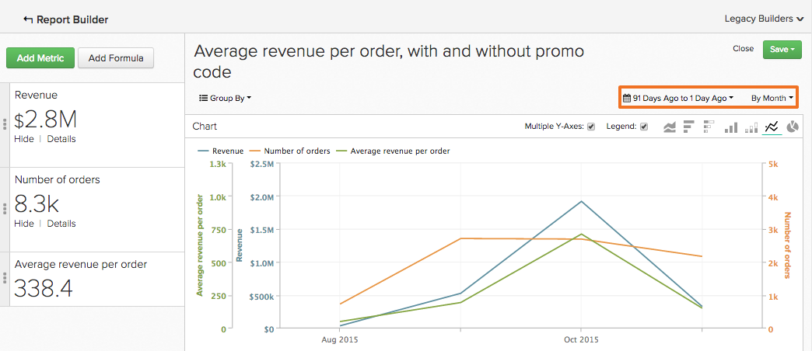
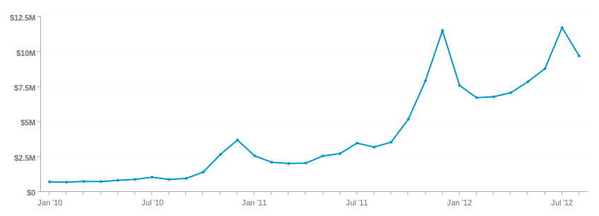

# Gebruik de `Visual Report Builder`

De [`Visual Report Builder`](../data-user/reports/ess-rpt-build-visual.md) kunt u uw gegevens visueel verkennen om inzichten te tekenen en zakelijke beslissingen te stimuleren. Dit leerprogramma begeleidt u door het proces om een basisrapport tot stand te brengen.

>[!NOTE]
>
>Als u een rapport aan een dashboard wilt toevoegen, moet u `Standard` [gebruikersmachtigingen](../administrator/user-management/user-management.md) en `Edit` toegang tot het dashboard.

## Stap 1: Een rapport maken

Als u een rapport wilt gaan maken, klikt u op **[!UICONTROL Report Builder]** op de zijbalk of **[!UICONTROL Add Report]** boven aan een dashboard. Wanneer de `Report Builder` op de selectiepagina worden weergegeven, klikt u op de **[!UICONTROL Visual Report Builder]** optie.

Als u een rapport wilt bewerken dat is gemaakt in het dialoogvenster `Visual Report Builder`klikt u op het tandwielpictogram (Opties) in de rechterbovenhoek van een diagram en klikt u vervolgens op **[!UICONTROL Edit]**.

## Stap 2: Metrisch toevoegen

De eerste stap bij het maken van een analyse is het selecteren van [de](../data-user/reports/ess-manage-data-metrics.md) om te analyseren. Terwijl de metriek door gebrek alfabetisch vermeld zijn, kunt u hen door de lijst ook groeperen die metrisch bevoegdheden.

U kunt extra metriek toevoegen nadat aanvankelijke metrisch wordt geselecteerd en alle metriek op één enkel rapport bedekken of multi-metrische berekeningen uitvoeren door formules toe te voegen.

## Stap 3: Toevoegen `Formulas`

`Formulas` worden toegevoegd aan rapporten door op **[!UICONTROL Add Formula]**, die net boven de lijst van metriek in het rapport wordt gevestigd. In de [formule-editor](../data-analyst/dev-reports/formulas-in-rpt-bldr.md), kan om het even welke metriek inbegrepen in het rapport als input worden gebruikt. De basis wiskundige exploitanten worden gebruikt om de verschillende metriek te manipuleren.

Stel dat u een rapport wilt maken waarin de gemiddelde inkomsten per bestelling worden weergegeven. In dit geval verdeelt u de `Revenue` metrisch met de `Number of orders` metrisch.

## Stap 4: De instelling `Time Period` en `Interval of Analysis` {#time}

Aan nul binnen op een bepaalde rektijd, kunt u de tijdspanne voor de analyse plaatsen. U kunt ook tijdintervallen kiezen om de gegevens te segmenteren (bijvoorbeeld op jaar, op kwartaal of op maand). Gebruik de menu&#39;s in de rechterbovenhoek van het diagram om de tijdsperiode en het interval in te stellen.

Wanneer het plaatsen van een specifieke datumwaaier voor de tijdspanne, zorg ervoor dat de begindatum bij het begin van het interval is en de einddatum aan het eind van uw interval is.

Stel bijvoorbeeld een tijdsperiode in van `January 1st to March 1st` en kiest u een `monthly` interval toont `March` als datapoint, maar elke dag negeren `March` behalve `March 1`. In dat geval moet u uw `Time Period` van `January 1 to March 31`.

## Stap 5: `Group by` / `Segmenting the Analysis` {#groupby}

[Uw metriek segmenteren door een gegevensdimensie](../best-practices/segment-filter.md)klikt u op de knop **[!UICONTROL Group by]** aan de linkerbovenhoek van het diagram. Dit onthult een dropdown met alle beschikbare afmetingen van eerste metrisch inbegrepen in de lijst.

U kunt `None` om te voorkomen dat een metrisch wordt gesegmenteerd. Bijvoorbeeld, zou u metrisch kunnen willen die totale opbrengst zonder wordt gesegmenteerd terugkeert, terwijl het hebben van een andere opbrengst metrisch die door gebied wordt gesegmenteerd.

Ga terug naar uw gemiddelde opbrengst per ordevoorbeeld en plaats de Groep door aan bevorderingscode. Dit toont u de gemiddelde opbrengst per orde voor orden zowel met als zonder een bevorderingscode.

Als de metriek inbegrepen in de analyse op verschillende gegevenslijsten wordt voortgebouwd, staat een pop-up u toe om de passende gegevensdimensie in elke lijst te selecteren. Het doel is hier dimensies te vinden die type van waarden voor segmentatie delen:

## Stap 6: Instelling `Metric Filters`, `Perspective`, en `Time Interval` {#metric-specific}

Voor elke metrische waarde die aan de analyse wordt toegevoegd, kunt u filters toevoegen, het relevante gegevensperspectief selecteren en instellen `time interval` opties. Klik op de trechter (`Filter`), ogen (`Perspective`), en de klok (`Time`) pictogrammen naast de metriek in het rapport.

### `Filters`

`Filters` de gegevensset in de analyse te beperken. Filters zijn bijvoorbeeld handig bij het evalueren van afzonderlijke verwervingskanalen en het verwijderen van uitschieters.

Naast de vervolgkeuzemenu&#39;s en het tekstvak kunt u ook speciale filteroperatoren gebruiken, zoals `LIKE` of `IN` om filters te maken.

Het gebruik van jokertekens (`%` of `_`) met `LIKE` instructies wordt ondersteund. De `%` jokerteken komt overeen met meerdere tekens, terwijl `_` komt alleen overeen met een enkel teken. Bijvoorbeeld:

- `affiliate's name Like B%` alleen gegevens zijn toegestaan van klanten waarvan de naam begint met `B`.

- `affiliate's name Like _ake` staat slechts gegevens van klanten toe waarvan de namen als iets zijn `Jake`, `Rake`, of `Bake` maar niet `Drake` of `Blake`.

Door meerdere filters toe te voegen, kunt u de gegevens in de grafiek strak beheren. Standaard moeten alle filtervoorwaarden true zijn voor een deel van de gegevens dat wordt opgenomen, maar u kunt OR-relaties maken door het tekstvak Filterregels te bewerken.

### `Perspectives`

`Perspectives` Hiermee kunt u eenvoudig schakelen tussen verschillende weergaven van uw gegevens. Bekijk wat beschikbaar is:

- `Standard perspective`: Het standaardperspectief toont u het resultaat voor de passende datum op x-as (bijvoorbeeld opbrengst in Januari). Dit is het perspectief dat u in uw Gemiddelde opbrengst per ordevoorbeeld gebruikt.

- `Amount` OF `Percent Change` versus `Previous Period` perspectief: Dit perspectief toont de hoeveelheid of de percentageverandering van één interval aan volgende en is nuttig om de snelheid van verandering in snel-veranderende metriek te meten. Er is ook een perspectief om het interval te vergelijken met dezelfde periode vorig jaar om de groei van jaar tot jaar te laten zien.

- `Cumulative perspective`: De `cumulative perspective` toont het lopende of cumulatieve bedrag van de maatstaf over de tijdsperiode. Dit wordt vaak gebruikt om totale klanten te analyseren en voor toekomstige capaciteit te plannen.

- `Percent of First Value perspective`: Dit perspectief toont de gegevens als percentage van het eerste tijdinterval inbegrepen in de analyse. Dit is nuttig bij het meten van de doeltreffendheid van specifieke acties in verhouding tot de prestaties van de eerste periode.

- `Rolling averages window perspective`: Het het rollen perspectief van het middelvenster van gemiddelden toont de het rollen gemiddelde waarde van metrisch over de gespecificeerde tijdwaaier. Het interval moet het zelfde zijn als het interval dat op het rapportniveau wordt geplaatst. Bijvoorbeeld, als het rapport het laatste volledige kwart van Ontvangsten door week toont, kunt u het het rollen gemiddelde tijdwaaier van het venster aan vier weken plaatsen. Dit betekent dat de eerste drie waarden null zijn en de vierde waarde het gemiddelde van de eerste vier weken van Ontvangsten vertegenwoordigt. Voor de duidelijkheid moet u de optie `Multiple Y-Axes` Schakel het selectievakje in als u dezelfde metrische waarde met een voortschrijdend gemiddelde weergeeft, zoals in het onderstaande voorbeeld.

### Opties voor metrische specifieke tijd

Er zijn twee opties voor metriek die in rapporten worden gebruikt: zij kunnen zich in de loop van de tijd , al dan niet volgens de globale tijdopties ontwikkelen , die hen als scalair aantal zullen tonen .

Een metrisch tijdinterval wijzigen in `None` retourneert een `scalar` getal, dat nuttig is bij het maken van formules waarbij een tijdtrending-metrische waarde wordt gedeeld door een `scalar` getal. U kunt ook het tijdbereik van het dialoogvenster `scalar` metrisch aan een tijdwaaier onafhankelijk van dat voor het rapport.

Bijvoorbeeld, wilde u 2019 maandelijkse inkomsten die als percentage van totale inkomsten 2019 worden uitgedrukt. U kunt twee toevoegen `Revenue` cijfers voor een rapport met een algemeen tijdbereik van 1 januari 2019 tot en met 31 december 2019, gesegmenteerd per maandinterval.

>[!NOTE]
>
>Als u `group by` afmetingen, kies een nieuwe visualisatie, of pas het tijdinterval aan en sparen enkel het Aantal (`scalar`). Deze aanpassingen blijven niet behouden wanneer u dat rapport weer opent vanaf een dashboard - alleen het tijdsbereik blijft behouden.

Meer informatie over het gebruiken van tijdopties in uw rapporten, zie dit [zelfstudie](../tutorials/time-options-visual-rpt-bldr.md).

## Stap 7: Het rapport opslaan

Wanneer u een grafiek maakt, kunt u deze opslaan door op **[!UICONTROL Save]** in de rechterbovenhoek van het `Visual Report Builder`.

U kunt een grafiek, tabel of nummer opslaan (`scalar`) met de `Type` dropdown en het dashboard waaraan het rapport zou moeten worden bewaard gebruikend `Location` vervolgkeuzelijst.

U kunt het rapport vervolgens opslaan door op **[!UICONTROL Save to Dashboard]**.

## Resultaten rapporteren

Om u te helpen beslissen welke rapportoutput om te kiezen, zie het volgende:

### Diagram

### Tabel

### Getal (`scalar`)

Gefeliciteerd! U bent klaar.
